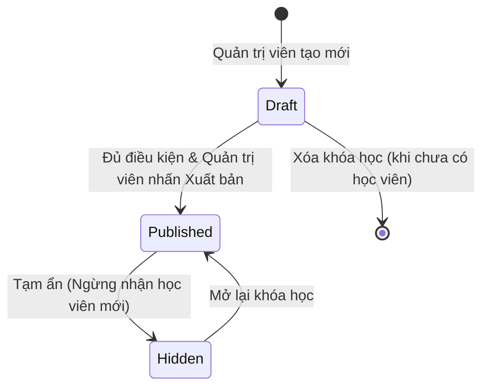
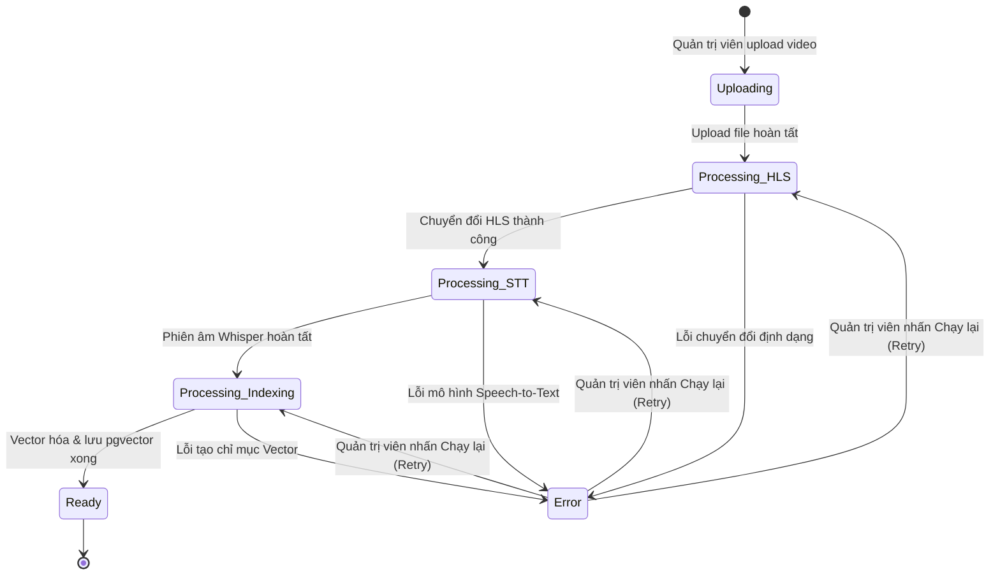
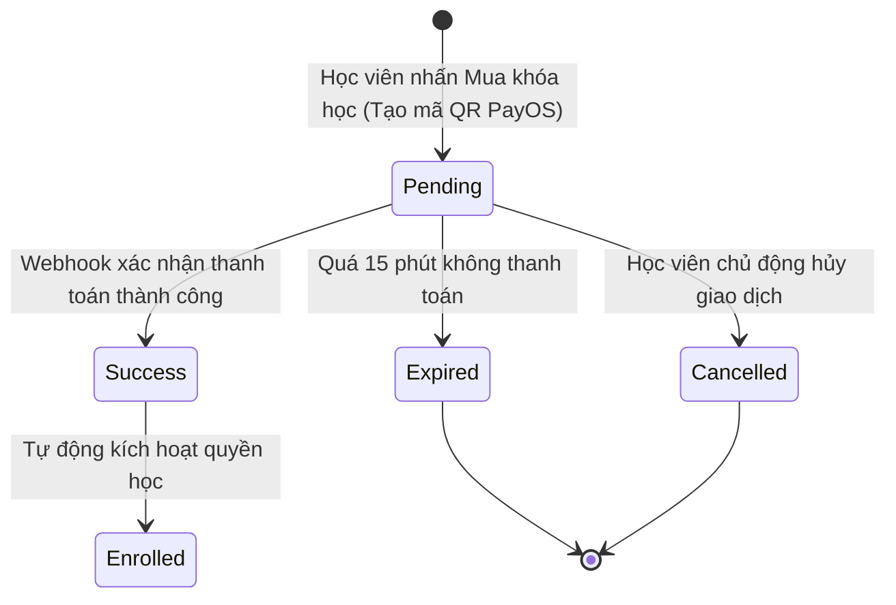

# HỆ THỐNG NỀN TẢNG HỌC TRỰC TUYẾN THÔNG MINH TÍCH HỢP AI TRỢ GIẢNG
## System & Business Analysis Document

> **Dự án:** Xây dựng nền tảng học trực tuyến thông minh tích hợp AI Trợ giảng tương tác ngữ cảnh bài giảng  
> **Đơn vị đào tạo:** Trường Đại học Công nghệ Thông tin – ĐHQG TP.HCM  
> **Học phần:** Đồ án 1 (Học kỳ 1, Năm học 2026 – 2027)  
> **Cán bộ hướng dẫn:** ThS. Võ Tuấn Kiệt  
> **Sinh viên thực hiện:** Trần Lê Đức Lợi (24520993) – Trần Quý Lộc (24520987)  
> **Phiên bản tài liệu:** 2.0 (Cập nhật chuẩn hóa theo mô hình 2 Role & Trọng tâm Mobile App Android)  

---

## 1. Mục đích tài liệu

Tài liệu này xây dựng mô hình nghiệp vụ (Business Model & Business Analysis) cho **Hệ thống Nền tảng học trực tuyến thông minh tích hợp AI Trợ giảng tương tác ngữ cảnh bài giảng**, làm nền tảng trực tiếp cho giai đoạn đặc tả yêu cầu phần mềm (Software Requirements Specification - SRS) và thiết kế hệ thống tiếp theo.

Tài liệu mô tả chi tiết cách thức nền tảng vận hành trong thực tế, các actor tham gia, quy trình nghiệp vụ từ đầu đến cuối, các khái niệm nghiệp vụ, quy tắc kinh doanh, vòng đời của các đối tượng trung tâm, phân tích nền tảng tương tác và ranh giới hệ thống.

Toàn bộ thông tin trong tài liệu được chuẩn hóa và phân loại nghiêm ngặt theo các mức độ:

- **[Confirmed]** — Thông tin đã được xác định chắc chắn, trích xuất trực tiếp từ Đề cương chi tiết Đồ án 1 đã được phê duyệt.
- **[Derived / Proposed]** — Nghiệp vụ do nhóm phân tích suy luận từ thực tế mô hình vận hành E-Learning và công nghệ AI/Mobile nhằm đảm bảo hệ thống khép kín, khả thi, không bị đứt gãy logic.
- **[Dự kiến — Chưa cam kết chính thức]** — Các hạng mục/chức năng được ghi nhận dưới dạng "dự kiến" trong đề cương gốc (như thanh toán trực tuyến PayOS, quản lý doanh thu, báo cáo phân tích nâng cao). Các hạng mục này **chưa chắc chắn sẽ được đưa vào sản phẩm phát hành chính thức của Đồ án 1**, tùy thuộc vào tiến độ thực tế của các sprint và quyết định thống nhất với Cán bộ hướng dẫn.
- **[TBD]** — Vấn đề còn bỏ ngỏ hoặc tồn tại nhiều phương án xử lý kỹ thuật/nghiệp vụ, cần xác nhận và chốt chính thức ở giai đoạn SRS.

---

## 2. Business Context

### 2.1. Bối cảnh bài toán `[Confirmed]`

Trong kỷ nguyên chuyển đổi số giáo dục, hình thức học tập trực tuyến qua video bài giảng theo yêu cầu (Video-on-Demand - VOD) trên các nền tảng lớn (như Coursera, Udemy, YouTube) đã trở thành thói quen tiếp thu tri thức phổ biến. Tuy nhiên, hình thức học video truyền thống bộc lộ nhược điểm lớn: **tính thụ động một chiều**. Người học chủ yếu chỉ xem và nghe, hoàn toàn thiếu đi sự tương tác và phản hồi tức thì khi phát sinh thắc mắc trong lúc xem bài giảng.

**Các bất cập thực tế của người học:**
- Khi gặp một khái niệm khó hiểu hoặc thuật ngữ mới, người học buộc phải tạm dừng video, tua đi tua lại nhiều lần, hoặc chuyển sang công cụ tìm kiếm bên ngoài (Google, ChatGPT chung chung, diễn đàn) để tìm câu trả lời.
- Việc rời khỏi bài giảng làm phân tán sự chú ý, đứt gãy mạch tư duy tiếp thu kiến thức liên tục. Đặc biệt trong các môn kỹ thuật, lập trình, công nghệ thông tin, một mắt xích kiến thức bị nghẽn ở đầu bài sẽ khiến toàn bộ nội dung phía sau trở nên vô cùng khó hiểu.
- Các công cụ AI tổng quát hiện nay (như ChatGPT tiêu chuẩn) thường trả lời quá rộng, không bám sát nội dung bài học cụ thể của giảng viên, thậm chí gây nhiễu loạn kiến thức (AI ảo giác - hallucination).

**Giải pháp của hệ thống:**
Ứng dụng các tiến bộ vượt bậc của Trí tuệ nhân tạo (AI) — cụ thể là Mô hình ngôn ngữ lớn (LLM như GPT-4o-mini / Gemini Flash), công nghệ Nhận dạng giọng nói (Speech-to-Text - Whisper), Tìm kiếm vector ngữ nghĩa (Vector Search với pgvector) theo kiến trúc **RAG (Retrieval-Augmented Generation)** để xây dựng **AI Trợ giảng thông minh**. Trợ lý AI được khoanh vùng tri thức (In-Context Q&A) để trả lời chính xác, tức thì các thắc mắc của học viên ngay trong lúc xem video, dựa trên đúng nội dung phụ đề phiên âm (transcript) và tài liệu của chính bài giảng đó.

### 2.2. Mô hình vận hành `[Confirmed]`

- **Loại hình sản phẩm:** Nền tảng E-Learning dạng Video-on-Demand (VOD) chuyên biệt tích hợp AI Trợ giảng tương tác ngữ cảnh.
- **Quy mô triển khai:** Hệ thống đơn lẻ (single-tenant), phục vụ cho một cơ sở đào tạo/học viện trực tuyến độc lập, không xây dựng theo kiến trúc đa chi nhánh (multi-branch) hay nền tảng sàn thương mại mở (open marketplace/multi-organization).
- **Trọng tâm đối tượng người dùng:** Hệ thống được thiết kế và chuẩn hóa với **đúng 2 vai trò (roles) duy nhất**:
  1. **Học viên (Learner)** — Sử dụng ứng dụng di động Android để học tập, xem video, tương tác với AI và làm bài tập.
  2. **Quản trị viên (Admin)** — Sử dụng trang web quản trị để quản trị toàn bộ hệ thống, kiêm nhiệm toàn bộ khâu tạo lập, biên tập, xuất bản nội dung khóa học và vận hành pipeline AI (không chia tách role Giảng viên độc lập).

### 2.3. Luồng giá trị cốt lõi (Core Value Flow) `[Confirmed]`

```
Quản trị viên tạo khóa học & cấu trúc chương/bài (Web Admin)
    → Upload video bài giảng thô lên hệ thống
        → Pipeline xử lý tự động: Chuyển đổi HLS + Phiên âm STT (Whisper) + Vector Indexing (pgvector)
            → Quản trị viên kiểm duyệt, hiệu chỉnh phụ đề (Transcript) & cấu hình bài tập/quiz
                → Xuất bản (Publish) khóa học
                    → Học viên tiếp cận & đăng ký khóa học trên Mobile App (Android)
                        [Dự kiến: Thanh toán VietQR qua PayOS nếu được kích hoạt]
                            → Học viên xem video phát trực tuyến mượt mà (HLS) kèm phụ đề đồng bộ
                                → Học viên đặt câu hỏi ngay tại mốc video → AI Trợ giảng trả lời chuẩn xác theo ngữ cảnh (RAG)
                                    → Học viên tóm tắt bài giảng bằng AI, ghi chú theo timestamp, làm quiz/bài tập
                                        → Hệ thống ghi nhận và cập nhật tiến độ học tập liên tục
```

---

## 3. Actor Analysis

Hệ thống được thiết kế tinh gọn và tập trung cao độ vào trải nghiệm thực tế của đồ án, chỉ bao gồm **2 actor tham gia trực tiếp**:

```
+------------------------------------------------------------------------------------+
|                                  HỆ THỐNG E-LEARNING AI                            |
|                                                                                    |
|   +--------------------------+                      +-------------------------+    |
|   |    Học viên (Learner)    |                      |  Quản trị viên (Admin)  |    |
|   +--------------------------+                      +-------------------------+    |
|                |                                                 |                 |
|                v                                                 v                 |
|   - Xem video HLS tương tác                         - Tạo & quản lý khóa học/bài   |
|   - Phụ đề đồng bộ real-time                        - Upload video & theo dõi AI   |
|   - AI Trợ giảng Hỏi-Đáp (RAG)                      - Duyệt & sửa phụ đề transcript|
|   - AI Tóm tắt bài giảng                            - Quản lý ngân hàng đề & quiz  |
|   - Ghi chú theo timestamp video                    - Quản trị tài khoản học viên  |
|   - Làm quiz giữa video & bài tập                   - [Dự kiến] Quản lý doanh thu  |
|   - [Dự kiến] Mua khóa học VietQR                   - [Dự kiến] Xem báo cáo hành vi|
+------------------------------------------------------------------------------------+
```

### 3.1. Học viên (Learner)

| Thuộc tính | Chi tiết phân tích |
|---|---|
| **Vai trò** | Người học, đối tượng thụ hưởng trực tiếp giá trị tri thức và tiện ích thông minh từ nền tảng. |
| **Mục tiêu** | Tiếp thu bài giảng một cách chủ động, giải tỏa mọi khúc mắc tức thì trong quá trình học qua AI Trợ giảng, ghi chú thuận tiện, ôn luyện kiến thức nhanh chóng và theo dõi được tiến trình phát triển của bản thân. |
| **Trách nhiệm / Hành vi nghiệp vụ** | • Đăng ký tài khoản mới và đăng nhập an toàn vào ứng dụng di động `[Confirmed]`.<br>• Cập nhật thông tin hồ sơ cá nhân cơ bản `[Derived / Proposed]`.<br>• Duyệt danh mục, tìm kiếm và xem thông tin chi tiết các khóa học `[Confirmed]`.<br>• Ghi danh tham gia khóa học; thực hiện thanh toán trực tuyến qua mã VietQR nếu khóa học có thu phí `[Dự kiến — Chưa cam kết chính thức]`.<br>• Xem video bài giảng trực tuyến chất lượng cao theo giao thức HLS (ExoPlayer/Media3) `[Confirmed]`.<br>• Bật/tắt và theo dõi phụ đề phiên âm chạy đồng bộ theo dòng thời gian video `[Confirmed]`.<br>• Tương tác trực tiếp với **AI Trợ giảng**: nhập câu hỏi thắc mắc bằng ngôn ngữ tự nhiên, nhận câu trả lời khoanh vùng ngữ cảnh bài giảng kèm trích dẫn nguồn `[Confirmed]`.<br>• Sử dụng tính năng AI để tóm tắt nhanh nội dung toàn bài hoặc từng chương `[Confirmed]`.<br>• Tạo và quản lý các ghi chú cá nhân gắn chặt với mốc thời gian (timestamp) cụ thể của video `[Confirmed]`.<br>• Thực hiện các câu hỏi kiểm tra nhanh (quiz) bật lên giữa video và làm bài tập ôn luyện cuối bài/cuối khóa `[Confirmed]`.<br>• Theo dõi tiến độ hoàn thành bài học và khóa học cá nhân `[Confirmed]`.<br>• Xem nội dung đã cache khi thiết bị gặp tình trạng gián đoạn kết nối mạng `[Confirmed]`. |
| **Nền tảng tương tác** | **Mobile App chuyên biệt trên hệ điều hành Android (Android Native)** `[Confirmed]`. |
| **Lưu ý phạm vi** | • Không xây dựng phiên bản ứng dụng trên hệ điều hành iOS trong phạm vi đồ án `[Confirmed]`.<br>• Không hỗ trợ tải file video về bộ nhớ máy để xem ngoại tuyến hoàn toàn (chỉ cache metadata, thông tin bài học và ghi chú) nhằm bảo vệ bản quyền nội dung `[Derived / Proposed]`. |

### 3.2. Quản trị viên (Admin)

| Thuộc tính | Chi tiết phân tích |
|---|---|
| **Vai trò** | Người quản trị điều hành toàn bộ hệ thống, kiêm nhiệm trực tiếp vai trò sản xuất, cấu hình và kiểm duyệt nội dung đào tạo (không tách rời vai trò Giảng viên riêng biệt) `[Confirmed]`. |
| **Mục tiêu** | Đảm bảo hệ thống vận hành thông suốt; xây dựng nội dung bài giảng khoa học; kiểm soát chất lượng dữ liệu đầu vào cho AI (transcript, slide, câu hỏi) nhằm giúp AI phản hồi chính xác nhất; theo dõi tình hình hoạt động tổng quan của nền tảng. |
| **Trách nhiệm / Hành vi nghiệp vụ** | • Đăng nhập an toàn vào hệ thống quản trị trung tâm `[Confirmed]`.<br>• Quản lý danh mục khóa học (CRUD) và cấu hình phân loại `[Confirmed]`.<br>• Quản lý cấu trúc bài giảng: chia chương (sections), sắp xếp thứ tự bài học, đính kèm học liệu `[Confirmed]`.<br>• Tải lên (upload) file video bài giảng dung lượng lớn lên hệ thống lưu trữ `[Confirmed]`.<br>• Giám sát quy trình xử lý video tự động đa bước (Pipeline: Upload → HLS Transcoding → Whisper Speech-to-Text → Vector Indexing pgvector); kích hoạt chạy lại khi gặp sự cố `[Confirmed]`.<br>• Kiểm duyệt, trực tiếp chỉnh sửa văn bản phiên âm (transcript) để sửa lỗi chính tả/thuật ngữ kỹ thuật; yêu cầu hệ thống cập nhật lại chỉ mục vector sau khi chỉnh sửa `[Confirmed]`.<br>• Quản lý ngân hàng câu hỏi đề thi và gán bài tập ôn tập, quiz tại các mốc thời gian bài giảng `[Confirmed]`.<br>• Quản trị danh sách tài khoản học viên (xem thông tin, kích hoạt hoặc khóa tài khoản vi phạm) `[Confirmed]`.<br>• Quản lý lịch sử giao dịch và doanh thu nền tảng `[Dự kiến — Chưa cam kết chính thức]`.<br>• Theo dõi dashboard và các báo cáo chuyên sâu về phân tích hành vi học tập của học viên và thống kê mức độ tương tác câu hỏi AI `[Dự kiến — Chưa cam kết chính thức]`. |
| **Nền tảng tương tác** | **Web Quản trị trung tâm (Web Admin xây dựng bằng Next.js, Tailwind CSS)** `[Confirmed]`. |
| **Lưu ý phạm vi** | Hệ thống áp dụng mô hình quản trị đơn (single-tenant admin). Không xây dựng hệ thống phân quyền đa cấp phức tạp (RBAC nhiều nhánh như Super Admin vs Instructor vs Teaching Assistant) trong phạm vi Đồ án 1 để tránh phân tán nguồn lực `[Derived / Proposed]`. |

---

## 4. Business Process Analysis

### BP-01 — Đăng ký và kích hoạt tài khoản học viên
- **Mục đích:** Cho phép người học tạo lập danh tính cá nhân trên hệ thống để bắt đầu trải nghiệm học tập.
- **Actor chính:** Học viên.
- **Actor liên quan:** Hệ thống xác thực (Backend API / Email Service).
- **Trigger:** Học viên mở ứng dụng di động Android lần đầu và chọn tính năng "Đăng ký tài khoản".
- **Điều kiện đầu vào:** Thiết bị di động có kết nối Internet; học viên cung cấp thông tin cá nhân chưa từng tồn tại trên hệ thống (Email/Số điện thoại).
- **Luồng nghiệp vụ chính:**
  1. Học viên nhập thông tin đăng ký: Họ và tên, Email, Mật khẩu, Xác nhận mật khẩu trên giao diện Mobile App.
  2. Hệ thống kiểm tra tính hợp lệ của định dạng dữ liệu và kiểm tra trùng lặp tài khoản.
  3. Hệ thống tạo mã xác thực (OTP) và gửi về hòm thư điện tử của học viên `[Confirmed]`.
  4. Học viên nhập mã OTP xác thực trên màn hình ứng dụng di động.
  5. Hệ thống xác nhận thành công, kích hoạt tài khoản chính thức và tự động cấp phiên đăng nhập (JWT Access Token & Refresh Token) để chuyển thẳng vào màn hình chính của ứng dụng.
- **Ngoại lệ:**
  - Email đã được sử dụng trước đó: Hệ thống thông báo lỗi và đề xuất chuyển sang màn hình đăng nhập hoặc quên mật khẩu.
  - Mã OTP hết hạn hoặc sai quá số lần quy định: Cho phép gửi lại mã OTP mới sau khoảng thời gian đếm ngược (cooldown).
- **Kết quả:** Học viên sở hữu tài khoản hợp lệ, sẵn sàng tham gia các hoạt động học tập.
- **Business rules liên quan:** BR-01, BR-02.

---

### BP-02 — Đăng nhập và quản lý phiên làm việc
- **Mục đích:** Xác thực danh tính người dùng khi truy cập vào hệ thống trên các nền tảng tương ứng.
- **Actor chính:** Học viên (trên Mobile App Android) hoặc Quản trị viên (trên Web Admin).
- **Actor liên quan:** Hệ thống xác thực trung tâm.
- **Trigger:** Người dùng mở ứng dụng/trang quản trị khi phiên đăng nhập cũ đã hết hạn hoặc sau khi đăng xuất.
- **Điều kiện đầu vào:** Người dùng đã có tài khoản tồn tại và đang ở trạng thái kích hoạt (Active).
- **Luồng nghiệp vụ chính:**
  1. Người dùng nhập thông tin định danh (Email) và Mật khẩu.
  2. Hệ thống thực hiện mã hóa và đối soát mật khẩu lưu trữ trong cơ sở dữ liệu.
  3. Hệ thống kiểm tra vai trò (Role):
     - Nếu là Học viên đăng nhập trên Mobile App → Cấp quyền truy cập phân hệ học viên.
     - Nếu là Quản trị viên đăng nhập trên Web Admin → Cấp quyền truy cập bảng điều khiển quản trị.
  4. Hệ thống khởi tạo phiên làm việc an toàn thông qua cặp mã thông báo: Access Token (thời hạn ngắn) và Refresh Token (lưu trữ an toàn trên thiết bị).
- **Ngoại lệ:**
  - Thông tin đăng nhập không chính xác: Cảnh báo lỗi sai thông tin; khóa tạm thời nếu nhập sai liên tiếp vượt ngưỡng bảo mật.
  - Tài khoản đang bị Quản trị viên khóa: Hiển thị thông báo tài khoản bị đình chỉ và cung cấp kênh liên hệ hỗ trợ.
- **Kết quả:** Người dùng đăng nhập thành công vào đúng nền tảng phù hợp với quyền hạn của mình.
- **Business rules liên quan:** BR-01, BR-03.

---

### BP-03 — Quản lý danh mục và cấu trúc khóa học
- **Mục đích:** Cho phép Quản trị viên thiết lập, tổ chức nội dung đào tạo bài bản trước khi cung cấp cho học viên.
- **Actor chính:** Quản trị viên.
- **Actor liên quan:** Không.
- **Trigger:** Quản trị viên có nhu cầu tạo mới hoặc hiệu chỉnh một khóa học trên trang Web Admin.
- **Điều kiện đầu vào:** Quản trị viên đã đăng nhập thành công vào trang Web Admin.
- **Luồng nghiệp vụ chính:**
  1. Quản trị viên tạo thông tin tổng quan của khóa học: Tên khóa học, mô tả tóm tắt, mô tả chi tiết, hình ảnh đại diện (thumbnail), danh mục đào tạo, giá bán (nếu có thu phí) hoặc cấu hình miễn phí.
  2. Quản trị viên xây dựng sơ đồ chương trình học: Tạo các Chương (Sections/Chapters) theo thứ tự logic.
  3. Trong mỗi chương, Quản trị viên thêm các Bài giảng (Lessons), đặt tên bài học, thời lượng dự kiến và thứ tự hiển thị.
  4. Quản trị viên tiến hành upload video và tài liệu gắn liền cho từng bài giảng (kích hoạt BP-04).
  5. Quản trị viên thiết lập trạng thái xuất bản: Lưu nháp (Draft) hoặc Xuất bản (Published).
- **Ngoại lệ:** Thiếu các trường thông tin bắt buộc hoặc chưa hoàn tất xử lý video cho bài học: Hệ thống chặn việc xuất bản và đưa ra cảnh báo chi tiết.
- **Kết quả:** Khóa học được tạo dựng hoàn chỉnh trên hệ thống với cấu trúc thứ bậc rõ ràng (Khóa học → Chương → Bài giảng).
- **Business rules liên quan:** BR-06, BR-07.

---

### BP-04 — Tải lên video bài giảng và vận hành Pipeline xử lý AI tự động
- **Mục đích:** Chuyển đổi file video thô thành định dạng phát sóng trực tuyến đa băng thông và xây dựng cơ sở tri thức phục vụ AI Trợ giảng.
- **Actor chính:** Quản trị viên.
- **Actor liên quan:** Hệ thống xử lý nền tảng (Video Transcoder, OpenAI Whisper STT, AI Embedding Service, pgvector Database).
- **Trigger:** Quản trị viên tải file video bài giảng lên hệ thống từ giao diện Web Admin.
- **Điều kiện đầu vào:** File video thuộc định dạng được chấp nhận (MP4, MKV, MOV), dung lượng trong giới hạn cho phép; đường truyền mạng ổn định.
- **Luồng nghiệp vụ chính:**
  1. Quản trị viên chọn file video từ máy tính và nhấn "Tải lên". Giao diện hiển thị thanh tiến trình (progress bar).
  2. File video được lưu trữ an toàn và kích hoạt chuỗi xử lý nền tự động (Background Pipeline):
     - **Bước 1 (Video Transcoding):** Hệ thống chuyển đổi video sang định dạng phát trực tuyến phân đoạn **HLS (HTTP Live Streaming)** với nhiều mức chất lượng (Adaptive Bitrate) và lưu trữ trên hệ thống phân phối (Cloudflare Stream hoặc AWS S3/CloudFront).
     - **Bước 2 (Speech-to-Text):** Hệ thống trích xuất audio của video và đưa qua mô hình nhận dạng giọng nói **OpenAI Whisper / Faster-Whisper** để sinh ra văn bản phụ đề (Transcript) có gắn kèm dấu thời gian chính xác từng câu (timestamps).
     - **Bước 3 (Vector Indexing):** Hệ thống thực hiện phân đoạn văn bản (Text Chunking), sử dụng mô hình Text Embedding để chuyển đổi các đoạn transcript thành các vector số học và lưu trữ vào cơ sở dữ liệu **PostgreSQL với extension pgvector**.
  3. Quản trị viên theo dõi trạng thái tiến trình thời gian thực trên bảng điều khiển: `Uploading` → `Processing_HLS` → `Processing_STT` → `Processing_Indexing` → `Ready`.
  4. Sau khi quy trình hoàn tất, Quản trị viên được thông báo để chuyển sang bước kiểm duyệt phụ đề (BP-05).
- **Ngoại lệ:**
  - Lỗi tại bất kỳ bước nào trong pipeline (lỗi file hỏng, lỗi API STT quá tải, lỗi embedding): Hệ thống ghi nhận log, cập nhật trạng thái `Error` tại bước tương ứng và cho phép Quản trị viên kích hoạt chạy lại (Retry) từ bước lỗi mà không cần upload lại file từ đầu.
- **Kết quả:** Video bài giảng sẵn sàng phát trực tuyến chuẩn HLS; cơ sở dữ liệu vector tri thức của bài học sẵn sàng phục vụ cho AI Trợ giảng Hỏi-Đáp.
- **Business rules liên quan:** BR-07, BR-08, BR-10.

---

### BP-05 — Duyệt và hiệu chỉnh phụ đề phiên âm (Transcript)
- **Mục đích:** Cho phép Quản trị viên rà soát và hiệu chỉnh văn bản phiên âm tự động, đảm bảo tính chuẩn xác tuyệt đối của nội dung trước khi cung cấp cho học viên và AI.
- **Actor chính:** Quản trị viên.
- **Actor liên quan:** Hệ thống Embedding (chạy lại chỉ mục vector khi có thay đổi).
- **Trigger:** Pipeline xử lý video đã hoàn tất bước Speech-to-Text, Quản trị viên mở giao diện duyệt phụ đề trên Web Admin.
- **Điều kiện đầu vào:** Bài giảng đã có bản phiên âm thô từ AI Whisper.
- **Luồng nghiệp vụ chính:**
  1. Quản trị viên xem video xem trước (preview) phát song song với danh sách các câu phụ đề theo từng mốc thời gian (timeline).
  2. Quản trị viên chỉnh sửa các từ ngữ chuyên ngành, thuật ngữ kỹ thuật, tên riêng mà mô hình STT có thể nhận diện chưa chuẩn.
  3. Quản trị viên nhấn "Lưu và Cập nhật".
  4. Hệ thống cập nhật lại file phụ đề hiển thị cho video, đồng thời tự động kích hoạt tính toán lại vector embedding cho các phân đoạn văn bản vừa được chỉnh sửa và cập nhật lại vào pgvector.
- **Kết quả:** Bản phụ đề chuẩn xác hoàn thiện, dữ liệu tri thức của AI được đồng bộ tuyệt đối với bài giảng.
- **Business rules liên quan:** BR-08, BR-15.

---

### BP-06 — Tiếp cận và Đăng ký khóa học của học viên
- **Mục đích:** Học viên tìm kiếm, lựa chọn và sở hữu quyền truy cập vào nội dung khóa học trên ứng dụng Android.
- **Actor chính:** Học viên.
- **Actor liên quan:** Quản trị viên (quản lý trạng thái khóa học), Cổng thanh toán trực tuyến `[Dự kiến]`.
- **Trigger:** Học viên xem chi tiết một khóa học trên Mobile App và quyết định tham gia học.
- **Điều kiện đầu vào:** Học viên đã đăng nhập; khóa học đang ở trạng thái đã xuất bản (Published).
- **Luồng nghiệp vụ chính:**
  1. Học viên duyệt danh sách hoặc tìm kiếm khóa học theo từ khóa/chủ đề trên Mobile App.
  2. Học viên nhấn xem màn hình Chi tiết khóa học (xem đề cương, số lượng bài, video học thử nếu có).
  3. Học viên nhấn "Đăng ký học ngay" (hoặc "Mua khóa học").
  4. **Xử lý đăng ký:**
     - *Trường hợp khóa học miễn phí (hoặc chính sách đồ án mở quyền trực tiếp):* Hệ thống ngay lập tức tạo bản ghi ghi danh (Enrollment) cho học viên và mở khóa toàn bộ bài giảng.
     - *Trường hợp áp dụng thanh toán PayOS `[Dự kiến — Chưa cam kết chính thức]`:*
       + Hệ thống khởi tạo giao dịch và hiển thị mã QR VietQR động (chứa chính xác số tiền và nội dung chuyển khoản tự động).
       + Học viên sử dụng ứng dụng ngân hàng trên điện thoại để quét mã QR và thanh toán.
       + Cổng thanh toán gửi tín hiệu xác nhận (Webhook) về Backend; hệ thống tự động kích hoạt trạng thái ghi danh cho học viên mà không cần duyệt thủ công.
  5. Khóa học được chuyển vào mục "Khóa học của tôi" (Thư viện cá nhân) của học viên trên ứng dụng Android.
- **Ngoại lệ:** Giao dịch thanh toán hết hạn (timeout) hoặc thất bại: Hệ thống thông báo rõ ràng cho học viên và cho phép khởi tạo lại mã thanh toán mới `[Dự kiến]`.
- **Kết quả:** Học viên có đầy đủ quyền hạn truy cập xem bài giảng và làm bài tập của khóa học.
- **Business rules liên quan:** BR-04, BR-05, BR-09.

---

### BP-07 — Học bài giảng qua Video tương tác trên Mobile App
- **Mục đích:** Mang đến trải nghiệm học tập đa phương tiện trực quan, liền mạch và tối ưu riêng cho môi trường di động Android.
- **Actor chính:** Học viên.
- **Actor liên quan:** Trình phát video di động (Media3 / ExoPlayer), Máy chủ phát video HLS.
- **Trigger:** Học viên chọn một bài giảng trong khóa học đã đăng ký từ ứng dụng di động.
- **Điều kiện đầu vào:** Học viên có quyền truy cập khóa học; bài giảng đã được xuất bản hoàn tất.
- **Luồng nghiệp vụ chính:**
  1. Ứng dụng Android khởi động trình phát video ExoPlayer, kết nối luồng phát HLS tương thích với độ phân giải và tốc độ mạng của thiết bị.
  2. Hệ thống tải dữ liệu phụ đề phiên âm và hiển thị chữ chạy đồng bộ chính xác theo từng giây nói của giảng viên trên khung hình video. Học viên có thể bật/tắt phụ đề theo nhu cầu.
  3. Học viên có thể mở danh sách các chương/mục (chapters) của bài giảng và nhấn nhảy trực tiếp (seek) đến đúng mốc thời gian quan tâm.
  4. Trong suốt quá trình xem, ứng dụng ngầm định kỳ gửi tín hiệu ghi nhận tiến trình học tập (% thời lượng đã xem, vị trí giây hiện tại) về máy chủ.
  5. Nếu học viên thoát ứng dụng giữa chừng, lần sau quay lại hệ thống sẽ tự động phát tiếp tục từ đúng vị trí tạm dừng trước đó (Resume playback).
- **Ngoại lệ:** Thiết bị mất kết nối mạng đột ngột: Trình phát hiển thị thông báo gián đoạn kết nối một cách thân thiện, giữ nguyên vị trí xem hiện tại và tự động kết nối lại khi có mạng.
- **Kết quả:** Học viên tiếp thu trọn vẹn nội dung bài học, tiến độ học tập được bảo lưu chính xác.
- **Business rules liên quan:** BR-12, BR-15.

---

### BP-08 — Tương tác Hỏi - Đáp với AI Trợ giảng theo ngữ cảnh (RAG Q&A)
- **Mục đích:** Giải đáp tức thì và chính xác mọi thắc mắc của học viên dựa trên tri thức bài giảng hiện tại, biến trải nghiệm học thụ động thành tương tác chủ động.
- **Actor chính:** Học viên.
- **Actor liên quan:** AI Service (LLM GPT-4o-mini/Gemini Flash, pgvector Search).
- **Trigger:** Trong quá trình xem video bài giảng, học viên gặp khái niệm chưa hiểu và nhấn vào nút "AI Trợ giảng" trên trình phát video.
- **Điều kiện đầu vào:** Bài giảng đã được tạo chỉ mục vector hoàn tất; thiết bị di động có kết nối mạng.
- **Luồng nghiệp vụ chính:**
  1. Học viên chạm vào biểu tượng AI Trợ giảng; ứng dụng Android mở khung trò chuyện tương tác (Bottom Sheet / Floating Panel) mà không làm gián đoạn hoàn toàn việc theo dõi video.
  2. Học viên nhập câu hỏi thắc mắc bằng tiếng Việt tự nhiên (Ví dụ: *"Đoạn này thầy nói về nguyên lý hoạt động của biến toàn cục là sao?"*).
  3. Hệ thống gửi câu hỏi kèm theo thông tin ngữ cảnh định danh (ID bài giảng, ID khóa học, mốc thời gian video hiện tại) về Backend API.
  4. **Quy trình RAG (Retrieval-Augmented Generation) tại Backend:**
     - Câu hỏi được nhúng thành vector ngữ nghĩa qua Embedding model.
     - Hệ thống thực hiện tìm kiếm vector tương đồng (Similarity Search) trên pgvector, truy xuất các đoạn phụ đề (transcript chunks) liên quan nhất của bài giảng hiện tại.
     - Backend đóng gói Prompt gồm: Lời nhắc hệ thống (chỉ trả lời dựa trên tài liệu được cung cấp, không bịa đặt), các đoạn transcript trích xuất được, và câu hỏi của học viên.
     - Mô hình LLM phân tích và sinh câu trả lời cô đọng, dễ hiểu.
  5. Ứng dụng Android hiển thị câu trả lời dạng bong bóng chat, đồng thời hiển thị **nguồn trích dẫn cụ thể** (đoạn phụ đề liên quan kèm mốc thời gian phát biểu trong video).
  6. Học viên có thể chạm vào mốc thời gian trích dẫn để video tự động tua về đúng đoạn giảng viên đang giảng về nội dung đó.
- **Ngoại lệ:** Câu hỏi nằm ngoài phạm vi bài học (ví dụ hỏi chuyện xã hội, giải bài tập không liên quan): AI lịch sự từ chối trả lời và hướng dẫn học viên tập trung vào nội dung bài giảng hiện tại.
- **Kết quả:** Học viên hiểu rõ kiến thức ngay tức khắc, không cần thoát khỏi bài học để tra cứu bên ngoài.
- **Business rules liên quan:** BR-10.

---

### BP-09 — Tóm tắt nội dung bài giảng bằng AI (AI Auto-Summarize)
- **Mục đích:** Giúp học viên nắm bắt nhanh chóng ý chính của toàn bộ bài học hoặc một chương cụ thể trước khi học hoặc sau khi ôn tập.
- **Actor chính:** Học viên.
- **Actor liên quan:** AI Summarization Service (LLM).
- **Trigger:** Học viên nhấn nút "Tóm tắt bài học" trên thanh công cụ học tập của ứng dụng Android.
- **Điều kiện đầu vào:** Bài giảng đã có bản phụ đề transcript hoàn chỉnh.
- **Luồng nghiệp vụ chính:**
  1. Học viên lựa chọn phạm vi tóm tắt: "Tóm tắt toàn bài giảng" hoặc "Tóm tắt chương hiện tại".
  2. Ứng dụng gửi yêu cầu tóm tắt về máy chủ Backend.
  3. Hệ thống tổng hợp toàn bộ transcript trong phạm vi yêu cầu, gửi yêu cầu tới LLM với chỉ dẫn trích xuất các ý chính, khái niệm cốt lõi, công thức/lưu ý trọng tâm dưới dạng gạch đầu dòng có cấu trúc.
  4. Kết quả tóm tắt được trả về và hiển thị trên màn hình Bottom Sheet của ứng dụng Android.
  5. Học viên có thể lưu nội dung tóm tắt này vào mục ghi chú cá nhân của mình chỉ bằng một thao tác chạm.
- **Kết quả:** Học viên có được bản tóm lược kiến thức cô đọng và nhanh chóng.
- **Business rules liên quan:** BR-11.

---

### BP-10 — Ghi chú theo mốc thời gian bài giảng (Timestamped Notes)
- **Mục đích:** Cho phép học viên lưu giữ suy nghĩ, thắc mắc hoặc điểm nhấn kiến thức cá nhân gắn liền với khoảnh khắc bài giảng.
- **Actor chính:** Học viên.
- **Actor liên quan:** Không.
- **Trigger:** Học viên nhấn nút "Thêm ghi chú" trong lúc xem video trên ứng dụng di động.
- **Điều kiện đầu vào:** Học viên đang mở xem bài giảng trên ứng dụng di động.
- **Luồng nghiệp vụ chính:**
  1. Khi nhấn nút "Thêm ghi chú", video tự động tạm dừng, ứng dụng hiển thị hộp thoại nhập ghi chú được gắn sẵn mốc thời gian hiện tại của video (Ví dụ: `04:25`).
  2. Học viên nhập nội dung ghi chú cá nhân và nhấn "Lưu".
  3. Hệ thống lưu trữ ghi chú vào tài khoản cá nhân của học viên, đồng thời hiển thị một điểm đánh dấu trực quan trên thanh tiến trình video.
  4. Học viên có thể mở tab "Danh sách ghi chú" bất cứ lúc nào để xem lại toàn bộ các ghi chú của bài học. Khi chạm vào bất kỳ ghi chú nào, trình phát video sẽ lập tức nhảy đến đúng mốc thời gian tương ứng.
- **Kết quả:** Học viên có một sổ tay học tập cá nhân hóa gắn liền với từng giây bài giảng.
- **Business rules liên quan:** BR-14.

---

### BP-11 — Ôn tập kiến thức qua Quiz giữa video và Bài tập tự rèn luyện
- **Mục đích:** Kiểm tra tức thời mức độ tiếp thu bài của học viên, chống hiện tượng lơ là mất tập trung khi xem video trực tuyến.
- **Actor chính:** Học viên.
- **Actor liên quan:** Quản trị viên (người cấu hình ngân hàng câu hỏi trên Web Admin).
- **Trigger:**
  - *Dạng 1 (Quiz tương tác giữa video):* Video phát đến một mốc thời gian được Quản trị viên cài đặt trước → Video tự động dừng và hiển thị câu hỏi trắc nghiệm đè lên màn hình.
  - *Dạng 2 (Bài tập cuối bài):* Học viên xem xong bài giảng và chủ động chọn mục "Làm bài tập ôn luyện".
- **Điều kiện đầu vào:** Bài giảng đã được Quản trị viên gán câu hỏi trắc nghiệm hoặc bài tập tự luận.
- **Luồng nghiệp vụ chính:**
  1. Ứng dụng Android hiển thị nội dung câu hỏi và các phương án trả lời.
  2. Học viên lựa chọn phương án và nhấn "Trả lời".
  3. **Xử lý chấm điểm:**
     - *Với trắc nghiệm:* Hệ thống đối chiếu đáp án ngay lập tức, hiển thị thông báo Đúng/Sai kèm lời giải thích chi tiết. Nếu đúng, học viên có thể tiếp tục phát video; nếu sai, hệ thống gợi ý học viên tua lại đoạn giảng liên quan.
     - *Với bài tập cuối bài:* Hệ thống tổng hợp điểm số, phần trăm trả lời đúng và lưu vào hồ sơ học tập của học viên.
- **Kết quả:** Học viên củng cố kiến thức đã học; hệ thống ghi nhận kết quả đánh giá năng lực người học.
- **Business rules liên quan:** BR-13.

---

### BP-12 — Quản lý tài khoản học viên và An toàn hệ thống
- **Mục đích:** Cho phép Quản trị viên giám sát, điều phối danh sách người dùng và xử lý các hành vi vi phạm.
- **Actor chính:** Quản trị viên.
- **Actor liên quan:** Học viên (đối tượng bị tác động).
- **Trigger:** Quản trị viên truy cập màn hình "Quản lý học viên" trên trang Web Admin.
- **Điều kiện đầu vào:** Quản trị viên đã đăng nhập trang quản trị.
- **Luồng nghiệp vụ chính:**
  1. Quản trị viên xem danh sách toàn bộ học viên đăng ký trên hệ thống, kèm thông tin ngày tạo, trạng thái tài khoản và số lượng khóa học đã tham gia.
  2. Quản trị viên có thể tìm kiếm học viên theo tên, email.
  3. Trong trường hợp phát hiện học viên chia sẻ tài khoản bất thường hoặc có hành vi gian lận, Quản trị viên thực hiện thao tác "Khóa tài khoản" (Deactivate/Ban).
  4. Khi tài khoản bị khóa, mọi phiên đăng nhập của học viên đó trên thiết bị di động sẽ lập tức bị hủy bỏ và không thể đăng nhập lại.
- **Kết quả:** Môi trường học tập an toàn, bảo vệ tài nguyên học liệu của hệ thống.
- **Business rules liên quan:** BR-01, BR-03.

---

### BP-13 [Dự kiến] — Báo cáo phân tích hành vi học viên và Thống kê câu hỏi AI
> [!IMPORTANT]
> **Lưu ý đặc biệt:** Đây là quy trình nghiệp vụ **[Dự kiến — Chưa cam kết chính thức]**. Tùy thuộc vào tiến độ phát triển các sprint cốt lõi (Video, AI Q&A, App Android) và sự phê duyệt của GVHD, chức năng này có thể được triển khai ở mức độ thống kê cơ bản hoặc tạm hoãn sang giai đoạn phát triển tiếp theo.

- **Mục đích:** Cung cấp cho Quản trị viên cái nhìn tổng quan về hiệu quả học tập và chất lượng hỗ trợ của AI.
- **Actor chính:** Quản trị viên.
- **Luồng nghiệp vụ dự kiến:**
  1. Quản trị viên truy cập module "Báo cáo & Phân tích" trên Web Admin.
  2. Hệ thống tổng hợp số liệu hiển thị: Tỷ lệ hoàn thành khóa học của học viên, thời lượng xem trung bình, các bài giảng/video có tỷ lệ học viên bỏ dở cao.
  3. Hệ thống thống kê tần suất đặt câu hỏi cho AI: Số lượt hỏi theo ngày/tuần, danh sách các chủ đề/thuật ngữ được học viên hỏi nhiều nhất, giúp Quản trị viên biết được phần kiến thức nào học viên đang gặp khó khăn để cải thiện bài giảng.
- **Kết quả dự kiến:** Quản trị viên nắm bắt được tình hình vận hành để cải tiến nội dung đào tạo.

---

### BP-14 [Dự kiến] — Quản lý doanh thu và Đối soát giao dịch
> [!IMPORTANT]
> **Lưu ý đặc biệt:** Đây là quy trình nghiệp vụ **[Dự kiến — Chưa cam kết chính thức]**, đi liền với việc kích hoạt cổng thanh toán PayOS. Nếu hệ thống vận hành theo mô hình mở quyền học tập nội bộ/miễn phí, quy trình này sẽ không được đưa vào bản chính thức của Đồ án 1.

- **Mục đích:** Theo dõi dòng tiền và trạng thái các giao dịch mua khóa học của học viên.
- **Actor chính:** Quản trị viên.
- **Luồng nghiệp vụ dự kiến:**
  1. Quản trị viên vào mục "Quản lý doanh thu" trên Web Admin.
  2. Xem danh sách chi tiết các giao dịch: Mã giao dịch, Tên học viên, Khóa học đã mua, Số tiền, Thời gian, Trạng thái (Thành công, Đang chờ, Thất bại).
  3. Xem tổng doanh thu thu được theo ngày/tháng qua biểu đồ trực quan.
- **Kết quả dự kiến:** Dữ liệu tài chính được minh bạch và đối soát tự động.

---

## 5. Business Concepts (Khái niệm nghiệp vụ cốt lõi)

| STT | Khái niệm nghiệp vụ | Mô tả định nghĩa nghiệp vụ | Phân loại |
|---|---|---|---|
| 1 | **Học viên (Learner)** | Người dùng cuối học tập trên ứng dụng di động Android. Sở hữu tài khoản cá nhân, danh sách khóa học đã đăng ký, tiến trình học và các ghi chú riêng. | `[Confirmed]` |
| 2 | **Quản trị viên (Admin)** | Người nắm toàn quyền quản trị hệ thống trên Web Admin; trực tiếp tạo, biên tập bài giảng, quản lý ngân hàng câu hỏi, vận hành pipeline AI và quản lý người dùng (đảm nhiệm toàn bộ vai trò giảng viên). | `[Confirmed]` |
| 3 | **Khóa học (Course)** | Sản phẩm đào tạo hoàn chỉnh cấp cao nhất, bao gồm tiêu đề, mô tả, ảnh đại diện, danh mục, giá bán và tập hợp nhiều chương bài học có liên kết logic. | `[Confirmed]` |
| 4 | **Chương (Chapter/Section)** | Đơn vị tổ chức chuyên đề kiến thức trung gian trong một khóa học, chứa một nhóm các bài giảng liên quan. | `[Confirmed]` |
| 5 | **Bài giảng (Lesson/Lecture)** | Đơn vị bài học nhỏ nhất, chứa video bài giảng trực tuyến, phụ đề đồng bộ, các mốc chương nội dung và các bài tập/quiz đính kèm. | `[Confirmed]` |
| 6 | **Luồng phát HLS (HLS Stream)** | Giao thức phát video phân đoạn qua HTTP (m3u8/ts segments), cho phép ứng dụng Android tự động điều chỉnh độ phân giải phù hợp với tốc độ mạng để video không bị giật lag. | `[Confirmed]` |
| 7 | **Bản phiên âm (Transcript)** | Toàn bộ nội dung lời nói của giảng viên trong video được chuyển đổi thành văn bản có gắn kèm mốc thời gian (timestamps), vừa làm phụ đề hiển thị vừa làm cơ sở dữ liệu tri thức cho AI. | `[Confirmed]` |
| 8 | **Vector Index & Embedding** | Dữ liệu văn bản transcript được chuyển đổi thành các vector số học đa chiều và lưu trữ trong cơ sở dữ liệu `pgvector`, cho phép tìm kiếm ngữ nghĩa theo câu hỏi của người học. | `[Confirmed]` |
| 9 | **Pipeline xử lý video** | Chuỗi quy trình tự động bất đồng bộ ở máy chủ: Nhận video → Chuyển đổi HLS → Chạy mô hình Speech-to-Text Whisper → Tạo chỉ mục Vector Indexing. | `[Confirmed]` |
| 10 | **AI Trợ giảng (AI Tutor - RAG)** | Tính năng trợ lý ảo thông minh chạy trên mô hình ngôn ngữ lớn (LLM), chỉ trả lời câu hỏi dựa trên nội dung tri thức được trích xuất từ chính video bài giảng đang phát (In-Context Q&A). | `[Confirmed]` |
| 11 | **AI Tóm tắt (Auto-Summarize)** | Khả năng của LLM trong việc tổng hợp, cô đọng nội dung chính của bài giảng hoặc một chương thành các gạch đầu dòng súc tích cho người học. | `[Confirmed]` |
| 12 | **Ghi chú gắn mốc thời gian (Timestamped Notes)** | Nội dung ghi chép cá nhân của học viên được neo cố định vào đúng giây của video bài giảng, cho phép nhấn vào để tua video đến đúng thời điểm đó. | `[Confirmed]` |
| 13 | **Quiz giữa video (In-video Quiz)** | Câu hỏi trắc nghiệm tự động xuất hiện tại mốc thời gian xác định trong lúc xem video, yêu cầu học viên tương tác trước khi tiếp tục. | `[Confirmed]` |
| 14 | **Ngân hàng đề thi (Question Bank)** | Kho lưu trữ các câu hỏi đánh giá do Quản trị viên xây dựng trên Web Admin, dùng để gán vào quiz bài giảng hoặc bài tập kiểm tra cuối khóa. | `[Confirmed]` |
| 15 | **Ghi danh (Enrollment)** | Mối quan hệ nghiệp vụ thể hiện việc một học viên có quyền truy cập vào một khóa học cụ thể. | `[Derived / Proposed]` |
| 16 | **Thanh toán VietQR qua PayOS** | Cổng trung gian thanh toán quét mã QR tự động từ tài khoản ngân hàng để mua khóa học. | `[Dự kiến — Chưa cam kết chính thức]` |
| 17 | **Báo cáo phân tích hành vi** | Hệ thống biểu đồ thống kê thời lượng xem, tỷ lệ hoàn thành và thói quen tương tác của học viên. | `[Dự kiến — Chưa cam kết chính thức]` |

---

## 6. Business Rules (Quy tắc nghiệp vụ)

| Mã BR | Tên quy tắc nghiệp vụ | Chi tiết nội dung quy tắc | Phân loại |
|---|---|---|---|
| **BR-01** | Định danh và Xác thực tài khoản duy nhất | Mỗi tài khoản trong hệ thống bắt buộc phải gắn liền với một địa chỉ Email duy nhất. Mật khẩu phải có độ dài tối thiểu 8 ký tự, bao gồm cả chữ và số để đảm bảo an toàn. | `[Derived / Proposed]` |
| **BR-02** | Kích hoạt tài khoản qua mã OTP | Tài khoản học viên sau khi đăng ký phải được kích hoạt bằng mã OTP gửi về email trước khi có thể thực hiện đăng nhập và sử dụng ứng dụng. | `[Confirmed]` |
| **BR-03** | Cơ chế phiên làm việc phân quyền | Hệ thống quản lý phiên bằng JWT. Học viên chỉ được phép truy cập tài nguyên phía Mobile Client; Quản trị viên mới có quyền truy cập hệ thống Web Admin. Mỗi tài khoản chỉ nên có phiên hoạt động hợp lệ trên một thiết bị tại một thời điểm để tránh dùng chung. | `[Confirmed]` |
| **BR-04** | Quyền hạn truy cập nội dung bài giảng | Học viên chỉ được xem toàn bộ video và làm bài tập của một khóa học khi đã có bản ghi Ghi danh (Enrollment) hợp lệ (qua đăng ký miễn phí hoặc hoàn tất thanh toán). Với khóa học chưa ghi danh, học viên chỉ được xem video giới thiệu hoặc bài học thử nếu Quản trị viên cho phép. | `[Derived / Proposed]` |
| **BR-05** | Xác nhận thanh toán tự động qua Webhook | Giao dịch thanh toán chỉ được coi là thành công khi máy chủ nhận được dữ liệu xác thực (Webhook) chính thức từ cổng PayOS. Khi thành công, hệ thống ngay lập tức mở quyền truy cập khóa học cho học viên mà không cần sự can thiệp thủ công của Quản trị viên. | `[Dự kiến — Chưa cam kết chính thức]` |
| **BR-06** | Điều kiện xuất bản khóa học | Một khóa học chỉ được phép chuyển sang trạng thái "Xuất bản" (Published) khi đã có tối thiểu 01 chương và các bài giảng bên trong đều đã hoàn tất quy trình xử lý video (Pipeline Ready). | `[Derived / Proposed]` |
| **BR-07** | Quy trình xử lý video bất đồng bộ | Quá trình tải lên video và chạy các mô hình AI (Transcoding, Speech-to-Text, Vector Indexing) phải diễn ra hoàn toàn bất đồng bộ (Asynchronous Background Job). Lỗi tại một bước phải cho phép Quản trị viên kích hoạt chạy lại (Retry) mà không làm mất dữ liệu đã upload. | `[Confirmed]` |
| **BR-08** | Đồng bộ hóa dữ liệu khi chỉnh sửa phụ đề | Bất cứ khi nào Quản trị viên chỉnh sửa nội dung văn bản phụ đề (Transcript) trên Web Admin, hệ thống bắt buộc phải tự động kích hoạt tính toán lại vector embedding cho các đoạn bị thay đổi để đảm bảo tri thức của AI Trợ giảng luôn trùng khớp 100% với phụ đề hiển thị. | `[Derived / Proposed]` |
| **BR-09** | Quyền sở hữu khóa học sau khi ghi danh | Trong phạm vi Đồ án 1, một khi học viên đã ghi danh/mua thành công khóa học thì sẽ sở hữu quyền truy cập học tập vĩnh viễn (không áp dụng chính sách gia hạn hoặc hết hạn định kỳ). | `[Derived / Proposed]` |
| **BR-10** | Giới hạn tri thức của AI Trợ giảng (In-Context Boundary) | AI Trợ giảng **tuyệt đối không được trả lời các câu hỏi nằm ngoài phạm vi tri thức** của bài giảng hiện tại (phụ đề transcript). Nếu câu hỏi không có căn cứ trong tài liệu bài học, AI phải thông báo rõ ràng rằng nội dung này không nằm trong phạm vi bài học và từ chối suy diễn lung tung. | `[Confirmed]` |
| **BR-11** | Phạm vi tóm tắt bài giảng của AI | Tính năng AI Auto-Summarize chỉ được phép trích xuất ý chính dựa trên đúng tập dữ liệu transcript của bài giảng hoặc chương mà học viên đang xem; không được tự ý bổ sung kiến thức ngoại lai. | `[Confirmed]` |
| **BR-12** | Lưu trữ và khôi phục vị trí xem video (Resume Playback) | Hệ thống tự động ghi nhận vị trí giây phát cuối cùng của video mỗi 5–10 giây. Khi học viên mở lại bài giảng đó trên ứng dụng Android, trình phát video phải tự động tiếp tục từ mốc thời gian đã lưu. | `[Derived / Proposed]` |
| **BR-13** | Cơ chế chấm điểm bài kiểm tra | Các câu hỏi trắc nghiệm (trong video hoặc cuối bài) phải được chấm điểm tự động tức thì ngay khi học viên nộp bài. Lời giải thích chi tiết chỉ được hiển thị sau khi học viên đã hoàn thành lượt làm bài. | `[Confirmed]` |
| **BR-14** | Tính riêng tư của ghi chú cá nhân | Toàn bộ ghi chú gắn mốc thời gian của học viên là dữ liệu cá nhân riêng tư, chỉ có chính học viên đó nhìn thấy, không chia sẻ công khai với học viên khác. | `[Derived / Proposed]` |
| **BR-15** | Đồng bộ phụ đề theo thời gian thực | Phụ đề phiên âm phải được hiển thị chính xác theo sai số không quá ±0.5 giây so với giọng nói phát ra từ video của giảng viên trên ứng dụng Android. | `[Confirmed]` |
| **BR-16** | Chính sách hủy đơn thanh toán tự động | Nếu học viên tạo yêu cầu mua khóa học nhưng không quét mã QR thanh toán trong vòng 15 phút, giao dịch sẽ tự động chuyển sang trạng thái "Đã hủy/Hết hạn" (Expired) để giải phóng tài nguyên. | `[Dự kiến — Chưa cam kết chính thức]` |

---

## 7. Lifecycle / Status Analysis (Vòng đời & Trạng thái)

### 7.1. Vòng đời Khóa học (Course Lifecycle) `[Derived / Proposed]`



- **Draft (Bản nháp):** Khóa học đang trong quá trình xây dựng nội dung, upload video và cấu hình bài tập. Chỉ Quản trị viên nhìn thấy trên Web Admin, hoàn toàn ẩn với học viên trên Mobile App.
- **Published (Đã xuất bản):** Khóa học đã hoàn thiện, xuất hiện công khai trên ứng dụng Android để học viên tìm kiếm, đăng ký và học tập.
- **Hidden (Tạm ẩn):** Khóa học tạm thời dừng tiếp nhận học viên mới (không xuất hiện trên mục tìm kiếm chung), tuy nhiên những học viên đã đăng ký từ trước vẫn được tiếp tục truy cập học tập bình thường.

---

### 7.2. Vòng đời Pipeline xử lý Video & AI (Video AI Pipeline Lifecycle) `[Confirmed]`



- **Uploading:** File video đang được truyền tải từ trình duyệt Web Admin lên hệ sinh thái lưu trữ của hệ thống.
- **Processing_HLS:** Máy chủ đang tiến hành mã hóa và phân đoạn video thành luồng phát trực tuyến HLS đa độ phân giải.
- **Processing_STT:** Mô hình AI Whisper đang trích xuất âm thanh và nhận dạng giọng nói để tạo file phụ đề có mốc thời gian.
- **Processing_Indexing:** Mô hình Embedding đang phân đoạn transcript và chuyển đổi thành các vector nhúng lưu vào pgvector.
- **Ready:** Toàn bộ chuỗi xử lý đã hoàn tất. Video sẵn sàng phát trên Mobile App và AI Trợ giảng đã có dữ liệu để hoạt động.
- **Error:** Gặp sự cố tại một bước bất kỳ. Hệ thống bảo lưu trạng thái lỗi và cho phép Quản trị viên nhấn nút Chạy lại (Retry) độc lập tại bước đó.

---

### 7.3. Vòng đời Giao dịch Thanh toán (Payment Lifecycle) `[Dự kiến — Chưa cam kết chính thức]`



- **Pending (Đang chờ):** Đơn hàng được tạo, hiển thị mã VietQR kèm đồng hồ đếm ngược.
- **Success (Thành công):** Nhận được webhook thanh toán thành công từ ngân hàng qua PayOS, kích hoạt ghi danh cho học viên.
- **Expired (Hết hạn):** Giao dịch không được thanh toán trong thời gian quy định (15 phút).
- **Cancelled (Đã hủy):** Học viên chủ động hủy giao dịch để chọn khóa học khác hoặc phương án khác.

---

### 7.4. Vòng đời Tiến độ học tập của Học viên (Learning Progress) `[Derived / Proposed]`

- **Not Started (Chưa học):** Bài giảng mới, học viên chưa từng nhấn mở video.
- **In Progress (Đang học):** Học viên đã xem một phần bài giảng (thời lượng xem < 90%), hệ thống ghi nhớ mốc giây cụ thể để resume.
- **Completed (Hoàn thành):** Học viên đã xem trên 90% thời lượng bài giảng và hoàn thành các bài kiểm tra/quiz bắt buộc đính kèm bài học đó.

---

## 8. Platform Analysis (Phân tích Nền tảng Tương tác)

Hệ thống được kiến trúc hóa rõ ràng thành 2 nền tảng công nghệ phục vụ cho đúng 2 actor tương ứng:

| Nền tảng | Actor sử dụng | Công nghệ chủ đạo | Trách nhiệm và Đặc thù nghiệp vụ |
|---|---|---|---|
| **Mobile App (Android)** | **Học viên (Learner)** | Android Native (Java/Kotlin), Media3 / ExoPlayer | • Nền tảng chuyên biệt dành cho người học.<br>• Tối ưu cho trải nghiệm xem video di động: chế độ xoay màn hình tự động (Portrait khi học kèm ghi chú/chat AI, Landscape khi xem toàn màn hình).<br>• Tương tác chạm vuốt mượt mà: Bottom Sheet cho AI Trợ giảng để không che khuất bài học.<br>• Tối ưu phụ đề nổi real-time và khả năng xử lý ngắt kết nối mạng (Network resilience & metadata caching). |
| **Web Admin Dashboard** | **Quản trị viên (Admin)** | Next.js (React), Tailwind CSS, TypeScript | • Nền tảng tập trung dành riêng cho quản trị viên điều hành.<br>• Tối ưu cho màn hình máy tính để bàn (Desktop-first) phục vụ việc quản lý dữ liệu lớn.<br>• Upload video dung lượng lớn, theo dõi đồ họa trạng thái pipeline đa tiến trình.<br>• Giao diện biên tập phụ đề hai cột: một bên video phát preview, một bên danh sách timeline transcript cho phép gõ sửa trực tiếp.<br>• Quản lý danh mục, ngân hàng câu hỏi và xem báo cáo phân tích. |

### Phân tích sâu về Trải nghiệm Học viên trên Mobile App Android:
1. **Tính linh hoạt và cơ động:** Học viên có thể học mọi lúc, mọi nơi trên điện thoại thông minh Android. Giao diện được thiết kế để thao tác thuận tiện chỉ với một tay.
2. **Khung tương tác AI Trợ giảng (Bottom Sheet Dialog):** Thay vì chuyển hướng sang một màn hình chat riêng biệt làm mất mạch học, khung chat AI trên Android được thiết kế dạng Bottom Sheet trượt từ dưới lên. Học viên vừa có thể dừng video để đọc câu trả lời của AI, vừa có thể thu nhỏ lại để tiếp tục xem bài giảng ngay lập tức.
3. **Quản lý bộ nhớ đệm (Offline & Cache State):** Ứng dụng Android tự động lưu trữ bộ nhớ đệm (cache) danh sách khóa học của tôi, nội dung ghi chú và thông tin bài học gần nhất. Khi học viên di chuyển vào vùng sóng yếu hoặc mất mạng đột ngột, ứng dụng vẫn hiển thị thông tin rõ ràng và cho phép xem lại các ghi chú cá nhân mà không bị văng ứng dụng (crash).

---

## 9. System Boundary (Ranh giới Hệ thống)

### 9.1. In Scope (Phạm vi thực hiện) ✅

#### A. Phân hệ Mobile App (Android Native) — Dành cho Học viên:
- Đăng ký, đăng nhập tài khoản an toàn qua JWT và xác thực mã OTP qua Email `[Confirmed]`.
- Quản lý hồ sơ cá nhân cơ bản và đổi mật khẩu `[Derived / Proposed]`.
- Duyệt danh mục, tìm kiếm khóa học theo từ khóa và xem thông tin chi tiết bài giảng `[Confirmed]`.
- Trình phát video bài giảng trực tuyến chất lượng cao theo giao thức HLS (ExoPlayer/Media3) `[Confirmed]`.
- Hiển thị phụ đề phiên âm tự động (từ AI Whisper) chạy đồng bộ theo thời gian thực `[Confirmed]`.
- Tính năng **AI Trợ giảng tương tác ngữ cảnh bài giảng (RAG Q&A)**: Học viên đặt câu hỏi bằng ngôn ngữ tự nhiên, AI trả lời chính xác dựa trên transcript kèm trích dẫn mốc thời gian `[Confirmed - Tính năng cốt lõi]`.
- Tính năng **AI Tóm tắt bài giảng (Auto-Summarize)**: Tóm tắt bài học/chương thành các ý chính `[Confirmed]`.
- Chia chương bài học và cho phép nhảy trực tiếp đến mốc thời gian từng phần trong video `[Confirmed]`.
- Tạo, xem và quản lý danh sách ghi chú cá nhân hóa gắn mốc thời gian video `[Confirmed]`.
- Làm câu hỏi trắc nghiệm tương tác bật lên giữa video (In-video Quiz) và bài tập cuối bài `[Confirmed]`.
- Theo dõi tiến độ học tập và tự động ghi nhớ vị trí xem dở của video (Resume playback) `[Confirmed]`.
- Quản lý thư viện khóa học cá nhân và xử lý trạng thái gián đoạn mạng (Cache metadata) `[Confirmed]`.

#### B. Phân hệ Web Admin (Next.js) — Dành cho Quản trị viên:
- Đăng nhập xác thực quản trị viên an toàn `[Confirmed]`.
- Dashboard tổng quan các chỉ số hoạt động cơ bản của hệ thống `[Confirmed]`.
- Quản lý khóa học (CRUD) và cấu hình xuất bản `[Confirmed]`.
- Quản lý cấu trúc bài giảng: tạo chương, bài học, sắp xếp thứ tự `[Confirmed]`.
- Tải lên video bài giảng và giám sát chuỗi xử lý nền tự động (HLS + Whisper STT + Vector Indexing pgvector) `[Confirmed]`.
- Giao diện duyệt, kiểm tra và trực tiếp chỉnh sửa văn bản phụ đề (Transcript), tự động cập nhật lại chỉ mục vector `[Confirmed]`.
- Quản lý ngân hàng câu hỏi đề thi và gán quiz vào các mốc thời gian của bài giảng `[Confirmed]`.
- Quản lý danh sách tài khoản học viên (xem thông tin, kích hoạt hoặc khóa tài khoản) `[Confirmed]`.

#### C. Các hạng mục Dự kiến (Có thể triển khai tùy tiến độ thực tế):
- Tích hợp thanh toán trực tuyến khóa học qua PayOS quét mã VietQR tự động `[Dự kiến — Chưa cam kết chính thức]`.
- Module quản lý doanh thu và lịch sử giao dịch trên Web Admin `[Dự kiến — Chưa cam kết chính thức]`.
- Báo cáo phân tích hành vi người học chuyên sâu và thống kê tần suất câu hỏi AI `[Dự kiến — Chưa cam kết chính thức]`.

---

### 9.2. Out of Scope (Nằm ngoài phạm vi thực hiện) ❌

Để đảm bảo tính khả thi cao nhất trong thời gian thực hiện Đồ án 1, các tính năng sau đây **hoàn toàn không thuộc phạm vi phát triển**:

1. **Phiên bản ứng dụng iOS:** Đồ án tập trung duy nhất vào nền tảng Android Native.
2. **Phiên bản Web dành cho Học viên (Web Learner) hoặc Progressive Web App (PWA):** Đồ án quy định người học sử dụng Mobile App; PWA được định hướng là giai đoạn phát triển tương lai.
3. **Phân quyền phức tạp nhiều cấp (Multi-role RBAC):** Không chia tách vai trò Giảng viên riêng, không có Trợ giảng, không có Super Admin đa cấp.
4. **Mô hình đa chi nhánh / Đa tổ chức (Multi-tenancy):** Hệ thống chỉ phục vụ một thực thể đào tạo đơn lẻ.
5. **AI tự động sinh đề thi từ video:** Quản trị viên chủ động tạo ngân hàng câu hỏi; AI tự sinh đề là hướng nghiên cứu mở rộng sau đồ án.
6. **AI đề xuất lộ trình học tập cá nhân hóa:** Nằm ngoài phạm vi Đồ án 1.
7. **Hỗ trợ phát video trực tiếp (Live Streaming):** Hệ thống chỉ tập trung vào mô hình Video theo yêu cầu (VOD).
8. **Tải video về máy xem hoàn toàn ngoại tuyến (Full Offline DRM Video):** Chỉ cache dữ liệu text và metadata để bảo vệ bản quyền.
9. **Mạng xã hội học tập, chat trực tiếp giữa các học viên (Peer-to-Peer Chat / Forum cộng đồng):** Không nằm trong mục tiêu nghiên cứu của đề tài.

---

## 10. Project Context (Bối cảnh thực hiện Đồ án 1)

Thông tin thực hiện đồ án được xác nhận chính thức từ Đề cương chi tiết:

- **Tên đề tài:** Xây dựng nền tảng học trực tuyến thông minh tích hợp AI Trợ giảng tương tác ngữ cảnh bài giảng.
- **Cơ quan đào tạo:** Trường Đại học Công nghệ Thông tin – Đại học Quốc gia TP. Hồ Chí Minh.
- **Học phần:** Đồ án 1.
- **Cán bộ hướng dẫn (CBHD):** ThS. Võ Tuấn Kiệt.
- **Thời gian thực hiện:** Bắt đầu từ ngày 07/09/2026 đến ngày kết thúc học phần Đồ án 1.
- **Quy trình phát triển:** Áp dụng phương pháp luận **Agile/Scrum**, chia dự án thành **9 Sprint** qua **2 Giai đoạn**:
  - *Giai đoạn 1 (Sprint 1 → Sprint 4: từ 07/09/2026 đến 18/10/2026):* Khảo sát yêu cầu, đặc tả kiến trúc, thiết kế UI/UX Figma và xây dựng các thành phần nền tảng cơ bản.
  - *Giai đoạn 2 (Sprint 5 → Sprint 9: từ 19/10/2026 đến kết thúc):* Xây dựng lõi AI Trợ giảng (RAG Q&A, Summarize), hoàn thiện trình phát video ExoPlayer trên Android, hoàn thiện Web Admin, kiểm thử toàn diện, tối ưu bảo mật, đóng gói ứng dụng (APK/AAB) và viết báo cáo cuối kỳ.

### Phân công nhân sự thực hiện `[Confirmed]`:
| Thành viên | MSSV | Vai trò chính trong dự án | Nhiệm vụ đảm trách cụ thể |
|---|---|---|---|
| **Trần Lê Đức Lợi** | 24520993 | Frontend & Mobile Lead, UI/UX Designer | • Thiết kế giao diện toàn hệ thống trên Figma.<br>• Phát triển ứng dụng di động **Android Native** (Java/Kotlin, Media3/ExoPlayer).<br>• Phát triển giao diện trang quản trị **Web Admin** (Next.js, React, Tailwind CSS).<br>• Đóng gói APK/AAB và viết báo cáo Frontend. |
| **Trần Quý Lộc** | 24520987 | Backend & AI Engineer | • Xây dựng **Backend API** trung tâm (Python FastAPI).<br>• Thiết kế và tối ưu cơ sở dữ liệu **PostgreSQL + pgvector**.<br>• Xây dựng và kiểm thử toàn bộ **Pipeline AI** (Whisper STT, Embedding, RAG Q&A với GPT-4o-mini/Gemini Flash).<br>• Thiết lập hệ thống phát video HLS và viết báo cáo Backend. |

### Định hướng Công nghệ & Công cụ `[Confirmed]`:
- **Hệ điều hành di động:** Android Native (ngôn ngữ Kotlin/Java), thư viện phát video chuẩn Google AndroidX Media3 / ExoPlayer.
- **Frontend Quản trị:** Next.js (React), TypeScript, Tailwind CSS.
- **Backend API:** Python FastAPI (hiệu năng cao, tương thích trực tiếp các thư viện AI tiên tiến).
- **Cơ sở dữ liệu:** PostgreSQL (lưu trữ quan hệ người dùng, khóa học, bài tập) kết hợp extension `pgvector` (lưu trữ và tìm kiếm vector ngữ nghĩa phục vụ RAG).
- **Công nghệ AI & Xử lý giọng nói:**
  - Speech-to-Text: OpenAI Whisper API / Faster-Whisper.
  - LLM phục vụ Hỏi-Đáp & Tóm tắt: OpenAI GPT-4o-mini / Google Gemini Flash.
  - Text Embedding: OpenAI text-embedding-3-small / BGE-M3.
- **Truyền tải Video:** Giao thức HLS (HTTP Live Streaming) tích hợp dịch vụ Cloudflare Stream hoặc AWS S3 + CloudFront.
- **Công cụ phát triển:** Android Studio, Visual Studio Code, Docker, Git/GitHub, Postman, Figma.

---

## 11. Traceability & Analysis Classification (Bảng tổng hợp Truy vết Phân loại)

| Mục phân tích | Nguồn gốc / Cơ sở phân tích | Phân loại |
|---|---|---|
| Xác định đúng 2 Role: Học viên & Quản trị viên (Admin kiêm Giảng viên) | Ràng buộc tinh gọn của đồ án, thống nhất với cấu trúc đề cương | `[Confirmed]` |
| Ứng dụng di động Android Native cho Học viên | Đề cương mục "Môi trường" & "Công nghệ" | `[Confirmed]` |
| Trang quản trị Web Next.js cho Quản trị viên | Đề cương mục "Môi trường" & "Công nghệ" | `[Confirmed]` |
| Tính năng AI Trợ giảng Hỏi-Đáp ngữ cảnh (RAG Q&A) | Đề cương mục "Mục tiêu đề tài" (Tính năng AI cốt lõi) | `[Confirmed]` |
| Tính năng AI Tóm tắt bài giảng (Auto-Summarize) | Đề cương mục "Mục tiêu đề tài" | `[Confirmed]` |
| Tính năng AI Speech-to-Text tự động (Whisper) & phụ đề | Đề cương mục "Mục tiêu đề tài" & "Công nghệ" | `[Confirmed]` |
| Pipeline xử lý video tự động: Upload → STT → Vector Indexing | Đề cương mục "Mục tiêu đề tài" | `[Confirmed]` |
| Trình phát video HLS với ExoPlayer/Media3 | Đề cương mục "Công nghệ sử dụng" | `[Confirmed]` |
| Chia chương bài học & Ghi chú mốc thời gian | Đề cương chi tiết mục kế hoạch thực hiện | `[Confirmed]` |
| Ngân hàng đề thi, quiz giữa video & bài tập ôn luyện | Đề cương chi tiết mục kế hoạch thực hiện | `[Confirmed]` |
| Xử lý mất kết nối & bộ nhớ đệm cache metadata trên Mobile | Đề cương mục "Công nghệ sử dụng" (xử lý bộ nhớ đệm offline) | `[Confirmed]` |
| Nhân sự (Lợi, Lộc), CBHD ThS. Võ Tuấn Kiệt, 9 Sprints, Tech Stack | Đề cương chi tiết các bảng kế hoạch | `[Confirmed]` |
| **Tính năng thanh toán khóa học trực tuyến qua VietQR PayOS** | Đề cương mục "Phạm vi chức năng" ghi nhận là "dự kiến" | **[Dự kiến — Chưa cam kết chính thức]** |
| **Tính năng quản lý doanh thu trên Web Admin** | Đi kèm với tính năng thanh toán PayOS | **[Dự kiến — Chưa cam kết chính thức]** |
| **Tính năng Báo cáo phân tích hành vi người học** | Đề cương mục "Phạm vi chức năng" ghi nhận là "dự kiến" | **[Dự kiến — Chưa cam kết chính thức]** |
| **Tính năng Thống kê mức độ tương tác câu hỏi AI** | Đề cương mục "Phạm vi chức năng" ghi nhận là "dự kiến" | **[Dự kiến — Chưa cam kết chính thức]** |
| Toàn bộ chi tiết luồng nghiệp vụ BP-01 đến BP-12 | Phân tích nghiệp vụ E-Learning thực tế của BA | `[Derived / Proposed]` |
| Vòng đời trạng thái Khóa học (Draft → Published → Hidden) | Suy luận nghiệp vụ đảm bảo không xuất bản khóa học rỗng | `[Derived / Proposed]` |
| Vòng đời tiến độ học tập (Not Started → In Progress → Completed) | Suy luận từ cơ chế lưu vị trí xem video dở | `[Derived / Proposed]` |
| BR-08: Tự động chạy lại Vector Index khi sửa Transcript | Suy luận kỹ thuật bắt buộc để đồng bộ RAG với phụ đề | `[Derived / Proposed]` |
| Vấn đề nguồn tài liệu Slide bài giảng trong prompt AI | Đề cương có nhắc chữ "slide" nhưng chưa có cơ chế trích xuất | `[TBD]` |
| Quyết định chính thức về việc tích hợp PayOS trong đồ án 1 | Phụ thuộc thời gian thực tế ở Sprint 6-7 | `[TBD]` |

---

## 12. Open Issues (Danh sách Vấn đề cần Xác nhận trước khi viết SRS)

Các vấn đề dưới đây cần được nhóm sinh viên thảo luận và thống nhất chính thức cùng Cán bộ hướng dẫn (ThS. Võ Tuấn Kiệt) trước khi hoàn thiện tài liệu Software Requirements Specification (SRS):

1. **Quyết định về việc tích hợp Cổng thanh toán PayOS:**
   - *Vấn đề:* Tính năng này được ghi chú là "dự kiến". Nhóm có đưa việc thanh toán VietQR thật vào phạm vi đánh giá Đồ án 1 hay không?
   - *Phương án đề xuất:* Nếu thời gian làm tính năng AI cốt lõi chiếm phần lớn tài nguyên, nhóm có thể áp dụng cơ chế "Đăng ký học trực tiếp miễn phí" hoặc chỉ tích hợp PayOS ở môi trường Test/Sandbox giả lập để biểu diễn luồng thanh toán.

2. **Cơ chế xử lý tài liệu "Slide bài giảng" trong AI RAG:**
   - *Vấn đề:* Đề cương đề cập *"AI trả lời dựa trên văn bản phiên âm (transcript) và slide của video hiện tại"*. Việc đưa slide vào RAG sẽ thực hiện bằng cách nào? Quản trị viên upload riêng file PDF slide, hay hệ thống tự động cắt khung hình (extract frames) từ video bằng OCR?
   - *Phương án đề xuất:* Để đảm bảo tính khả thi cao nhất cho Đồ án 1, ở giai đoạn đầu nên tập trung 100% ngữ cảnh vào **Transcript có mốc thời gian**. Việc đưa thêm slide file PDF chỉ nên xem xét nếu còn thời gian ở Sprint 5.

3. **Phạm vi chấm bài tập tự luận:**
   - *Vấn đề:* Đề cương có nhắc đến "bài tập trắc nghiệm / tự luận". Với bài tự luận, ai sẽ là người chấm điểm? Quản trị viên chấm thủ công trên web hay dùng AI tự chấm?
   - *Phương án đề xuất:* Trong phạm vi Đồ án 1, nên ưu tiên tập trung hoàn thiện **100% câu hỏi trắc nghiệm** (có chấm điểm tự động tức thì). Phần tự luận chỉ lưu bài làm mẫu hoặc tạm hoãn để tránh làm phình to khối lượng công việc.

4. **Giới hạn số lượng câu hỏi AI (Rate Limit) cho mỗi học viên:**
   - *Vấn đề:* Do việc gọi API LLM (GPT-4o-mini/Gemini Flash) có phát sinh chi phí token, hệ thống có cần thiết lập hạn mức số câu hỏi tối đa một học viên được hỏi mỗi ngày hay không?
   - *Phương án đề xuất:* Cần cấu hình một biến số giới hạn (ví dụ tối đa 30 câu hỏi AI/ngày/học viên) trong cài đặt hệ thống để tránh tình trạng spam API làm cạn kiệt ngân sách đồ án.

5. **Mức độ cam kết của module Báo cáo phân tích hành vi học viên:**
   - *Vấn đề:* Để có báo cáo biểu đồ bỏ dở video hay độ thu hút người xem đòi hỏi phải xây dựng hệ thống thu thập sự kiện liên tục (Telemetry logging). Nếu ở Sprint 7 thời gian gấp, module này có thể tinh giản thành các con số thống kê cơ bản trên Dashboard được không?
   - *Phương án đề xuất:* Thống nhất tinh giản hiển thị các chỉ số tổng hợp (Tổng học viên, Tổng khóa học, Tổng số câu hỏi AI đã phục vụ) thay vì biểu đồ phân tích hành vi phức tạp.
