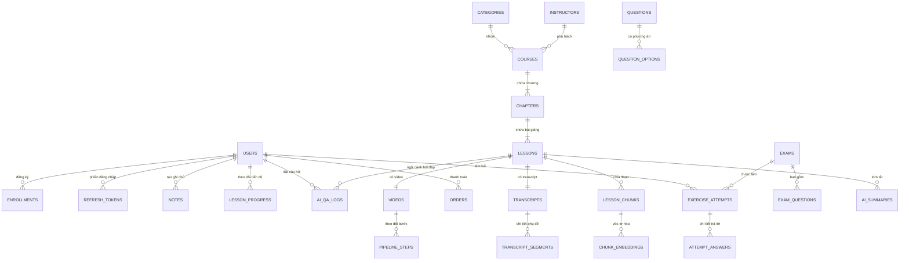

# 09 — Đặc Tả Lược Đồ Cơ Sở Dữ Liệu (Database Schema Specification)

> **Dự án:** Nền tảng học trực tuyến thông minh tích hợp AI Trợ giảng tương tác theo ngữ cảnh bài giảng.
> **Phiên bản tài liệu:** 2.1 — Kế thừa phiên bản 2.0, cập nhật hạ tầng triển khai theo kiến trúc AWS gồm Amazon EC2, Amazon RDS for PostgreSQL + pgvector, Amazon S3 và Amazon CloudFront.
> **Nguồn tham chiếu ưu tiên:** `00_SYSTEM_BUSINESS_ANALYSIS.md` [Confirmed], `02_Use_Case_Specification.md` [Confirmed], `08_FE_BE_Data_Contract.md` [Confirmed], `10_BE_Architecture.md` [Confirmed], `11_BE_AI_Pipeline_Spec.md` [Confirmed].
> **Phạm vi:** Đặc tả toàn bộ lược đồ cơ sở dữ liệu quan hệ và lưu trữ véc-tơ phục vụ Backend. Tài liệu này không chứa mã nguồn triển khai chi tiết.
> **Quy ước trạng thái:** `[Confirmed]` đã được xác nhận rõ trong nguồn. `[Derived / Proposed]` được suy ra hợp lý nhưng chưa xác nhận trực tiếp. `[Dự kiến — Chưa cam kết chính thức]` là hạng mục dự kiến. `[TBD]` là chưa có quyết định.

---

## 1. Mục Đích, Phạm Vi Và Đối Tượng Sử Dụng

### 1.1 Mục đích

Tài liệu này mô tả đầy đủ cấu trúc dữ liệu mà Backend cần triển khai để hỗ trợ các quy trình nghiệp vụ đã được xác định trong tài liệu phân tích hệ thống và đặc tả use case `[Confirmed]`, đồng thời đáp ứng chính xác các hợp đồng trao đổi dữ liệu giữa giao diện người dùng và Backend `[Confirmed]`.

Một nhà phát triển Backend mới, khi đọc tài liệu này cùng với hợp đồng dữ liệu `08`, có cơ sở để xác định cần tạo những bảng nào, mỗi bảng gồm những cột nào với ý nghĩa nghiệp vụ gì, các mối quan hệ giữa các bảng, các ràng buộc toàn vẹn, các chỉ mục phục vụ truy vấn, cách lưu trữ véc-tơ nhúng, vòng đời dữ liệu và cách quản lý di trú lược đồ.

### 1.2 Phạm vi

Tài liệu bao gồm hệ quản trị cơ sở dữ liệu quan hệ chính, phần mở rộng tìm kiếm véc-tơ, toàn bộ thực thể từ người dùng đến khóa học, video, transcript, đoạn văn bản, véc-tơ nhúng, bài tập, ghi chú, tiến độ, thanh toán, nhật ký trí tuệ nhân tạo và thông báo.

Tài liệu không mô tả chi tiết tệp mã nguồn, không quy định câu lệnh truy vấn cụ thể ở tầng ứng dụng, không thiết kế lại kiến trúc và không bổ sung tính năng mới ngoài những gì nguồn đã xác nhận.

### 1.3 Đối tượng sử dụng

Nhà phát triển Backend chịu trách nhiệm tạo lược đồ, viết tầng kho dữ liệu và đảm bảo toàn vẹn dữ liệu. Kiến trúc sư hệ thống sử dụng tài liệu để kiểm tra tính nhất quán giữa cơ sở dữ liệu, kiến trúc Backend và pipeline trí tuệ nhân tạo. Kiểm thử viên sử dụng để xây dựng kịch bản kiểm tra ràng buộc và vòng đời.

---

## 2. Tổng Quan Cơ Sở Dữ Liệu

### 2.1 Hệ quản trị cơ sở dữ liệu chính

Hệ thống sử dụng PostgreSQL làm cơ sở dữ liệu quan hệ chính `[Confirmed]`. Mọi dữ liệu nghiệp vụ có cấu trúc gồm tài khoản người dùng, khóa học, bài giảng, ghi danh, bài tập, ghi chú, đơn hàng và nhật ký đều được lưu trữ trong PostgreSQL. Lựa chọn này được giữ nguyên theo quyết định kiến trúc hiện tại vì PostgreSQL đáp ứng đồng thời yêu cầu toàn vẹn giao dịch, truy vấn quan hệ phức tạp và khả năng mở rộng bằng phần mở rộng véc-tơ.

Triển khai quản trị chốt trên Amazon RDS for PostgreSQL với phần mở rộng pgvector `[Confirmed — Chốt nội bộ]`. Trong giai đoạn phát triển cục bộ, API/worker có thể chạy trên máy phát triển và kết nối tới RDS trên AWS để sử dụng cùng lược đồ với môi trường triển khai `[Derived / Proposed]`.

### 2.2 Vai trò của phần mở rộng pgvector

Phần mở rộng pgvector được sử dụng để lưu trữ và truy xuất các véc-tơ nhúng ngữ nghĩa của nội dung bài giảng `[Confirmed]`. Mỗi đoạn văn bản transcript sau khi được chia nhỏ sẽ được chuyển thành một véc-tơ số học và lưu trong bảng dành riêng. Khi người học đặt câu hỏi, Backend tạo véc-tơ cho câu hỏi và tìm các đoạn văn bản gần nghĩa nhất bằng độ đo khoảng cách hình thức cosine.

Chỉ mục HNSW được sử dụng để tăng tốc tìm kiếm lân cận gần đúng trên tập véc-tơ lớn `[Derived / Proposed]`. Chỉ mục được tạo theo từng phiên bản nhúng để tránh lẫn lộn giữa các thế hệ mô hình khác nhau.

### 2.3 Các nhóm mô-đun được phục vụ

Cơ sở dữ liệu phục vụ toàn bộ các mô-đun nghiệp vụ chính: xác thực và quản lý tài khoản, quản lý danh mục và khóa học, quản lý video và pipeline xử lý, quản lý transcript và phụ đề, truy xuất ngữ nghĩa, quản lý ngân hàng câu hỏi và đề thi, ghi chú theo mốc thời gian, theo dõi tiến độ, thanh toán dự kiến qua PayOS, trợ giảng trí tuệ nhân tạo và thông báo.

---

## 3. Mô Hình Thực Thể (Entity Model)

### 3.1 Nhóm người dùng và xác thực

**Người dùng (users)** là thực thể trung tâm của toàn hệ thống `[Confirmed]`. Hệ thống chuẩn hóa với đúng hai vai trò (roles) duy nhất là học viên (`student`) và quản trị viên (`admin`). Mỗi người dùng có họ tên, địa chỉ email duy nhất, mật khẩu đã được băm, vai trò, ảnh đại diện, trạng thái xác minh email và trạng thái khóa tài khoản. Trạng thái xác minh phản ánh quy tắc BR-02 về xác thực OTP, trạng thái khóa phản ánh khả năng tạm ngưng tài khoản `[Derived / Proposed]`.

**Mã OTP (otp_codes)** hỗ trợ quy trình đăng ký và đặt lại mật khẩu `[Confirmed]`. Mỗi bản ghi gắn với một địa chỉ email, một mục đích sử dụng, một mã băm, số lần thử sai, thời điểm hết hạn và thời điểm đã sử dụng. Bảng này không dùng khóa ngoại cứng tới bảng người dùng vì mã OTP có thể được tạo trước khi tài khoản được xác minh hoàn toàn `[Derived / Proposed]`.

**Token làm mới (refresh_tokens)** hỗ trợ phiên đăng nhập an toàn trên nhiều thiết bị theo nguyên tắc một thiết bị cho học viên `[Confirmed]`. Mỗi bản ghi gắn với một người dùng, chứa mã băm của token, thời điểm hết hạn và thời điểm thu hồi khi đăng xuất hoặc đăng nhập thiết bị mới.

### 3.2 Nhóm khóa học và nội dung

**Danh mục (categories)** dùng để nhóm các khóa học theo chủ đề `[Confirmed]`. Mỗi danh mục có tên duy nhất, định danh đường dẫn duy nhất và mô tả.

**Giảng viên (instructors)** lưu trữ thông tin hồ sơ của giảng viên phụ trách chuyên môn khóa học `[Confirmed]`. Giảng viên thuần túy là dữ liệu hồ sơ danh mục (Master Data / Profile Metadata) do Quản trị viên toàn quyền quản lý trên Web Admin, không có mật khẩu hay thông tin xác thực đăng nhập (không tạo role `instructor`). Mỗi giảng viên có họ tên, học vị/chuyên môn, tiểu sử, ảnh đại diện, email liên hệ, số điện thoại liên hệ và trạng thái hoạt động.

**Khóa học (courses)** là đơn vị kinh doanh và học tập chính `[Confirmed]`. Mỗi khóa học có tiêu đề, mô tả, danh mục, giảng viên phụ trách (khóa ngoại `instructor_id` tham chiếu `instructors`), giá bán, ảnh thu nhỏ, trạng thái bản nháp, đã xuất bản hoặc tạm ẩn, người tạo và các mốc thời gian. Khóa học áp dụng xóa mềm để bảo toàn dữ liệu ghi danh và giao dịch trong quá khứ `[Derived / Proposed]`.

**Chương học (chapters)** và **bài giảng (lessons)** tổ chức nội dung khóa học thành cây phân cấp `[Confirmed]`. Chương giúp nhóm các bài giảng liên quan, bài giảng là đơn vị học tập nhỏ nhất gắn với một video. Mỗi chương và mỗi bài giảng đều có thứ tự sắp xếp, tiêu đề, mô tả và trạng thái. Việc giữ bảng chương là quyết định đã chốt nhằm đảm bảo khả năng mở rộng phân cấp, dù hợp đồng dữ liệu hiện tại chưa mô tả đối tượng chương riêng.

**Video (videos)** gắn với mỗi bài giảng theo quan hệ một đổi một ở mức logic `[Confirmed]`. Video lưu trữ đường dẫn tệp thô, đường dẫn luồng HLS chính, thời lượng, trạng thái tổng thể và phiên bản transcript hiện hành. **Bước pipeline (pipeline_steps)** ghi nhận tiến trình xử lý của từng video theo bốn bước gồm tải lên (upload), chuyển mã (transcode), phiên âm (transcribe) và lập chỉ mục véc-tơ (index) `[Confirmed — Chốt theo hợp đồng 08]`, mỗi bước có trạng thái đang chờ, đang xử lý, hoàn tất hoặc thất bại cùng thông điệp lỗi nếu có. Hợp đồng `08` hiện ghi tên bước phiên âm là `stt`, cách gọi chính thức thống nhất là phiên âm và ánh xạ sang `stt` khi cần tương thích API.

### 3.3 Nhóm transcript và tri thức ngữ nghĩa

**Transcript (transcripts)** là bản phiên âm hoàn chỉnh của một bài giảng `[Confirmed]`. Mỗi transcript gắn với một bài giảng, có phiên bản nội dung, ngôn ngữ và thời điểm cập nhật. **Đoạn transcript (transcript_segments)** là các dòng phụ đề chi tiết, mỗi đoạn có số thứ tự, thời điểm bắt đầu, thời điểm kết thúc và nội dung văn bản.

**Đoạn văn bản truy xuất (lesson_chunks)** là đơn vị tri thức dùng cho tìm kiếm ngữ nghĩa `[Derived / Proposed]`. Các đoạn này được tạo bằng cách gom và chia nhỏ các đoạn transcript theo cấu hình phiên bản chunk, mỗi đoạn lưu nội dung, mốc thời gian bắt đầu và kết thúc, số thứ tự và phiên bản cấu hình. **Véc-tơ nhúng (chunk_embeddings)** lưu véc-tơ số học của từng đoạn văn bản, kèm phiên bản mô hình nhúng và thời điểm tạo. Việc tách thành hai bảng giúp quản lý nhiều thế hệ véc-tơ song song và lập chỉ mục riêng theo phiên bản.

### 3.4 Nhóm ghi danh, tiến độ và ghi chú

**Ghi danh (enrollments)** ghi nhận quyền học một khóa học của một học viên `[Confirmed]`. Mỗi bản ghi gắn một người dùng với một khóa học, có thời điểm ghi danh, nguồn ghi danh từ mua trực tiếp hay thanh toán và tiến độ tổng thể. Ràng buộc duy nhất theo cặp người dùng và khóa học ngăn ghi danh trùng lặp.

**Tiến độ bài giảng (lesson_progress)** theo dõi quá trình học chi tiết tới từng bài giảng `[Derived / Proposed]`. Mỗi bản ghi gắn một người dùng với một bài giảng, lưu vị trí video đã xem tính bằng giây, trạng thái hoàn tất và thời điểm cập nhật cuối. Dữ liệu này phục vụ chức năng tiếp tục học, thanh tiến độ và điều kiện mở khóa nội dung.

**Ghi chú (notes)** cho phép học viên lưu nội dung tại một mốc thời gian cụ thể trong video `[Confirmed]`. Mỗi ghi chú gắn với một người dùng và một bài giảng, gồm nội dung văn bản và mốc thời gian tính bằng giây.

### 3.5 Nhóm bài tập và đánh giá

**Câu hỏi (questions)** thuộc ngân hàng đề thi dùng chung `[Confirmed]`. Mỗi câu hỏi có loại gồm chọn một đáp án, chọn nhiều đáp án, đúng sai và tự luận, độ khó, nội dung, điểm số và người tạo. **Lựa chọn trả lời (question_options)** lưu các phương án của câu hỏi trắc nghiệm, gồm nội dung, thứ tự và dấu hiệu đáp án đúng.

**Đề thi (exams)** là một tập hợp câu hỏi gắn với một bài giảng hoặc một khóa học `[Confirmed]`. Mỗi đề có loại gồm kiểm tra xen kẽ trong video và bài tập cuối, thời gian giới hạn, điểm đạt, số lần làm tối đa và trạng thái. **Liên kết đề thi và câu hỏi (exam_questions)** lưu danh sách câu hỏi thuộc một đề cùng thứ tự và điểm số từng câu.

**Lần làm bài (exercise_attempts)** ghi nhận một lượt học viên thực hiện đề thi `[Confirmed]`. Mỗi lần làm bài gắn với một đề và một học viên, có thời điểm bắt đầu, thời điểm nộp, điểm số và trạng thái gồm đang làm, đã nộp, đã chấm và chờ chấm. **Câu trả lời chi tiết (attempt_answers)** lưu câu trả lời của học viên cho từng câu hỏi trong lần làm bài, gồm nội dung trả lời, đáp án đã chọn, điểm thành phần và nhận xét.

### 3.6 Nhóm thanh toán, AI và thông báo

**Đơn hàng (orders)** ghi nhận giao dịch mua khóa học qua PayOS `[Dự kiến — Chưa cam kết chính thức]`. Mỗi đơn hàng gắn với một học viên và một khóa học, gồm mã đơn hàng, số tiền, trạng thái, đường dẫn mã QR, đường dẫn thanh toán, mã giao dịch của nhà cung cấp, lý do thất bại, thời điểm hết hạn và thời điểm thanh toán.

**Nhật ký hỏi đáp AI (ai_qa_logs)** lưu toàn bộ câu hỏi của học viên và câu trả lời của AI Trợ giảng `[Confirmed]`. Mỗi bản ghi gắn với người hỏi và bài giảng, gồm nội dung câu hỏi, mốc thời gian video tại lúc hỏi, nội dung trả lời, danh sách nguồn trích dẫn, mô hình đã sử dụng và phản hồi tăng hoặc giảm của người học.

**Tóm tắt AI (ai_summaries)** lưu kết quả tóm tắt bài giảng `[Confirmed]`. Mỗi bản ghi gắn với một bài giảng, gồm phạm vi tóm tắt toàn bài hoặc theo chương, nội dung tóm tắt và phiên bản transcript đã dùng để sinh tóm tắt nhằm phục vụ bộ nhớ đệm.

**Thông báo (notifications)** phục vụ use case thông báo `[Confirmed]`. Mỗi thông báo gắn với một người dùng hoặc để trống nhằm gửi quảng bá, gồm tiêu đề, nội dung, loại thông báo, trạng thái đã đọc và đường dẫn hành động.

**Cài đặt hệ thống (system_settings)** lưu các tham số vận hành dưới dạng khóa và giá trị `[Derived / Proposed]`. Các khóa quan trọng gồm phiên bản nhúng hiệu lực, Top-K, ngưỡng tương đồng, cửa sổ tăng trọng thời gian, hạn mức hỏi đáp và tóm tắt mỗi ngày, địa chỉ lưu trữ và mô hình ngôn ngữ chính.

---

## 4. Kiểu Liệt Kê (Enums)

Hệ thống sử dụng các kiểu liệt kê sau để chuẩn hóa trạng thái và phân loại `[Derived / Proposed]`, trong đó ý nghĩa nghiệp vụ đã được xác nhận trong tài liệu `00` và `08`:

- Vai trò người dùng gồm học viên và quản trị viên `[Confirmed]`.
- Mục đích OTP gồm đăng ký và đặt lại mật khẩu `[Confirmed]`.
- Trạng thái khóa học gồm bản nháp, đã xuất bản và tạm ẩn `[Confirmed]`.
- Trạng thái tổng thể của video gồm `uploading` (đang tải lên), `uploaded` (đã tải lên), `processing` (đang xử lý), `completed` (hoàn tất, tên nghiệp vụ tương đương Ready), `failed` (thất bại) — khớp hợp đồng `08` mục 9.2.
- Bước pipeline gồm bốn bước: tải lên (upload), chuyển mã (transcode), phiên âm (transcribe) và lập chỉ mục véc-tơ (index) theo hợp đồng `08` `[Confirmed — Chốt theo hợp đồng 08]`. Bước chuyển mã tương ứng trạng thái xử lý HLS trong tài liệu `00`, bước phiên âm tương ứng trạng thái xử lý nhận dạng giọng nói, bước lập chỉ mục tương ứng trạng thái xử lý lập chỉ mục.
- Trạng thái từng bước gồm `pending` (đang chờ), `processing` (đang xử lý), `completed` (hoàn tất) và `failed` (thất bại).
- Trạng thái đơn hàng gồm đang chờ (pending), đã thanh toán (paid), thất bại (failed), đã hủy (cancelled) và hết hạn (expired) `[Dự kiến — Chưa cam kết chính thức]`. Tên nghiệp vụ tương đương cho trạng thái đã thanh toán là thành công (Success).
- Loại câu hỏi gồm chọn một đáp án, chọn nhiều đáp án, đúng sai và tự luận `[Confirmed]`.
- Độ khó gồm dễ, trung bình và khó.
- Loại đề thi gồm kiểm tra xen kẽ trong video và bài tập cuối `[Confirmed]`.
- Trạng thái lần làm bài gồm đang làm, đã nộp, đã chấm và chờ chấm.
- Phản hồi AI gồm chưa phản hồi, đánh giá tốt và đánh giá chưa tốt.
- Phạm vi tóm tắt gồm toàn bài và theo chương.
- Loại thông báo gồm thanh toán, khóa học, hệ thống và bài tập.

#### 4.1 Ánh Xạ Enum Giữa Tầng Dữ Liệu Và Tầng API

Bảng dưới đây là **nguồn duy nhất** cho tên enum và giá trị; module không tự định nghĩa lại. Giá trị qua API trùng giá trị trong DB, trừ các trường hợp có ghi chú.

| Enum | Giá trị trong DB | Giá trị qua API | Ghi chú |
|---|---|---|---|
| `user_role` | `student`, `admin` | trùng | — |
| `otp_purpose` | `registration`, `password_reset` | trùng | khớp hợp đồng `08` mục 1.2 |
| `course_status` | `draft`, `published`, `hidden` | trùng | khớp hợp đồng `08` mục 2.3 |
| `video_overall_status` | `uploading`, `uploaded`, `processing`, `completed`, `failed` | trùng | `completed` tương đương tên nghiệp vụ Ready (DE-03) |
| `pipeline_step` | `upload`, `transcode`, `transcribe`, `index` | `upload`, `transcode`, `stt`, `index` | hợp đồng `08` dùng `stt`; tên chính thức là `transcribe` (DE-02) |
| `step_status` | `pending`, `processing`, `completed`, `failed` | trùng | — |
| `order_status` | `pending`, `paid`, `failed`, `cancelled`, `expired` | trùng | `paid` tương đương tên nghiệp vụ Success (DE-03) |
| `question_type` | `single_choice`, `multiple_choice`, `true_false`, `essay` | trùng | khớp Prompt 5 của chuỗi prompt |
| `difficulty` | `easy`, `medium`, `hard` | trùng | — |
| `exam_type` | `in_video_quiz`, `end_lesson_exam`, `end_course_exam` | trùng | `in_video_quiz` bắt buộc có `trigger_timestamp` |
| `attempt_status` | `in_progress`, `submitted`, `graded`, `pending_grading` | trùng | `pending_grading` chỉ dùng cho câu tự luận |
| `ai_feedback` | `none`, `up`, `down` | trùng | — |
| `summary_scope` | `lesson`, `chapter` | trùng | — |
| `notification_type` | `payment`, `course`, `system`, `exercise` | trùng | — |
| `embedding_version` | `v1` | `v1` | phiên bản nhúng hiệu lực đọc từ `system_settings` |
| `chunk_config_version` | `c1` | `c1` | c1 = 500 token, chồng lấp 80–100 token |

`[Derived]` — danh sách giá trị cần nhóm rà lại trước khi viết migration.

---

## 5. Đặc Tả Bảng Chi Tiết (Table Specification)

### 5.1 Quy ước chung

Toàn bộ bảng sử dụng khóa chính là định danh duy nhất toàn cục dạng UUID được sinh ngẫu nhiên `[Derived / Proposed]`. Các mốc thời gian sử dụng kiểu thời gian có múi giờ, mặc định là thời điểm hiện tại. Số tiền sử dụng số nguyên đơn vị Việt Nam Đồng. Các mốc thời gian trong video sử dụng số thực tính bằng giây để đảm bảo độ chính xác dưới một giây cho phụ đề và ghi chú `[Confirmed]`.

### 5.2 Bảng người dùng và xác thực

**Bảng users** lưu hồ sơ tài khoản `[Confirmed]`.

| Cột | Kiểu dữ liệu | Cho phép rỗng | Mặc định | Mô tả |
|---|---|---|---|---|
| id | UUID | Không | Sinh ngẫu nhiên | Khóa chính. |
| full_name | VARCHAR(100) | Không | — | Họ tên, từ 2 đến 100 ký tự. |
| email | VARCHAR(255) | Không | — | Email duy nhất, dùng đăng nhập và nhận OTP. |
| password_hash | TEXT | Không | — | Mật khẩu đã băm, không lưu mật khẩu gốc. |
| role | user_role | Không | student | Vai trò học viên hoặc quản trị viên. |
| avatar_url | TEXT | Có | NULL | Đường dẫn ảnh đại diện. |
| is_verified | BOOLEAN | Không | FALSE | Đã xác minh email qua OTP hay chưa. |
| is_locked | BOOLEAN | Không | FALSE | Tài khoản có đang bị khóa hay không. |
| created_at | TIMESTAMPTZ | Không | now() | Thời điểm tạo. |
| updated_at | TIMESTAMPTZ | Không | now() | Thời điểm cập nhật. |
| deleted_at | TIMESTAMPTZ | Có | NULL | Thời điểm xóa mềm, NULL nghĩa là đang hoạt động. |

**Bảng otp_codes** lưu mã xác thực dùng một lần `[Confirmed]`.

| Cột | Kiểu dữ liệu | Cho phép rỗng | Mặc định | Mô tả |
|---|---|---|---|---|
| id | UUID | Không | Sinh ngẫu nhiên | Khóa chính. |
| email | VARCHAR(255) | Không | — | Email nhận mã, liên kết logic tới người dùng. |
| purpose | otp_purpose | Không | — | Mục đích đăng ký hoặc đặt lại mật khẩu. |
| code_hash | TEXT | Không | — | Mã OTP đã băm, mã gốc 6 chữ số. |
| attempt_count | INTEGER | Không | 0 | Số lần nhập sai, dùng để khóa sau 5 lần sai trong 15 phút. |
| expires_at | TIMESTAMPTZ | Không | — | Hết hạn sau 300 giây kể từ khi tạo. |
| used_at | TIMESTAMPTZ | Có | NULL | Thời điểm đã sử dụng, NULL nghĩa là chưa dùng. |
| created_at | TIMESTAMPTZ | Không | now() | Thời điểm tạo. |

**Bảng refresh_tokens** quản lý phiên đăng nhập `[Derived / Proposed]`.

| Cột | Kiểu dữ liệu | Cho phép rỗng | Mặc định | Mô tả |
|---|---|---|---|---|
| id | UUID | Không | Sinh ngẫu nhiên | Khóa chính. |
| user_id | UUID | Không | — | Khóa ngoại tới users, xóa xếp tầng. |
| token_hash | TEXT | Không | Duy nhất | Mã băm của refresh token. |
| expires_at | TIMESTAMPTZ | Không | — | Hết hạn 7 ngày cho di động và 24 giờ cho quản trị viên. |
| revoked_at | TIMESTAMPTZ | Có | NULL | Thời điểm thu hồi khi đăng xuất hoặc đăng nhập thiết bị mới. |
| created_at | TIMESTAMPTZ | Không | now() | Thời điểm tạo. |

### 5.3 Bảng danh mục, giảng viên, khóa học, chương và bài giảng

**Bảng categories** `[Confirmed]`.

| Cột | Kiểu dữ liệu | Cho phép rỗng | Mặc định | Mô tả |
|---|---|---|---|---|
| id | UUID | Không | Sinh ngẫu nhiên | Khóa chính. |
| name | VARCHAR(150) | Không | Duy nhất | Tên danh mục. |
| slug | VARCHAR(150) | Không | Duy nhất | Định danh đường dẫn. |
| description | TEXT | Có | NULL | Mô tả danh mục. |
| created_at | TIMESTAMPTZ | Không | now() | Thời điểm tạo. |
| updated_at | TIMESTAMPTZ | Không | now() | Thời điểm cập nhật. |

**Bảng instructors** lưu hồ sơ giảng viên (Master Data) `[Confirmed]`.

| Cột | Kiểu dữ liệu | Cho phép rỗng | Mặc định | Mô tả |
|---|---|---|---|---|
| id | UUID | Không | Sinh ngẫu nhiên | Khóa chính. |
| name | VARCHAR(100) | Không | — | Họ tên giảng viên, từ 2 đến 100 ký tự. |
| title | VARCHAR(150) | Không | — | Học vị / Chuyên môn (VD: Thạc sĩ Khoa học Máy tính). |
| bio | TEXT | Có | NULL | Tiểu sử tóm tắt (tối đa 2.000 ký tự). |
| avatar_url | TEXT | Có | NULL | Đường dẫn ảnh đại diện. |
| email | VARCHAR(255) | Có | NULL | Email liên hệ chuyên môn (không dùng đăng nhập). |
| phone | VARCHAR(20) | Có | NULL | Số điện thoại liên hệ (tùy chọn). |
| is_active | BOOLEAN | Không | TRUE | Trạng thái cộng tác (đang hoạt động / tạm ngưng). |
| created_at | TIMESTAMPTZ | Không | now() | Thời điểm tạo hồ sơ. |
| updated_at | TIMESTAMPTZ | Không | now() | Thời điểm cập nhật cuối. |
| deleted_at | TIMESTAMPTZ | Có | NULL | Xóa mềm, bảo toàn liên kết với các khóa học đã xuất bản. |

> **Quy tắc phân quyền & xác thực:** Bảng `instructors` thuần túy là dữ liệu hồ sơ danh mục (Master Data / Profile Metadata), do Quản trị viên toàn quyền quản lý trên Web Admin. Bảng này **tuyệt đối không chứa** mật khẩu, mã OTP, token hay bất kỳ thông tin chứng thực tài khoản nào. Hệ thống giữ vững nguyên tắc chỉ có 2 role duy nhất (`student` và `admin`).

**Bảng courses** `[Confirmed]`.

| Cột | Kiểu dữ liệu | Cho phép rỗng | Mặc định | Mô tả |
|---|---|---|---|---|
| id | UUID | Không | Sinh ngẫu nhiên | Khóa chính. |
| title | VARCHAR(255) | Không | — | Tiêu đề khóa học. |
| description | TEXT | Có | NULL | Mô tả chi tiết. |
| category_id | UUID | Có | NULL | Khóa ngoại tới categories, xóa đặt NULL. |
| instructor_id | UUID | Có | NULL | Khóa ngoại tới `instructors`, xóa đặt NULL. Bắt buộc phải có khi xuất bản (`status = 'published'`). |
| price | INTEGER | Không | 0 | Giá bán VND, không âm. |
| thumbnail_url | TEXT | Có | NULL | Ảnh bìa. |
| status | course_status | Không | draft | Bản nháp, đã xuất bản hoặc tạm ẩn. |
| created_by | UUID | Có | NULL | Người tạo, tham chiếu users. |
| created_at | TIMESTAMPTZ | Không | now() | Thời điểm tạo. |
| updated_at | TIMESTAMPTZ | Không | now() | Thời điểm cập nhật. |
| deleted_at | TIMESTAMPTZ | Có | NULL | Xóa mềm, bảo toàn ghi danh và giao dịch. |

Điều kiện xuất bản gồm tiêu đề, mô tả, ảnh bìa, danh mục, giảng viên phụ trách (`instructor_id IS NOT NULL`), giá bán, ít nhất một chương và mỗi chương ít nhất một bài giảng có video đã sẵn sàng được kiểm tra ở tầng dịch vụ `[Confirmed]`.

**Bảng chapters** `[Confirmed]`.

| Cột | Kiểu dữ liệu | Cho phép rỗng | Mặc định | Mô tả |
|---|---|---|---|---|
| id | UUID | Không | Sinh ngẫu nhiên | Khóa chính. |
| course_id | UUID | Không | — | Khóa ngoại tới courses, xóa xếp tầng. |
| title | VARCHAR(255) | Không | — | Tiêu đề chương. |
| order_index | INTEGER | Không | 0 | Thứ tự sắp xếp trong khóa học. |
| created_at | TIMESTAMPTZ | Không | now() | Thời điểm tạo. |
| updated_at | TIMESTAMPTZ | Không | now() | Thời điểm cập nhật. |

Ràng buộc duy nhất theo cặp (course_id, order_index).

**Bảng lessons** `[Confirmed]`.

| Cột | Kiểu dữ liệu | Cho phép rỗng | Mặc định | Mô tả |
|---|---|---|---|---|
| id | UUID | Không | Sinh ngẫu nhiên | Khóa chính. |
| chapter_id | UUID | Không | — | Khóa ngoại tới chapters, xóa xếp tầng. |
| course_id | UUID | Không | — | Phi chuẩn hóa để kiểm tra ghi danh nhanh; khóa ngoại tới courses. |
| title | VARCHAR(255) | Không | — | Tiêu đề bài giảng. |
| description | TEXT | Có | NULL | Mô tả bài giảng. |
| order_index | INTEGER | Không | 0 | Thứ tự sắp xếp trong chương. |
| duration_seconds | DOUBLE PRECISION | Có | NULL | Thời lượng bài giảng. |
| is_trial_allowed | BOOLEAN | Không | FALSE | Cho phép học thử khi chưa ghi danh (BR-04). |
| created_at | TIMESTAMPTZ | Không | now() | Thời điểm tạo. |
| updated_at | TIMESTAMPTZ | Không | now() | Thời điểm cập nhật. |

Ràng buộc duy nhất theo cặp (chapter_id, order_index).

`[Derived]` — bảng cột của chapters và lessons được suy ra từ mô tả nghiệp vụ, cần nhóm rà lại.

### 5.4 Bảng video, pipeline, transcript và tri thức ngữ nghĩa

**Bảng videos** lưu siêu dữ liệu của tệp video gắn với bài giảng `[Confirmed]`.

| Cột | Kiểu dữ liệu | Cho phép rỗng | Mặc định | Mô tả |
|---|---|---|---|---|
| id | UUID | Không | Sinh ngẫu nhiên | Khóa chính. |
| lesson_id | UUID | Không | Duy nhất | Khóa ngoại duy nhất tới lessons, xóa xếp tầng. |
| original_filename | TEXT | Không | — | Tên tệp gốc. |
| file_size_bytes | BIGINT | Không | — | Dung lượng byte của toàn bộ video hoàn chỉnh, tối đa 5GB. Mỗi yêu cầu tải lên nhiều phần tối đa dưới 200MB. `[Confirmed — Chốt theo hợp đồng 08]` |
| mime_type | VARCHAR(100) | Không | — | Định dạng video. |
| raw_storage_url | TEXT | Có | NULL | Đường dẫn tệp thô `[Derived / Proposed]`. |
| hls_master_url | TEXT | Có | NULL | Đường dẫn playlist HLS chính `[Confirmed]`. |
| duration_seconds | DOUBLE PRECISION | Có | NULL | Thời lượng giây. |
| overall_status | video_overall_status | Không | uploading | Trạng thái tổng thể: đang tải lên, đã tải lên, đang xử lý, hoàn tất (completed) hoặc thất bại (failed). Tên nghiệp vụ tương đương cho trạng thái hoàn tất là sẵn sàng (Ready). `[Confirmed — Chốt theo hợp đồng 08]` |
| error_message | TEXT | Có | NULL | Thông điệp lỗi của bước thất bại. |
| started_at | TIMESTAMPTZ | Có | NULL | Thời điểm bắt đầu xử lý. |
| completed_at | TIMESTAMPTZ | Có | NULL | Thời điểm hoàn tất toàn pipeline. |
| created_at | TIMESTAMPTZ | Không | now() | Thời điểm tạo. |
| updated_at | TIMESTAMPTZ | Không | now() | Thời điểm cập nhật. |

**Bảng pipeline_steps** theo dõi từng bước xử lý `[Confirmed]`.

| Cột | Kiểu dữ liệu | Cho phép rỗng | Mặc định | Mô tả |
|---|---|---|---|---|
| id | UUID | Không | Sinh ngẫu nhiên | Khóa chính. |
| video_id | UUID | Không | — | Khóa ngoại tới videos, xóa xếp tầng. |
| step | pipeline_step | Không | — | Bước tải lên (upload), chuyển mã (transcode), phiên âm (transcribe) hoặc lập chỉ mục (index). |
| status | step_status | Không | pending | Trạng thái từng bước. |
| progress | DOUBLE PRECISION | Có | NULL | Tiến độ phần trăm từ 0 đến 100. |
| error_message | TEXT | Có | NULL | Chi tiết lỗi. |
| started_at | TIMESTAMPTZ | Có | NULL | Thời điểm bắt đầu bước. |
| completed_at | TIMESTAMPTZ | Có | NULL | Thời điểm kết thúc bước. |
| attempt_count | INTEGER | Không | 0 | Số lần đã thử, dùng cho chính sách thử lại tối đa 3 lần. |
| next_attempt_at | TIMESTAMPTZ | Có | NULL | Thời điểm được phép thử lại (backoff 30 giây, 2 phút, 10 phút). |
| lease_expires_at | TIMESTAMPTZ | Có | NULL | Hạn giữ job; vượt hạn khi đang `processing` nghĩa là worker đã chết và job cần được thu hồi. |
| created_at | TIMESTAMPTZ | Không | now() | Thời điểm tạo. |
| updated_at | TIMESTAMPTZ | Không | now() | Thời điểm cập nhật. |

Ràng buộc duy nhất theo cặp video và bước đảm bảo mỗi video chỉ có một bản ghi cho mỗi bước. Bảng pipeline_steps lưu đúng bốn giá trị bước gồm tải lên (upload), chuyển mã (transcode), phiên âm (transcribe) và lập chỉ mục (index) `[Confirmed — Chốt theo hợp đồng 08]`.

**Bảng transcripts** `[Confirmed]`.

| Cột | Kiểu dữ liệu | Cho phép rỗng | Mặc định | Mô tả |
|---|---|---|---|---|
| id | UUID | Không | Sinh ngẫu nhiên | Khóa chính. |
| lesson_id | UUID | Không | Duy nhất | Khóa ngoại tới lessons, xóa xếp tầng; mỗi bài giảng tối đa một transcript chính. |
| video_id | UUID | Có | NULL | Khóa ngoại tới videos, xóa đặt NULL. |
| language | VARCHAR(10) | Không | vi | Ngôn ngữ phiên âm tiếng Việt. |
| version | INTEGER | Không | 1 | Tăng mỗi khi nội dung phụ đề bị chỉnh sửa (BR-08). |
| created_at | TIMESTAMPTZ | Không | now() | Thời điểm tạo. |
| updated_at | TIMESTAMPTZ | Không | now() | Thời điểm cập nhật. |

**Bảng transcript_segments** `[Confirmed]`.

| Cột | Kiểu dữ liệu | Cho phép rỗng | Mặc định | Mô tả |
|---|---|---|---|---|
| id | UUID | Không | Sinh ngẫu nhiên | Khóa chính. |
| transcript_id | UUID | Không | — | Khóa ngoại tới transcripts, xóa xếp tầng. |
| segment_index | INTEGER | Không | — | Số thứ tự đoạn, bắt đầu từ 0. |
| start_time | DOUBLE PRECISION | Không | — | Thời điểm bắt đầu tính bằng giây, không âm. |
| end_time | DOUBLE PRECISION | Không | — | Thời điểm kết thúc tính bằng giây, CHECK end_time > start_time. |
| text | TEXT | Không | — | Nội dung phụ đề. |
| created_at | TIMESTAMPTZ | Không | now() | Thời điểm tạo. |

Ràng buộc duy nhất theo cặp (transcript_id, segment_index).

`[Derived]` — bảng cột của transcripts và transcript_segments được suy ra từ mô tả nghiệp vụ, cần nhóm rà lại.

**Bảng lesson_chunks** lưu đoạn văn bản phục vụ truy xuất `[Derived / Proposed]`.

| Cột | Kiểu dữ liệu | Cho phép rỗng | Mặc định | Mô tả |
|---|---|---|---|---|
| id | UUID | Không | Sinh ngẫu nhiên | Khóa chính. |
| lesson_id | UUID | Không | — | Khóa ngoại tới lessons, xóa xếp tầng. |
| transcript_id | UUID | Có | NULL | Khóa ngoại tới transcripts, xóa đặt NULL. |
| transcript_version | INTEGER | Không | 1 | Phiên bản transcript đã dùng để tạo chunk, phục vụ lập chỉ mục lại song song. |
| chunk_index | INTEGER | Không | — | Số thứ tự chunk trong bài giảng, bắt đầu từ 0. |
| text | TEXT | Không | — | Nội dung đoạn văn bản. |
| start_time | DOUBLE PRECISION | Có | NULL | Mốc bắt đầu (giây). |
| end_time | DOUBLE PRECISION | Có | NULL | Mốc kết thúc (giây). |
| chunk_config_version | VARCHAR(20) | Không | c1 | Phiên bản cấu hình chunk. c1 = 500 tokens, độ chồng lấp 80–100. |
| is_active | BOOLEAN | Không | TRUE | Đoạn đang phục vụ truy xuất. Lập chỉ mục lại tắt cờ bản cũ thay vì xóa ngay. |
| created_at | TIMESTAMPTZ | Không | now() | Thời điểm tạo. |

Ràng buộc duy nhất theo bộ (lesson_id, transcript_version, chunk_config_version, chunk_index) — cho phép chunk của phiên bản transcript mới và cũ **cùng tồn tại** trong lúc lập chỉ mục lại mà không gián đoạn phục vụ. Truy xuất chỉ lấy các bản ghi `is_active = TRUE`. Dọn dẹp (xóa các bản ghi `is_active = FALSE`) thực hiện sau thời gian giữ lại, do tác vụ nền.

**Bảng chunk_embeddings** lưu véc-tơ nhúng tách riêng để quản lý phiên bản `[Derived / Proposed]`.

| Cột | Kiểu dữ liệu | Cho phép rỗng | Mặc định | Mô tả |
|---|---|---|---|---|
| id | UUID | Không | Sinh ngẫu nhiên | Khóa chính. |
| chunk_id | UUID | Không | — | Khóa ngoại tới lesson_chunks, xóa xếp tầng. |
| embedding | VECTOR(1536) | Không | — | Véc-tơ nhúng của phiên bản v1. Số chiều phải khớp mô hình nhúng hiệu lực. |
| embedding_model | VARCHAR(100) | Không | — | Tên mô hình nhúng. |
| embedding_version | VARCHAR(20) | Không | v1 | Phiên bản nhúng. v1 = mô hình nhúng nhỏ, 1536 chiều, độ đo cosine. |
| embedding_dim | INTEGER | Không | 1536 | Số chiều thực tế của véc-tơ. |
| created_at | TIMESTAMPTZ | Không | now() | Thời điểm tạo. |

Ràng buộc duy nhất theo cặp (chunk_id, embedding_version). Mọi truy vấn truy xuất phải lọc đồng thời theo phiên bản hiệu lực và phạm vi bài giảng.

### 5.5 Bảng ghi danh, tiến độ, ghi chú, bài tập, thanh toán, AI và thông báo

**Bảng enrollments** ghi nhận quyền học khóa học `[Confirmed]`.

| Cột | Kiểu dữ liệu | Cho phép rỗng | Mặc định | Mô tả |
|---|---|---|---|---|
| id | UUID | Không | Sinh ngẫu nhiên | Khóa chính. |
| user_id | UUID | Không | — | Khóa ngoại tới users, xóa xếp tầng. |
| course_id | UUID | Không | — | Khóa ngoại tới courses, xóa xếp tầng. |
| source | VARCHAR(20) | Không | free | Nguồn ghi danh gồm miễn phí hoặc thanh toán. |
| progress_percent | DOUBLE PRECISION | Không | 0 | Tiến độ tổng thể của khóa học. |
| last_lesson_id | UUID | Có | NULL | Bài giảng gần nhất phục vụ Tiếp tục học. |
| enrolled_at | TIMESTAMPTZ | Không | now() | Thời điểm ghi danh. |

Ràng buộc duy nhất theo cặp người dùng và khóa học. Học viên được ghi danh vĩnh viễn sau khi mua thành công `[Confirmed]`.

**Bảng lesson_progress** theo dõi tiến độ từng bài giảng `[Derived / Proposed]`.

| Cột | Kiểu dữ liệu | Cho phép rỗng | Mặc định | Mô tả |
|---|---|---|---|---|
| id | UUID | Không | Sinh ngẫu nhiên | Khóa chính. |
| user_id | UUID | Không | — | Khóa ngoại tới users. |
| lesson_id | UUID | Không | — | Khóa ngoại tới lessons. |
| watch_position_seconds | DOUBLE PRECISION | Không | 0 | Vị trí đã xem, cập nhật mỗi 5 đến 10 giây. |
| is_completed | BOOLEAN | Không | FALSE | Đã hoàn tất bài giảng hay chưa. |
| completed_at | TIMESTAMPTZ | Có | NULL | Thời điểm hoàn tất. |
| updated_at | TIMESTAMPTZ | Không | now() | Thời điểm cập nhật cuối. |

Ràng buộc duy nhất theo cặp người dùng và bài giảng.

**Bảng notes** lưu ghi chú theo mốc thời gian `[Confirmed]`.

| Cột | Kiểu dữ liệu | Cho phép rỗng | Mặc định | Mô tả |
|---|---|---|---|---|
| id | UUID | Không | Sinh ngẫu nhiên | Khóa chính. |
| user_id | UUID | Không | — | Người tạo ghi chú. |
| lesson_id | UUID | Không | — | Bài giảng chứa ghi chú. |
| content | TEXT | Không | — | Nội dung từ 1 đến 2000 ký tự. |
| timestamp | DOUBLE PRECISION | Không | — | Mốc thời gian video tính bằng giây, không âm. |
| created_at | TIMESTAMPTZ | Không | now() | Thời điểm tạo. |
| updated_at | TIMESTAMPTZ | Không | now() | Thời điểm cập nhật. |

**Bảng questions** thuộc ngân hàng đề thi dùng chung `[Confirmed]`.

| Cột | Kiểu dữ liệu | Cho phép rỗng | Mặc định | Mô tả |
|---|---|---|---|---|
| id | UUID | Không | Sinh ngẫu nhiên | Khóa chính. |
| content | TEXT | Không | — | Nội dung câu hỏi. |
| question_type | question_type | Không | single_choice | Loại câu hỏi. |
| explanation | TEXT | Có | NULL | Giải thích, chỉ trả cho học viên sau khi nộp bài (BR-13). |
| difficulty | difficulty | Không | medium | Độ khó. |
| lesson_id | UUID | Có | NULL | Bài giảng tham chiếu, xóa đặt NULL. |
| course_id | UUID | Có | NULL | Khóa học tham chiếu, xóa đặt NULL. |
| created_by | UUID | Có | NULL | Người tạo, tham chiếu users. |
| created_at | TIMESTAMPTZ | Không | now() | Thời điểm tạo. |
| updated_at | TIMESTAMPTZ | Không | now() | Thời điểm cập nhật. |

`[Derived]` — bảng cột suy ra từ mô tả nghiệp vụ, cần nhóm rà lại.

**Bảng question_options** lưu các phương án trắc nghiệm.

| Cột | Kiểu dữ liệu | Cho phép rỗng | Mặc định | Mô tả |
|---|---|---|---|---|
| id | UUID | Không | Sinh ngẫu nhiên | Khóa chính. |
| question_id | UUID | Không | — | Khóa ngoại tới questions, xóa xếp tầng. |
| label | VARCHAR(5) | Có | NULL | Nhãn hiển thị như A, B, C, D. |
| content | TEXT | Không | — | Nội dung phương án. |
| is_correct | BOOLEAN | Không | FALSE | Dấu hiệu đáp án đúng; không bao giờ trả cho học viên trước khi nộp. |
| order_index | INTEGER | Không | 0 | Thứ tự sắp xếp phương án. |

Ràng buộc duy nhất theo cặp (question_id, order_index).

**Bảng exams** là đề thi gắn với bài giảng hoặc khóa học `[Confirmed]`.

| Cột | Kiểu dữ liệu | Cho phép rỗng | Mặc định | Mô tả |
|---|---|---|---|---|
| id | UUID | Không | Sinh ngẫu nhiên | Khóa chính. |
| title | VARCHAR(255) | Không | — | Tiêu đề đề thi. |
| lesson_id | UUID | Có | NULL | Bài giảng gắn đề, xóa xếp tầng. |
| course_id | UUID | Có | NULL | Khóa học gắn đề, xóa xếp tầng. |
| exam_type | exam_type | Không | end_lesson_exam | Loại đề thi. |
| trigger_timestamp | DOUBLE PRECISION | Có | NULL | Mốc giây để video tự dừng và bật quiz; bắt buộc khi `exam_type = 'in_video_quiz'`. |
| duration_minutes | INTEGER | Không | 0 | Thời gian giới hạn tính bằng phút, 0 nghĩa là không giới hạn. |
| passing_score | INTEGER | Không | 0 | Điểm đạt từ 0 đến 100. |
| max_attempts | INTEGER | Không | 0 | Số lần làm tối đa, 0 nghĩa là không giới hạn. |
| created_by | UUID | Có | NULL | Người tạo, tham chiếu users. |
| created_at | TIMESTAMPTZ | Không | now() | Thời điểm tạo. |
| updated_at | TIMESTAMPTZ | Không | now() | Thời điểm cập nhật. |

Ràng buộc: `CHECK (exam_type <> 'in_video_quiz' OR trigger_timestamp IS NOT NULL)`.

`[Derived]` — `trigger_timestamp` trước đây chỉ xuất hiện trong tài liệu triển khai, nay được chính thức hoá vào lược đồ; cần nhóm rà lại.

**Bảng exam_questions** là liên kết nhiều nhiều giữa đề thi và câu hỏi `[Derived / Proposed]`.

| Cột | Kiểu dữ liệu | Cho phép rỗng | Mặc định | Mô tả |
|---|---|---|---|---|
| exam_id | UUID | Không | — | Khóa ngoại tới exams, xóa xếp tầng. Phần đầu khóa chính. |
| question_id | UUID | Không | — | Khóa ngoại tới questions, xóa xếp tầng. Phần sau khóa chính. |
| order_index | INTEGER | Không | 0 | Thứ tự xuất hiện trong đề. |
| points | INTEGER | Không | 1 | Điểm số của câu trong đề, CHECK points >= 0. |
| trigger_timestamp | DOUBLE PRECISION | Có | NULL | Mốc giây xuất hiện riêng của từng câu ở quiz giữa video. |

Khóa chính là cặp (exam_id, question_id).

**Bảng exercise_attempts** ghi nhận lượt làm bài `[Confirmed]`.

| Cột | Kiểu dữ liệu | Cho phép rỗng | Mặc định | Mô tả |
|---|---|---|---|---|
| id | UUID | Không | Sinh ngẫu nhiên | Khóa chính. |
| exam_id | UUID | Không | — | Đề thi, xóa xếp tầng. |
| student_id | UUID | Không | — | Học viên làm bài, xóa xếp tầng. |
| attempt_number | INTEGER | Không | 1 | Số thứ tự lần làm, bắt đầu từ 1. |
| score | INTEGER | Có | NULL | Điểm đạt được, NULL khi chưa chấm. |
| max_score | INTEGER | Không | 0 | Tổng điểm tối đa của đề. |
| is_passed | BOOLEAN | Có | NULL | Kết quả đạt hay chưa, NULL khi chưa chấm. |
| status | attempt_status | Không | in_progress | Trạng thái lượt làm bài. |
| started_at | TIMESTAMPTZ | Không | now() | Thời điểm bắt đầu. |
| submitted_at | TIMESTAMPTZ | Có | NULL | Thời điểm nộp bài. |

Ràng buộc duy nhất theo bộ (exam_id, student_id, attempt_number). Khi vượt quá `exams.max_attempts`, trả `403 MAX_ATTEMPTS_REACHED` theo hợp đồng `08` mục 6.4.

**Bảng attempt_answers** lưu câu trả lời chi tiết theo từng câu hỏi.

| Cột | Kiểu dữ liệu | Cho phép rỗng | Mặc định | Mô tả |
|---|---|---|---|---|
| id | UUID | Không | Sinh ngẫu nhiên | Khóa chính. |
| attempt_id | UUID | Không | — | Lần làm bài, xóa xếp tầng. |
| question_id | UUID | Không | — | Câu hỏi được trả lời. |
| selected_option_ids | JSONB | Có | NULL | Danh sách UUID phương án đã chọn (dùng cho trắc nghiệm). |
| essay_answer | TEXT | Có | NULL | Nội dung trả lời tự luận. |
| is_correct | BOOLEAN | Có | NULL | Đúng/sai, NULL với câu tự luận chưa chấm. |
| points_awarded | INTEGER | Không | 0 | Điểm thành phần được cộng. |

Ràng buộc duy nhất theo cặp (attempt_id, question_id).

**Bảng orders** ghi nhận giao dịch mua khóa học `[Dự kiến — Chưa cam kết chính thức]`.

| Cột | Kiểu dữ liệu | Cho phép rỗng | Mặc định | Mô tả |
|---|---|---|---|---|
| id | UUID | Không | Sinh ngẫu nhiên | Khóa chính. |
| order_code | VARCHAR(50) | Không | Duy nhất | Mã đơn hàng hiển thị và dùng đối soát với PayOS. |
| user_id | UUID | Không | — | Học viên mua khóa học, xóa xếp tầng. |
| course_id | UUID | Không | — | Khóa học cần mua, xóa xếp tầng. |
| amount | INTEGER | Không | — | Số tiền VND, CHECK amount > 0. |
| status | order_status | Không | pending | `pending`, `paid`, `failed`, `cancelled`, `expired` — khớp hợp đồng `08` mục 8.2. |
| qr_code_url | TEXT | Có | NULL | Ảnh mã QR VietQR. |
| payment_url | TEXT | Có | NULL | Đường dẫn thanh toán PayOS. |
| payos_payment_id | VARCHAR(100) | Có | NULL | Mã thanh toán do PayOS cấp. |
| transaction_id | VARCHAR(100) | Có | NULL | Mã giao dịch ngân hàng. |
| failure_reason | TEXT | Có | NULL | Lý do thất bại để đối soát. |
| expires_at | TIMESTAMPTZ | Không | — | Thời điểm hết hạn, tạo + 15 phút. |
| paid_at | TIMESTAMPTZ | Có | NULL | Thời điểm thanh toán thành công. |
| created_at | TIMESTAMPTZ | Không | now() | Thời điểm tạo. |
| updated_at | TIMESTAMPTZ | Không | now() | Thời điểm cập nhật. |

Cơ chế idempotency của webhook PayOS bảo vệ bằng quy tắc chuyển trạng thái: chỉ `pending` mới được chuyển sang `paid`/`failed`/`cancelled`/`expired`; cập nhật trùng lặp không thay đổi dữ liệu.

**Bảng ai_qa_logs** lưu nhật ký hỏi đáp AI `[Confirmed]`.

| Cột | Kiểu dữ liệu | Cho phép rỗng | Mặc định | Mô tả |
|---|---|---|---|---|
| id | UUID | Không | Sinh ngẫu nhiên | Khóa chính. |
| user_id | UUID | Không | — | Học viên đặt câu hỏi, xóa xếp tầng. |
| lesson_id | UUID | Không | — | Bài giảng ngữ cảnh, xóa xếp tầng. |
| question | TEXT | Không | — | Nội dung câu hỏi, tối thiểu 5 ký tự. |
| answer | TEXT | Có | NULL | Nội dung trả lời, NULL khi lỗi mô hình. |
| sources | JSONB | Có | NULL | Danh sách nguồn trích dẫn — dùng đúng cấu trúc `AISource` của hợp đồng `08` mục 4.1 (gồm `chunk_id`, `text`, `start_time`, `end_time`, `relevance_score`). |
| video_position_seconds | DOUBLE PRECISION | Có | NULL | Mốc video tại lúc hỏi (giây). Đổi tên từ `current_timestamp` để tránh trùng với hàm SQL chuẩn. |
| response_time_ms | INTEGER | Có | NULL | Thời gian phản hồi (mili giây). |
| feedback | ai_feedback | Không | none | `none`, `up`, `down` — ghi nhận qua endpoint 4.4. |
| prompt_version | VARCHAR(20) | Có | NULL | Phiên bản mẫu nhắc đã dùng, lấy từ `app/adapters/ai/prompts/`. |
| created_at | TIMESTAMPTZ | Không | now() | Thời điểm tạo. |

Hạn mức 50 câu hỏi mỗi ngày cho mỗi học viên `[Derived / Proposed]`; khi vượt hạn mức trả về 429 `AI_QUOTA_EXCEEDED` kèm số lượt còn lại — khớp mã lỗi trong hợp đồng `08`.

**Bảng ai_summaries** lưu tóm tắt AI `[Confirmed]`.

| Cột | Kiểu dữ liệu | Cho phép rỗng | Mặc định | Mô tả |
|---|---|---|---|---|
| id | UUID | Không | Sinh ngẫu nhiên | Khóa chính. |
| lesson_id | UUID | Không | — | Bài giảng được tóm tắt, xóa xếp tầng. |
| scope | summary_scope | Không | lesson | Phạm vi tóm tắt toàn bài hoặc theo chương. |
| chapter_id | UUID | Có | NULL | Chương tham chiếu khi `scope = 'chapter'`, xóa đặt NULL. |
| content | TEXT | Không | — | Nội dung tóm tắt gồm bullet points và mốc thời gian chính. |
| model | VARCHAR(50) | Có | NULL | Mô hình đã sinh tóm tắt. |
| transcript_version | INTEGER | Không | 1 | Phiên bản transcript dùng để sinh tóm tắt, phục vụ bộ nhớ đệm (BR-11). |
| created_at | TIMESTAMPTZ | Không | now() | Thời điểm tạo. |

Ràng buộc duy nhất theo bộ (lesson_id, scope, chapter_id, transcript_version).

**Bảng notifications** phục vụ thông báo `[Confirmed]`.

| Cột | Kiểu dữ liệu | Cho phép rỗng | Mặc định | Mô tả |
|---|---|---|---|---|
| id | UUID | Không | Sinh ngẫu nhiên | Khóa chính. |
| user_id | UUID | Có | NULL | Người nhận; NULL nghĩa là thông báo quảng bá cho mọi người dùng. |
| title | VARCHAR(255) | Không | — | Tiêu đề thông báo. |
| content | TEXT | Không | — | Nội dung thông báo. |
| type | notification_type | Không | system | Loại thông báo. |
| is_read | BOOLEAN | Không | FALSE | Đã đọc hay chưa. |
| action_url | TEXT | Có | NULL | Đường dẫn hành động khi người dùng nhấn vào. |
| created_at | TIMESTAMPTZ | Không | now() | Thời điểm tạo. |

Phạm vi: chỉ thông báo **trong ứng dụng**. Thông báo do sự kiện backend sinh ra (ghi danh thành công, pipeline video hoàn tất hoặc thất bại, khóa học mới được xuất bản). Giai đoạn hiện tại **không** làm push notification nên không lưu device token.

**Bảng system_settings** lưu tham số vận hành `[Derived / Proposed]`.

| Cột | Kiểu dữ liệu | Cho phép rỗng | Mặc định | Mô tả |
|---|---|---|---|---|
| key | VARCHAR(100) | Không | — | Khóa chính, tên tham số dạng snake_case. |
| value | JSONB | Không | — | Giá trị tham số. |
| updated_at | TIMESTAMPTZ | Không | now() | Thời điểm cập nhật. |

Danh sách khóa đã chốt (tên khóa là nguồn duy nhất, dùng thống nhất giữa service và seed):

| Khóa | Ý nghĩa | Giá trị mặc định |
|---|---|---|
| `embedding_active_version` | Phiên bản nhúng đang phục vụ | `v1` |
| `embedding_dim` | Số chiều véc-tơ | `1536` |
| `retrieval_top_k` | Số ứng viên tối đa | `5` |
| `retrieval_similarity_threshold` | Ngưỡng tương đồng tối thiểu | `0.72` |
| `retrieval_time_window_seconds` | Cửa sổ tăng trọng thời gian | `120` |
| `retrieval_time_weight` | Trọng số tăng trọng thời gian `w` | `0.05` |
| `ai_qa_daily_limit` | Hạn mức hỏi đáp mỗi ngày mỗi học viên | `50` |
| `ai_summary_daily_limit` | Hạn mức tóm tắt mỗi ngày mỗi học viên | `10` |
| `chunk_size_tokens` | Kích thước chunk | `500` |
| `chunk_overlap_tokens` | Độ chồng lấp chunk | `90` |
| `chunk_config_version` | Phiên bản cấu hình chunk | `c1` |
| `upload_max_part_bytes` | Giới hạn mỗi phần tải lên | `209715200` |
| `upload_max_total_bytes` | Giới hạn toàn bộ video | `5368709120` |
| `order_ttl_seconds` | Thời hạn đơn hàng | `900` |
| `storage_public_base_url` | Base URL dùng để phân phối tài nguyên qua Amazon CloudFront | *(theo môi trường)* |
| `llm_primary_model` | Mô hình ngôn ngữ chính | `gpt-4o-mini` |
| `llm_fallback_model` | Mô hình ngôn ngữ dự phòng | `gemini-1.5-flash` |

`[Derived]` — tên khóa được chuẩn hoá trong lần cập nhật này, cần nhóm rà lại trước khi seed.

---

## 6. Mối Quan Hệ Giữa Các Bảng (Relationships)

### 6.1 Chuỗi người dùng, ghi danh và khóa học

Một người dùng có thể có nhiều bản ghi ghi danh, mỗi bản ghi gắn người dùng với một khóa học `[Confirmed]`. Một khóa học có nhiều bản ghi ghi danh tương ứng với các học viên đã mua. Ràng buộc duy nhất theo cặp người dùng và khóa học đảm bảo không trùng lặp. Khi người dùng bị xóa, các bản ghi ghi danh, tiến độ, ghi chú, đơn hàng, lần làm bài và nhật ký AI liên quan bị xóa xếp tầng để tránh dữ liệu mồ côi `[Derived / Proposed]`.

### 6.2 Chuỗi khóa học, chương, bài giảng và video

Một danh mục có nhiều khóa học, mỗi khóa học thuộc về tối đa một danh mục `[Confirmed]`. Một giảng viên có thể phụ trách nhiều khóa học, mỗi khóa học liên kết với đúng một giảng viên phụ trách chuyên môn thông qua khóa ngoại `instructor_id` (`instructors 1 — n courses`). Một khóa học có nhiều chương, mỗi chương thuộc về đúng một khóa học. Một chương có nhiều bài giảng, mỗi bài giảng thuộc về đúng một chương và đồng thời mang tham chiếu phi chuẩn hóa tới khóa học để kiểm tra quyền ghi danh nhanh. Mỗi bài giảng có tối đa một video và mỗi video thuộc về đúng một bài giảng. Mỗi video có nhiều bước pipeline, mỗi bước thuộc về đúng một video.

### 6.3 Chuỗi video, transcript, đoạn văn bản và véc-tơ

Mỗi bài giảng có tối đa một transcript chính `[Confirmed]`. Mỗi transcript có nhiều đoạn transcript chi tiết theo số thứ tự. Mỗi bài giảng có nhiều đoạn văn bản truy xuất được sinh từ transcript. Mỗi đoạn văn bản có thể có nhiều véc-tơ nhúng thuộc các phiên bản mô hình khác nhau, nhưng mỗi cặp đoạn văn bản và phiên bản chỉ có một véc-tơ duy nhất. Thiết kế tách bảng này cho phép tồn tại song song véc-tơ v1 và véc-tơ thế hệ tiếp theo trong giai đoạn chuyển đổi mà không ảnh hưởng truy vấn đang phục vụ `[Derived / Proposed]`.

### 6.4 Chuỗi bài tập và làm bài

Một câu hỏi có nhiều lựa chọn trả lời, mỗi lựa chọn thuộc về đúng một câu hỏi `[Confirmed]`. Một đề thi có nhiều câu hỏi thông qua bảng liên kết, mỗi liên kết mang thứ tự và điểm số. Một đề thi có nhiều lần làm bài của các học viên khác nhau. Mỗi lần làm bài có nhiều câu trả lời chi tiết, mỗi câu trả lời gắn với đúng một câu hỏi trong đề.

### 6.5 Sơ đồ quan hệ thực thể

---

### 6.x Kiến trúc lưu trữ đối tượng

Tệp video thô, luồng HLS, ảnh thu nhỏ và ảnh đại diện được lưu trên Amazon S3. Amazon CloudFront phân phối các tài nguyên cần phục vụ cho client. Đường dẫn nghiệp vụ tiếp tục sử dụng `storage_public_base_url` làm base URL theo môi trường; giá trị triển khai trỏ tới domain CloudFront. `[Confirmed — Chốt theo kiến trúc 10 và pipeline 11]`

## 7. Lưu Trữ Véc-Tơ (Vector Storage)

### 7.1 Vị trí lưu trữ

Véc-tơ nhúng được lưu trong bảng chunk_embeddings thuộc PostgreSQL có cài phần mở rộng pgvector `[Confirmed]`. Mỗi véc-tơ gắn với đúng một đoạn văn bản trong bảng lesson_chunks. Nội dung văn bản và véc-tơ số học được tách thành hai bảng để quản lý phiên bản độc lập, tránh phải sửa đổi hàng loạt bản ghi văn bản khi thay đổi mô hình nhúng `[Derived / Proposed]`. Tệp thô và luồng HLS lưu tại Amazon S3 — object storage chính thức của dự án; Amazon CloudFront phân phối HLS và các tài nguyên cần phục vụ cho client `[Confirmed — Chốt nội bộ]`. Không có object storage bền vững trên EC2; chỉ sử dụng ổ đĩa tạm thời cho các tệp trung gian của FFmpeg/Whisper và phải dọn dẹp sau khi xử lý. Mọi môi trường dev/test/prod sử dụng RDS và S3 trên AWS.

### 7.2 Số chiều và độ đo khoảng cách

Phiên bản nhúng hiệu lực v1 sử dụng 1536 chiều với độ đo khoảng cách hình thức cosine `[Derived / Proposed]`. Cột véc-tơ khai báo `VECTOR(1536)` để bảo đảm pgvector kiểm tra đúng số chiều khi ghi dữ liệu. Cột số chiều thực tế lưu giá trị 1536 cho v1 để tầng ứng dụng kiểm tra tính nhất quán. Nếu chuyển sang mô hình có số chiều khác, hệ thống tạo migration hoặc bảng/cột véc-tơ phiên bản mới, điền dữ liệu song song, đánh giá chất lượng rồi chuyển cờ phiên bản hiệu lực; không ghi véc-tơ khác số chiều vào cùng cột v1.

### 7.3 Chỉ mục véc-tơ

Hệ thống sử dụng chỉ mục HNSW cho tìm kiếm lân cận gần đúng `[Derived / Proposed]`. Chỉ mục được tạo riêng theo từng phiên bản nhúng dưới dạng chỉ mục từng phần, ví dụ chỉ mục cho phiên bản v1 chỉ bao phủ các bản ghi có phiên bản bằng v1. Cách tổ chức này ngăn truy vấn vô tình so sánh véc-tơ câu hỏi của thế hệ mới với véc-tơ dữ liệu của thế hệ cũ.

### 7.4 Quản lý phiên bản

Phiên bản nhúng hiệu lực được lưu trong bảng system_settings với khóa phiên bản nhúng hiệu lực `[Derived / Proposed]`. Khi chuyển sang phiên bản mới, hệ thống điền dữ liệu song song cho toàn bộ đoạn văn bản mà không sửa đổi tại chỗ các véc-tơ cũ, sau đó đánh giá chất lượng và chuyển cờ phiên bản hiệu lực. Dữ liệu cũ được giữ lại một thời gian trước khi dọn dẹp để có thể quay lại khi cần. Mọi truy vấn truy xuất bắt buộc lọc theo phiên bản hiệu lực và phạm vi bài giảng theo quy tắc BR-10.

---

## 8. Chỉ Mục Quan Hệ (Indexing)

Danh mục chỉ mục có tên, dùng trực tiếp khi viết tập lệnh di trú `[Derived / Proposed]`:

| Tên chỉ mục | Bảng | Cột | Loại | Mục đích |
|---|---|---|---|---|
| uq_users_email | users | LOWER(email) | UNIQUE | Đăng nhập và kiểm tra trùng lặp email, không phân biệt hoa thường. |
| ix_courses_status | courses | (status) WHERE deleted_at IS NULL | B-tree từng phần | Danh sách khóa học công khai. |
| ix_courses_instructor | courses | (instructor_id) | B-tree | Lọc và truy vấn khóa học theo giảng viên phụ trách. |
| ix_instructors_active | instructors | (is_active) WHERE deleted_at IS NULL | B-tree | Lọc danh sách giảng viên đang cộng tác. |
| ix_chapters_course | chapters | (course_id, sort_order) | B-tree | Dựng cây nội dung theo thứ tự. |
| ix_lessons_chapter | lessons | (chapter_id, sort_order) | B-tree | Danh sách bài giảng trong chương. |
| ix_lessons_course | lessons | (course_id) | B-tree | Kiểm tra ghi danh nhanh theo khóa. |
| ix_pipeline_video | pipeline_steps | (video_id, step) | B-tree | Theo dõi tiến trình từng bước. |
| ix_segments_transcript | transcript_segments | (transcript_id, idx) | B-tree | Phát phụ đề theo thứ tự. |
| ix_notes_user_lesson | notes | (user_id, lesson_id, timestamp) | B-tree | Danh sách ghi chú theo mốc thời gian. |
| ix_enroll_user | enrollments | (user_id) | B-tree | Thư viện cá nhân. |
| ix_progress_user_lesson | lesson_progress | (user_id, lesson_id) | B-tree | Tiếp tục học và cập nhật tiến độ. |
| ix_orders_user_status | orders | (user_id, status) | B-tree | Lịch sử thanh toán. |
| ix_qa_user_day | ai_qa_logs | (user_id, created_at) | B-tree | Kiểm soát hạn mức hỏi đáp ngày. |
| ix_attempt_exam_student | exercise_attempts | (exam_id, student_id) | B-tree | Kiểm tra số lần làm bài. |
| ix_chunks_lesson | lesson_chunks | (lesson_id, is_active) | B-tree | Giới hạn phạm vi truy xuất theo bài giảng. |
| ix_emb_v1 | chunk_embeddings | (embedding vector_cosine_ops) WHERE embedding_version = 'v1' | HNSW từng phần | Tìm kiếm lân cận cho phiên bản nhúng hiệu lực. |

---

## 9. Vòng Đời Dữ Liệu (Data Lifecycle)

### 9.1 Vòng đời xử lý video và AI

Vòng đời gồm các trạng thái đang tải lên, đã tải lên, đang xử lý, hoàn tất và thất bại `[Confirmed]`. Khi quản trị viên bắt đầu tải lên, bản ghi video được tạo ở trạng thái đang tải lên. Khi tệp thô đã lưu xong, trạng thái chuyển sang đã tải lên và khởi tạo bốn bước pipeline gồm tải lên, chuyển mã, phiên âm và lập chỉ mục véc-tơ ở trạng thái đang chờ `[Confirmed — Chốt theo hợp đồng 08]`. Worker lần lượt xử lý bốn bước này, trong thời gian đó trạng thái tổng thể là đang xử lý. Khi toàn bộ các bước hoàn tất, trạng thái chuyển sang hoàn tất và video sẵn sàng cho phát trực tuyến cùng AI Trợ giảng. Nếu bất kỳ bước nào thất bại, trạng thái tổng thể chuyển sang thất bại, bước lỗi lưu thông điệp chi tiết và cho phép chạy lại độc lập từng bước. Hành động hủy trong lúc xử lý đưa video về trạng thái đã tải lên để giữ lại tệp thô `[Confirmed]`.

### 9.2 Vòng đời khóa học

Khóa học bắt đầu ở trạng thái bản nháp, chỉ quản trị viên nhìn thấy `[Confirmed]`. Khi đáp ứng đủ điều kiện xuất bản, quản trị viên chuyển sang trạng thái đã xuất bản để học viên tìm kiếm và mua. Trạng thái tạm ẩn dừng tiếp nhận học viên mới nhưng học viên đã ghi danh vẫn tiếp tục học bình thường. Khóa học đã có học viên không được xóa vật lý mà chỉ xóa mềm.

### 9.3 Vòng đời giao dịch thanh toán

Giao dịch dự kiến bắt đầu ở trạng thái đang chờ khi đơn hàng và mã QR được tạo `[Dự kiến — Chưa cam kết chính thức]`. Giao dịch chuyển sang thành công khi nhận webhook xác nhận từ PayOS, đồng thời kích hoạt ghi danh vĩnh viễn. Giao dịch hết hạn sau 15 phút không thanh toán `[Confirmed]` hoặc bị hủy khi học viên chủ động dừng. Trạng thái thất bại ghi nhận lý do để đối soát.

### 9.4 Vòng đời tiến độ học tập

Tiến độ bắt đầu ở trạng thái chưa học khi học viên chưa mở video `[Derived / Proposed]`. Khi học viên bắt đầu xem, bản ghi tiến độ được tạo với vị trí xem được cập nhật định kỳ. Khi xem gần hết video hoặc đạt điều kiện hoàn tất, bản ghi chuyển sang đã hoàn tất. Tiến độ tổng thể của khóa học được suy ra từ các tiến độ bài giảng thành phần.

---

## 10. Ràng Buộc Toàn Vẹn (Database Constraints)

Các ràng buộc quan trọng cần thực thi ở tầng cơ sở dữ liệu gồm khóa chính và khóa ngoại với hành vi xóa đã nêu (trong đó `courses.instructor_id` tham chiếu `instructors(id)` với hành vi `ON DELETE SET NULL`), ràng buộc duy nhất cho email, định danh đường dẫn danh mục, cặp video và bước pipeline, cặp transcript và số thứ tự đoạn, cặp bài giảng và số thứ tự chunk, cặp chunk và phiên bản nhúng, cặp người dùng và khóa học trong ghi danh, cặp người dùng và bài giảng trong tiến độ, mã đơn hàng, bộ đề thi học viên và số lần làm, cặp lần làm bài và câu hỏi, cùng bộ bài giảng phạm vi chương và phiên bản transcript trong tóm tắt `[Derived / Proposed]`.

Các ràng buộc kiểm tra gồm họ tên người dùng từ 2 đến 100 ký tự, email tối đa 255 ký tự, mật khẩu đáp ứng chính sách độ mạnh ở tầng API, họ tên giảng viên từ 2 đến 100 ký tự, học vị giảng viên từ 2 đến 150 ký tự, giá khóa học không âm, điểm đạt từ 0 đến 100, thời điểm kết thúc đoạn transcript lớn hơn thời điểm bắt đầu, nội dung ghi chú từ 1 đến 2000 ký tự, mốc thời gian ghi chú không âm và số tiền đơn hàng dương.

---

## 11. Đối Chiếu API Với Cơ Sở Dữ Liệu (API to Database Mapping)

Nhóm xác thực sử dụng bảng users, otp_codes và refresh_tokens cho đăng ký, xác minh OTP, đăng nhập, làm mới token và đăng xuất `[Confirmed]`. Hồ sơ người dùng đọc và cập nhật từ bảng users. Nhóm giảng viên sử dụng bảng instructors cho CRUD hồ sơ giảng viên (Admin) và lấy danh sách chọn giảng viên cho khóa học. Nhóm khóa học sử dụng bảng courses, categories, instructors, chapters, lessons, enrollments và lesson_progress cho duyệt danh sách, xem chi tiết, thư viện cá nhân và tiếp tục học. Chi tiết bài giảng kết hợp lessons, videos, transcripts, transcript_segments và chapters để trả về đường dẫn phát, phụ đề và cấu trúc chương. Nhóm video và AI sử dụng videos, pipeline_steps, transcripts, lesson_chunks, chunk_embeddings, ai_qa_logs và ai_summaries cho tải lên, theo dõi pipeline, hỏi đáp, phản hồi và tóm tắt. Nhóm bài tập sử dụng questions, question_options, exams, exam_questions, exercise_attempts và attempt_answers cho lấy đề, nộp bài và xem kết quả. Nhóm ghi chú sử dụng bảng notes. Nhóm thanh toán dự kiến sử dụng bảng orders và enrollments. Nhóm thông báo sử dụng bảng notifications.

### 11.1 Ma Trận Truy Vết (Quy Tắc Nghiệp Vụ ↔ Use Case ↔ Nhóm API ↔ Bảng Dữ Liệu)

| Mã BR | Tên quy tắc | Use case liên quan | Nhóm API (hợp đồng `08`) | Bảng dữ liệu chính |
|---|---|---|---|---|
| BR-01 | Định danh và xác thực tài khoản duy nhất | UC-01, UC-02 | 1.1, 1.4 | users |
| BR-02 | Kích hoạt tài khoản qua mã OTP | UC-01, UC-03 | 1.1, 1.2, 1.3, 1.7, 1.8 | users, otp_codes |
| BR-03 | Cơ chế phiên làm việc phân quyền | UC-02, UC-20, UC-23, UC-38 | 1.4, 1.5, 1.6 | refresh_tokens, users |
| BR-04 | Quyền hạn truy cập nội dung bài giảng | UC-05..UC-08, UC-17 | 2.5, 2.6, 2.7, 2.8 | enrollments, lessons, courses |
| BR-05 | Xác nhận thanh toán tự động qua Webhook | UC-07 | 8.1..8.4 | orders, enrollments |
| BR-06 | Điều kiện xuất bản khóa học | UC-25, UC-26 | 2.9..2.13 | courses, chapters, lessons, videos, instructors |
| BR-07 | Quy trình xử lý video bất đồng bộ | UC-27, UC-28 | 9.1..9.5 | videos, pipeline_steps |
| BR-08 | Đồng bộ hóa dữ liệu khi chỉnh sửa phụ đề | UC-29 | 9.6 | transcripts, lesson_chunks, chunk_embeddings |
| BR-09 | Quyền sở hữu khóa học sau khi ghi danh | UC-06, UC-07, UC-17 | 2.6, 2.8 | enrollments |
| BR-10 | Giới hạn tri thức của AI Trợ giảng | UC-10 | 4.1, 4.2, 4.4 | lesson_chunks, chunk_embeddings, ai_qa_logs |
| BR-11 | Phạm vi tóm tắt bài giảng của AI | UC-11 | 5.1 | ai_summaries, transcripts, system_settings |
| BR-12 | Lưu trữ và khôi phục vị trí xem video | UC-08, UC-16 | 2.2, 3.1, 3.2 | lesson_progress |
| BR-13 | Cơ chế chấm điểm bài kiểm tra | UC-14, UC-15 | 6.1..6.4 | exams, questions, exercise_attempts, attempt_answers |
| BR-14 | Tính riêng tư của ghi chú cá nhân | UC-13 | 7.1..7.4 | notes |
| BR-15 | Đồng bộ phụ đề theo thời gian thực | UC-09 | 2.7, 9.6 | transcript_segments |
| BR-16 | Chính sách hủy đơn thanh toán tự động | UC-07, UC-33 | 8.1, 8.2, 8.3 | orders |
| BR-17 | Quan hệ Khóa học — Giảng viên (n - 1) | UC-25, UC-32 | 2.9, 2.10, 2.14 | instructors, courses |

Mỗi dòng trong ma trận trên phải có ít nhất một test tương ứng ở tầng tích hợp. Nhóm thông báo (10.x) và nhóm báo cáo (12.x) không gắn với quy tắc nghiệp vụ bắt buộc nào mà phục vụ hiển thị và thống kê.

---

## 12. Di Trú Lược Đồ (Migration)

### 12.1 Môi trường triển khai cơ sở dữ liệu

Amazon RDS for PostgreSQL là nơi lưu trữ bền vững cho toàn bộ dữ liệu quan hệ và véc-tơ; EC2 không lưu bản sao cơ sở dữ liệu bền vững. API và Worker trên EC2 kết nối tới RDS qua mạng riêng trong AWS theo cấu hình triển khai; các thay đổi lược đồ được áp dụng bằng Alembic và không thực hiện chỉnh sửa thủ công trên RDS. `[Derived / Proposed]`

Công cụ Alembic được sử dụng để quản lý di trú lược đồ cơ sở dữ liệu `[Derived / Proposed]`. Mọi thay đổi gồm tạo bảng, thêm cột, thêm chỉ mục và tạo phần mở rộng pgvector đều phải thực hiện qua tập lệnh di trú có đánh số phiên bản và có thể quay lui. Môi trường phát triển và môi trường chính thức áp dụng cùng chuỗi di trú để tránh lệch lược đồ. Việc chuyển phiên bản nhúng không thực hiện bằng sửa đổi tại chỗ định nghĩa cột véc-tơ mà bằng điền dữ liệu song song và chuyển cờ phiên bản trong bảng system_settings. Lược đồ được áp dụng thống nhất trên Amazon RDS bằng Alembic.

---

## 13. Quyết Định Đã Chốt (Không Còn Xung Đột Mở)

1. **DE-01 Giới hạn dung lượng tải lên [Confirmed — Chốt theo hợp đồng 08]:** Mỗi yêu cầu tải lên nhiều phần tối đa dưới 200MB. Toàn bộ video hoàn chỉnh tối đa 5GB. Video vượt 200MB được cắt thành nhiều phần, mỗi phần dưới 200MB, gửi lần lượt qua giao thức tải lên có thể tiếp tục và tiếp tục từ phần còn thiếu khi mất mạng. Video vượt 5GB bị từ chối với lỗi dung lượng quá lớn.
2. **DE-02 Tên bước pipeline [Confirmed — Chốt theo hợp đồng 08]:** Dùng 4 bước gồm tải lên (upload), chuyển mã (transcode), phiên âm (transcribe) và lập chỉ mục (index) cho API và cơ sở dữ liệu. Hợp đồng `08` hiện ghi tên bước phiên âm là `stt`, cách gọi chính thức thống nhất là phiên âm và ánh xạ sang `stt` khi cần tương thích API. Bước chuyển mã tương ứng trạng thái xử lý HLS trong tài liệu `00`, bước phiên âm tương ứng trạng thái xử lý nhận dạng giọng nói, bước lập chỉ mục tương ứng trạng thái xử lý lập chỉ mục.
3. **DE-03 Tên trạng thái hoàn tất và thanh toán [Confirmed — Chốt theo hợp đồng 08]:** Tầng dữ liệu và API dùng giá trị hoàn tất cho video và giá trị đã thanh toán cho đơn hàng. Tên nghiệp vụ tương đương trong tài liệu `00` là sẵn sàng và thành công, chỉ dùng cho mô tả nghiệp vụ và hiển thị.
4. **DE-04 Bảng chương học [Confirmed — Chốt giữ bảng]:** Giữ bảng chương học trong lược đồ để hỗ trợ phân cấp nội dung, sắp xếp bài giảng và tóm tắt theo chương. Hợp đồng `08` hiện chưa có đối tượng chương riêng nên Backend tự dựng cây chương từ bài giảng khi trả chi tiết khóa học. Lộ trình bổ sung đối tượng chương vào hợp đồng được ghi nhận khi giao diện cần màn hình chương riêng.
5. **DE-05 Kiến trúc lưu trữ [Confirmed — Chốt nội bộ]:** Cloud stack chính thức của dự án gồm Amazon EC2 chạy FastAPI và Worker; Amazon RDS for PostgreSQL + pgvector là cơ sở dữ liệu chính thức; Amazon S3 là object storage chính thức cho tệp video thô, luồng HLS, ảnh thu nhỏ và ảnh đại diện; Amazon CloudFront là lớp CDN phân phối nội dung. Không có database hoặc object storage bền vững cục bộ trên EC2. Mọi thao tác object storage đi qua Storage Adapter và mọi truy cập mô hình AI đi qua AI Adapter để business logic không phụ thuộc nhà cung cấp cụ thể.
6. **DE-06 Phạm vi giai đoạn 2 [TBD]:** Đánh giá sao, slide bài giảng, báo cáo phân tích nâng cao, giám sát nâng cao và nhận dạng giọng nói tự triển khai thuộc giai đoạn 2. Phạm vi Đồ án 1 chỉ giữ thống kê câu hỏi trí tuệ nhân tạo và doanh thu cơ bản đã có trong hợp đồng.
7. **DE-07 Ràng buộc lập chỉ mục lại [Confirmed — Chốt ngày 16/09/2026]:** Bảng `lesson_chunks` thêm cột `transcript_version` và cờ `is_active`; ràng buộc duy nhất đổi thành bộ (lesson_id, transcript_version, chunk_config_version, chunk_index) để chunk thế hệ mới và cũ cùng tồn tại khi lập chỉ mục lại mà không gián đoạn phục vụ. Hợp đồng `08` đồng bộ: loại bỏ enum trạng thái pipeline 7 giá trị tại đối tượng lesson, tham chiếu về `overall_status` và `PipelineStep`.
8. **DE-08 Bổ sung hợp đồng [Confirmed — Chốt ngày 16/09/2026]:** Hợp đồng `08` bổ sung endpoint webhook PayOS (`POST /api/webhooks/payos`, xác thực HMAC, idempotent), endpoint phản hồi AI (`POST /api/ai-messages/{message_id}/feedback`), trường `chunk_id` trong `AISource`, và quy ước response lỗi tập trung. Kiến trúc `10` ghi nhận quy tắc idempotency và tính nguyên tử của webhook.
9. **DE-09 Hằng số vận hành [Confirmed — Chốt nội bộ]:** Các giá trị dùng chung được chốt tại một nguồn duy nhất là bảng `system_settings` (danh sách khóa ở mục 5.5): phiên bản nhúng hiệu lực v1 (1536 chiều, cosine), Top-K bằng 5, ngưỡng tương đồng 0.72, cửa sổ tăng trọng thời gian 120 giây với trọng số `w = 0.05`, hạn mức hỏi đáp 50 câu/ngày/học viên và hạn mức tóm tắt 10 lượt/ngày/học viên. Kích thước chunk 500 token với độ chồng lấp 80–100 token (giá trị mặc định dùng khi seed là 90), tokenizer là `tiktoken` với bảng mã `cl100k_base`. Token truy cập 900 giây; token làm mới 7 ngày cho di động và 24 giờ cho quản trị viên; OTP 300 giây với tối đa 5 lần nhập sai trong 15 phút; đơn hàng hết hạn sau 15 phút. Giới hạn tải lên gồm mỗi phần dưới 200MB và toàn bộ video tối đa 5GB. Thời gian chờ mô hình AI là 30 giây cho mỗi lần gọi và tối đa 60 giây cho cả chuỗi chính kèm dự phòng. Trang quản trị polling trạng thái pipeline mỗi 10 giây, máy khách polling trạng thái thanh toán mỗi 3 giây. Thời gian trong phụ đề và vị trí xem sai số cộng trừ 0.5 giây. Múi giờ nghiệp vụ dùng cho hạn mức theo ngày và thống kê là `Asia/Ho_Chi_Minh` (UTC+7).

---

## 14. Phạm Vi Đối Chiếu Và Ghi Chú Kết Thúc

Phạm vi đối chiếu của tài liệu này gồm các use case từ UC-01 đến UC-37 có đặc tả chi tiết trong tài liệu `02`, các trường dữ liệu trong hợp đồng `08`, các quy tắc từ BR-01 đến BR-16 trong tài liệu `00`, cùng các bảng mà kiến trúc Backend trong tài liệu `10` và pipeline trí tuệ nhân tạo trong tài liệu `11` cần sử dụng. Các giá trị kỹ thuật được giữ theo quyết định hiện tại và gắn nhãn trạng thái tương ứng tại từng mục.
