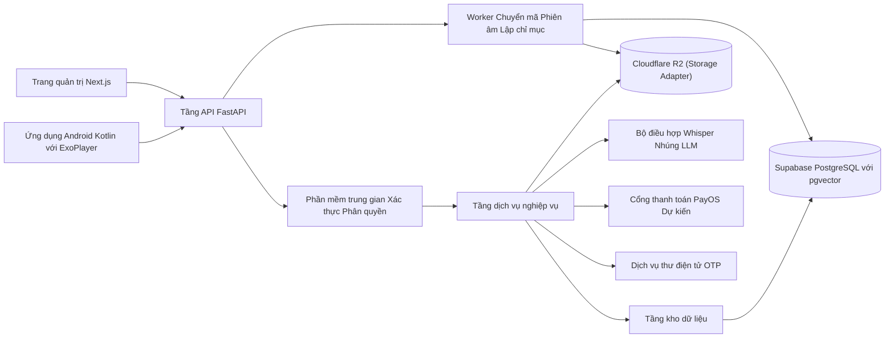
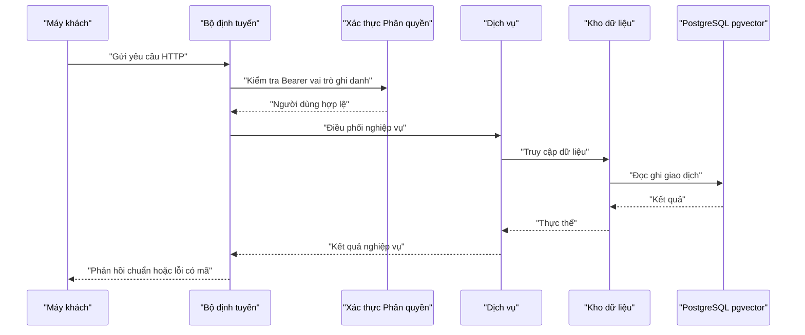

# 10 — Đặc Tả Kiến Trúc Backend (Backend Architecture Specification)

> **Dự án:** Nền tảng học trực tuyến thông minh tích hợp AI Trợ giảng tương tác theo ngữ cảnh bài giảng.
> **Phiên bản tài liệu:** 2.1 — Kế thừa phiên bản 2.0, chốt Cloud stack chính thức duy nhất (Supabase PostgreSQL + pgvector, Cloudflare R2) và bổ sung định nghĩa Storage Adapter, AI Adapter.
> **Nguồn tham chiếu:** `00_SYSTEM_BUSINESS_ANALYSIS.md` [Confirmed], `02_Use_Case_Specification.md` [Confirmed], `08_FE_BE_Data_Contract.md` [Confirmed], `09_BE_Database_Schema.md`.
> **Quy ước trạng thái:** `[Confirmed]`, `[Derived / Proposed]`, `[Dự kiến — Chưa cam kết chính thức]`, `[TBD]` được sử dụng như đã thống nhất toàn hệ thống.

---

## 1. Mục Đích, Phạm Vi Và Đối Tượng Sử Dụng

### 1.1 Mục đích

Tài liệu này mô tả kiến trúc Backend của hệ thống ở mức đủ chi tiết để một nhà phát triển có thể hiểu Backend được tổ chức thành những tầng nào, mỗi tầng chịu trách nhiệm gì, một yêu cầu đi qua hệ thống như thế nào, các mô-đun nghiệp vụ được phân chia ra sao, các công việc nền vận hành thế nào và Backend tích hợp với lưu trữ, trí tuệ nhân tạo và thanh toán bằng cơ chế gì.

Tài liệu giữ nguyên các quyết định kiến trúc đã có trong phiên bản trước, đồng thời bổ sung diễn giải về phạm vi trách nhiệm, đầu vào, đầu ra, quy tắc nghiệp vụ, trạng thái và xử lý lỗi nhằm làm rõ trách nhiệm và quan hệ giữa các thành phần.

### 1.2 Phạm vi

Phạm vi bao gồm ngăn xếp công nghệ, sơ đồ tổng thể, trách nhiệm từng tầng, cấu trúc mô-đun và thư mục, vòng đời yêu cầu, xác thực và phân quyền, công việc nền, kiến trúc lưu trữ, tích hợp trí tuệ nhân tạo, tích hợp thanh toán dự kiến và xử lý lỗi. Tài liệu không chứa mã nguồn triển khai và không thay đổi công nghệ đã chốt.

### 1.3 Đối tượng sử dụng

Nhà phát triển Backend, người phụ trách tích hợp trí tuệ nhân tạo và pipeline video, người quản trị cơ sở dữ liệu và kiểm thử viên tích hợp hệ thống.

---

## 2. Tổng Quan Kiến Trúc

Hệ thống Backend được tổ chức theo mô hình phân tầng kết hợp với xử lý bất đồng bộ cho các tác vụ nặng `[Derived / Proposed]`. Hai ứng dụng khách là ứng dụng di động Android dành cho học viên `[Confirmed]` và trang quản trị web dành cho quản trị viên `[Confirmed]` đều giao tiếp với cùng một tầng giao diện lập trình ứng dụng (API) được xây dựng trên nền tảng FastAPI.

Tầng API chịu trách nhiệm tiếp nhận yêu cầu, kiểm tra xác thực, kiểm tra phân quyền, kiểm tra tính hợp lệ của dữ liệu và điều phối sang tầng dịch vụ nghiệp vụ. Tầng dịch vụ thực thi các quy tắc kinh doanh như điều kiện xuất bản khóa học, điều kiện ghi danh, kiểm soát phạm vi trả lời của trí tuệ nhân tạo và tính điểm bài tập. Tầng kho dữ liệu chịu trách nhiệm truy cập PostgreSQL và pgvector. Các tác vụ tải lên, chuyển mã, phiên âm và lập chỉ mục véc-tơ được tách sang worker chạy nền để không chặn yêu cầu tương tác. Các tích hợp bên ngoài gồm lưu trữ đối tượng, nhà cung cấp mô hình trí tuệ nhân tạo, cổng thanh toán PayOS và dịch vụ thư điện tử được truy cập thông qua các bộ điều hợp biên có ranh giới rõ ràng.

---

## 3. Ngăn Xếp Công Nghệ (Technology Stack)

### 3.0 Cloud Stack chính thức (đã chốt)

Cloud stack của dự án đã được chốt thống nhất trên toàn bộ tài liệu ở giai đoạn hiện tại, không còn mô tả theo dạng nhiều lựa chọn `[Confirmed — Chốt nội bộ]`:

| Thành phần | Công nghệ chốt |
|---|---|
| Cơ sở dữ liệu & véc-tơ | Supabase PostgreSQL + pgvector |
| Lưu trữ đối tượng | Cloudflare R2 |
| Backend API | Python FastAPI |
| Xử lý nền | Worker chạy nền (pipeline video/AI) |
| Chuyển mã video | FFmpeg + ffprobe (tự mã hóa HLS) |
| Nhận dạng giọng nói | Whisper |
| Mô hình nhúng | OpenAI text-embedding-3-small (1536 chiều, phiên bản v1) |
| Mô hình ngôn ngữ | GPT-4o-mini (chính), Gemini Flash (dự phòng) |
| Thanh toán | PayOS (VietQR, webhook HMAC) |

Pipeline xử lý chính được mô tả thống nhất theo luồng:

```text
Client → FastAPI → Supabase PostgreSQL/pgvector + Cloudflare R2 → Worker → FFmpeg/Whisper/Embedding/LLM
```

Quy định đi kèm cloud stack chốt:

- Supabase và Cloudflare R2 là stack Cloud chính thức của dự án ở giai đoạn hiện tại.
- MinIO chỉ được dùng cho mục đích kiểm thử cục bộ khi phát triển, không phải lưu trữ chính thức và không xuất hiện trong pipeline chính.
- AWS không được đưa vào pipeline hiện tại; AWS chỉ được ghi nhận là hướng migration trong tương lai thông qua các bộ điều hợp (Storage Adapter, AI Adapter), xem DE-06.
- Mọi truy cập lưu trữ đối tượng và mô hình bên ngoài đi qua bộ điều hợp biên có ranh giới rõ ràng để business logic không phụ thuộc nhà cung cấp cụ thể.

### 3.1 Tầng giao diện lập trình ứng dụng

Backend sử dụng Python với FastAPI cho tầng API, Pydantic v2 cho kiểm tra dữ liệu, SQLAlchemy 2.0 cho truy cập cơ sở dữ liệu và Alembic cho di trú lược đồ `[Derived / Proposed]`. Lựa chọn này phù hợp với yêu cầu triển khai nhanh, kiểm tra kiểu dữ liệu khớp với hợp đồng `08` và quản lý phiên bản lược đồ có thể quay lui.

### 3.2 Cơ sở dữ liệu và lưu trữ

PostgreSQL kết hợp pgvector là cơ sở dữ liệu chính, triển khai quản trị trên Supabase `[Confirmed — Chốt nội bộ]`. Tệp video, luồng HLS, ảnh thu nhỏ và ảnh đại diện lưu trên Cloudflare R2, phân phối qua mạng phân phối nội dung `[Confirmed — Chốt nội bộ]`. MinIO chỉ dùng để kiểm thử cục bộ khi phát triển, không phải lưu trữ chính thức và không nằm trong pipeline chính. Mọi thao tác lưu trữ đi qua bộ điều hợp lưu trữ (Storage Adapter) và biến môi trường cấu hình, không sửa mã nghiệp vụ khi thay đổi nhà cung cấp; AWS không nằm trong pipeline hiện tại và chỉ được ghi nhận là hướng migration tương lai.

### 3.3 Xử lý video và tải lên

FFmpeg tự triển khai chịu trách nhiệm chuyển mã video sang HLS đa độ phân giải, kèm ffprobe kiểm tra thông tin media `[Derived / Proposed]`. Tải lên sử dụng hai cơ chế gồm tải lên nhiều phần, trong đó mỗi yêu cầu tối đa dưới 200MB cho tệp nhỏ `[Confirmed]`, và tải lên có thể tiếp tục cho tệp dung lượng lớn, trong đó toàn bộ video hoàn chỉnh tối đa 5GB `[Confirmed — Chốt theo hợp đồng 08]`. Video vượt 200MB được cắt thành nhiều phần, mỗi phần dưới 200MB, gửi lần lượt và tiếp tục từ phần còn thiếu khi mất mạng. Video vượt 5GB bị từ chối với lỗi dung lượng quá lớn. Quyết định tự mã hóa bằng FFmpeg, không dùng dịch vụ Stream tính phí nhằm kiểm soát chi phí `[Confirmed — Chốt nội bộ]`.

### 3.4 Trí tuệ nhân tạo

Phiên âm sử dụng Whisper với ngôn ngữ tiếng Việt `[Confirmed]`. Tạo véc-tơ nhúng sử dụng mô hình OpenAI text-embedding-3-small phiên bản v1 với 1536 chiều và độ đo cosine `[Derived / Proposed]`. Mô hình ngôn ngữ chính là GPT-4o-mini, mô hình dự phòng là Gemini Flash `[Confirmed]`. Thời gian chờ gọi mô hình là 30 giây `[Derived / Proposed]`.

### 3.5 Thanh toán, công việc nền, xác thực và quan sát

Thanh toán qua PayOS với mã VietQR và webhook xác nhận là hạng mục dự kiến `[Dự kiến — Chưa cam kết chính thức]`. Công việc nền ở giai đoạn tối thiểu dùng tác vụ nền của FastAPI kết hợp với theo dõi trạng thái qua API, khi mở rộng dùng Celery với Redis `[Derived / Proposed]`. Xác thực dùng JWT với token truy cập 900 giây `[Confirmed]`, token làm mới 7 ngày cho di động và 24 giờ cho quản trị viên `[Derived / Proposed]`, OTP qua email hiệu lực 300 giây `[Confirmed]`. Quan sát hệ thống dùng nhật ký JSON kèm định danh yêu cầu `[Derived / Proposed]`, các công cụ Prometheus và Sentry thuộc phạm vi giai đoạn 2 theo mục quyết định đã chốt `[TBD]`.

---

## 4. Sơ Đồ Kiến Trúc Tổng Thể



Sơ đồ trên phản ánh đúng luồng phụ thuộc: máy khách chỉ gọi API, API đi qua phần mềm trung gian rồi tới dịch vụ, dịch vụ gọi kho dữ liệu (Supabase PostgreSQL + pgvector) và các tích hợp biên qua bộ điều hợp, worker chạy nền cập nhật cơ sở dữ liệu và lưu trữ Cloudflare R2. Pipeline xử lý chính được mô tả thống nhất: Client → FastAPI → Supabase PostgreSQL/pgvector + Cloudflare R2 → Worker → FFmpeg/Whisper/Embedding/LLM `[Confirmed — Chốt nội bộ]`.

---

## 5. Trách Nhiệm Từng Tầng (Layer Responsibilities)

### 5.1 Tầng bộ định tuyến API

Trách nhiệm gồm tiếp nhận yêu cầu HTTP, kiểm tra tính hợp lệ của dữ liệu bằng Pydantic khớp tên trường trong hợp đồng `08`, áp dụng phân trang chung và đối chiếu mã lỗi `[Confirmed]`. Tầng này không chứa quy tắc nghiệp vụ phức tạp, không truy cập trực tiếp cơ sở dữ liệu và không gọi trực tiếp nhà cung cấp AI. Đầu vào là yêu cầu từ máy khách, đầu ra là phản hồi chuẩn hoặc lỗi có mã.

### 5.2 Tầng phần mềm trung gian

Trách nhiệm gồm xác minh token Bearer, tải thông tin người dùng, kiểm tra tài khoản bị khóa và chưa xác minh, kiểm tra vai trò quản trị viên cho các đường dẫn quản trị và kiểm tra ghi danh cho các tài nguyên bài giảng, AI, bài tập và ghi chú `[Confirmed]`. Khi thiếu quyền ghi danh, hệ thống trả về lỗi thiếu quyền ghi danh với mã 403. Tầng này không thực thi logic nghiệp vụ chi tiết.

### 5.3 Tầng dịch vụ nghiệp vụ

Đây là nơi thực thi các quy tắc BR-06 về xuất bản, BR-12 về tiếp tục học, BR-13 về chấm điểm tự động, BR-10 và BR-11 về kiểm soát phạm vi AI, BR-16 về hết hạn thanh toán và BR-08 về phiên bản cùng lập chỉ mục lại `[Confirmed]`. Tầng dịch vụ điều phối kho dữ liệu, worker và bộ điều hợp, đảm bảo tính nhất quán nghiệp vụ. Tầng này không trực tiếp tạo câu lệnh SQL chi tiết và không phụ thuộc vào nhà cung cấp cụ thể.

### 5.4 Tầng kho dữ liệu

Trách nhiệm gồm các thao tác tạo, đọc, cập nhật và xóa trên các bảng đã mô tả trong tài liệu `09`, cùng các giao dịch đảm bảo thanh toán thành công thì kích hoạt ghi danh, nộp bài thì chấm điểm và chỉnh sửa transcript thì tăng phiên bản `[Derived / Proposed]`. Tầng này không chứa quy tắc nghiệp vụ và không gọi API bên ngoài.

### 5.5 Worker và bộ điều hợp

Worker chịu trách nhiệm xử lý tải lên, chuyển mã HLS, phiên âm, lập chỉ mục, lập chỉ mục lại và hết hạn đơn hàng, kèm theo dõi tiến độ và thử lại `[Confirmed — Chốt theo hợp đồng 08]`. Bộ điều hợp AI bọc các nhà cung cấp với thời gian chờ 30 giây và ánh xạ lỗi 502, 503, 504 `[Derived / Proposed]`. Tích hợp thanh toán, thư điện tử và lưu trữ đều đi qua bộ điều hợp biên để dễ thay thế đầu cung cấp.

### 5.6 Ranh giới giao dịch nghiệp vụ

Ranh giới giao dịch được đặt tại tầng dịch vụ nghiệp vụ, còn tầng kho dữ liệu chỉ nhận phiên làm việc cơ sở dữ liệu hiện hành và thực thi thao tác dữ liệu cụ thể `[Derived / Proposed]`. Mỗi yêu cầu ghi dữ liệu chỉ được commit sau khi toàn bộ quy tắc nghiệp vụ liên quan đã thành công; khi một bước thất bại, giao dịch rollback và tầng API trả lỗi theo hợp đồng `08`.

Các luồng bắt buộc có giao dịch nguyên tử gồm: xác minh OTP đăng ký và chuyển tài khoản sang đã xác minh; tạo ghi danh miễn phí; webhook PayOS chuyển đơn sang `paid` và tạo ghi danh; nộp bài, lưu câu trả lời và chấm điểm tự động; chỉnh sửa transcript, tăng phiên bản và tạo yêu cầu lập chỉ mục lại; retry pipeline step, đặt lại trạng thái bước và ghi nhận số lần thử. Những thao tác gọi dịch vụ ngoài như gửi email, gọi AI, tạo mã QR hoặc lưu tệp lên object storage không được giữ giao dịch database mở trong lúc chờ phản hồi mạng. Với các thao tác cần phối hợp giữa database và dịch vụ ngoài, hệ thống ghi trạng thái trung gian trước, sau đó worker hoặc bộ điều hợp cập nhật kết quả bằng thao tác idempotent.

---

## 6. Cấu Trúc Mô-Đun Và Thư Mục

### 6.1 Các mô-đun nghiệp vụ

Backend được chia thành các mô-đun gồm xác thực, người dùng, danh mục, khóa học, bài giảng và chương, video và pipeline, transcript, trí tuệ nhân tạo, ngân hàng câu hỏi, đề thi, ghi chú, tiến độ và ghi danh, đơn hàng, thông báo, phân tích và mô-đun dùng chung `[Derived / Proposed]`. Mỗi mô-đun có bộ định tuyến, lược đồ dữ liệu, dịch vụ và kho dữ liệu riêng, giúp cô lập thay đổi và kiểm thử độc lập.

### 6.2 Bố cục thư mục đề xuất

Bố cục gồm điểm khởi động ứng dụng, cấu hình, bảo mật, phụ thuộc dùng chung, giới hạn tần suất, lưu trữ và thư điện tử ở tầng lõi. Mỗi mô-đun nghiệp vụ có bốn thành phần tương ứng. Thư mục worker chứa các tác vụ tải lên, chuyển mã, phiên âm, lập chỉ mục, lập chỉ mục lại và hết hạn đơn hàng. Thư mục bộ điều hợp AI chứa các trình bọc Whisper, nhúng, mô hình ngôn ngữ và mẫu nhắc. Thư mục cơ sở dữ liệu chứa khai báo nền, phiên làm việc, mô hình và tập lệnh di trú. Môi trường phát triển dùng container gồm API và PostgreSQL có pgvector; MinIO chỉ dùng làm container kiểm thử lưu trữ cục bộ, Redis từ xa dành cho giai đoạn mở rộng `[Derived / Proposed]`.

Ví dụ bố cục triển khai:

```text
app/
  main.py
  core/
    config.py
    security.py
    permissions.py
    rate_limit.py
    errors.py
  db/
    session.py
    models/
    migrations/
  modules/
    auth/
      router.py
      schemas.py
      service.py
      repository.py
    courses/
    lessons/
    videos/
    transcripts/
    ai/
    exams/
    notes/
    progress/
    orders/
    notifications/
    analytics/
  workers/
    video_pipeline.py
    reindex.py
    order_expiry.py
  adapters/
    storage.py
    mailer.py
    payos.py
    ai/
      whisper.py
      embeddings.py
      llm.py
      prompts/
```

### 6.3 Quy tắc phụ thuộc giữa các mô-đun

Luồng phụ thuộc chuẩn là `router -> service -> repository -> database`; router không gọi trực tiếp repository, repository không gọi service, và repository không gọi dịch vụ ngoài `[Derived / Proposed]`. Các module nghiệp vụ không truy cập bảng của module khác bằng câu lệnh tùy ý; khi cần dữ liệu liên module, service điều phối qua repository chuyên trách hoặc qua một truy vấn đọc được đặt trong module sở hữu dữ liệu. Bộ điều hợp lưu trữ, PayOS, email và AI chỉ được gọi từ service hoặc worker, không gọi từ router.

Mọi schema request/response dùng Pydantic và giữ tên trường đúng hợp đồng `08`. Model SQLAlchemy phản ánh lược đồ trong tài liệu `09`; thay đổi lược đồ phải đi qua Alembic, không sửa thủ công database. Các hằng số dùng chung như mã lỗi, vai trò, trạng thái pipeline và trạng thái đơn hàng đặt trong `core` hoặc enum trung tâm để tránh mỗi module tự định nghĩa một biến thể riêng.

---

## 7. Vòng Đời Yêu Cầu (Request Lifecycle)

Một yêu cầu điển hình đi qua các bước gồm máy khách gửi tới bộ định tuyến, kiểm tra xác thực, kiểm tra phân quyền, kiểm tra tính hợp lệ của dữ liệu, thực thi dịch vụ nghiệp vụ, truy cập kho dữ liệu và cơ sở dữ liệu, sau đó trả phản hồi chuẩn `[Derived / Proposed]`.



### 7.1 Luồng xem video

Học viên lấy danh sách khóa học, lấy chi tiết bài giảng gồm đường dẫn phát, phụ đề và chương, sau đó trình phát tải luồng HLS và gửi vị trí xem mỗi 5 đến 10 giây `[Confirmed]`. Backend kiểm tra bài học thử hoặc quyền ghi danh trước khi trả đường dẫn phát.

### 7.2 Luồng hỏi đáp AI

Học viên gửi câu hỏi kèm mốc thời gian, Backend kiểm tra ghi danh, trạng thái video, độ dài câu hỏi và hạn mức ngày, sau đó tạo véc-tơ câu hỏi cùng phiên bản hiệu lực, truy xuất Top-K trong phạm vi bài giảng, xây dựng mẫu nhắc có kiểm soát phạm vi, gọi mô hình ngôn ngữ, lưu nhật ký và trả lời kèm nguồn trích dẫn `[Confirmed]`.

### 7.3 Luồng tải lên và thanh toán

Quản trị viên khởi tạo tải lên, Backend tạo bản ghi video và bốn bước pipeline gồm tải lên, chuyển mã, phiên âm và lập chỉ mục, worker xử lý nền và máy khách theo dõi trạng thái qua API cho tới khi hoàn tất hoặc thử lại từng bước `[Confirmed]`. Video vượt 200MB được cắt thành nhiều phần, mỗi phần dưới 200MB, gửi lần lượt qua giao thức tải lên có thể tiếp tục, toàn bộ video tối đa 5GB `[Confirmed — Chốt theo hợp đồng 08]`. Thanh toán dự kiến tạo đơn hàng và mã QR, máy khách theo dõi trạng thái, webhook xác nhận sẽ kích hoạt ghi danh và công việc nền sẽ hết hạn đơn hàng sau 15 phút `[Dự kiến — Chưa cam kết chính thức]`.

---

## 8. Xác Thực, Phân Quyền, Lưu Trữ, Tích Hợp Và Xử Lý Lỗi

### 8.1 Xác thực và phân quyền

Hệ thống chỉ có hai vai trò là học viên và quản trị viên `[Confirmed]`. Token truy cập hiệu lực 900 giây, token làm mới xoay vòng và thu hồi theo nguyên tắc một thiết bị cho học viên. OTP 6 chữ số hiệu lực 300 giây, giới hạn 5 lần sai trong 15 phút và mã chỉ được dùng một lần. Các đường dẫn quản trị yêu cầu vai trò quản trị viên, các tài nguyên học tập yêu cầu quyền ghi danh hoặc bài học thử.

### 8.2 Công việc nền

Các công việc gồm tải lên, chuyển mã HLS, phiên âm, lập chỉ mục, lập chỉ mục lại, hết hạn đơn hàng và tổng hợp tiến độ `[Confirmed — Chốt theo hợp đồng 08]`. Mỗi công việc được tạo sau một sự kiện như tải lên xong hoặc chỉnh sửa transcript, có trạng thái đang chờ, đang xử lý, hoàn tất và thất bại, có số lần thử lại và lưu thông điệp lỗi. Máy khách theo dõi qua API trạng thái pipeline thay vì kết nối thời gian thực ở giai đoạn hiện tại: trang quản trị polling mỗi 10 giây, máy khách polling trạng thái thanh toán mỗi 3 giây theo hợp đồng `08`; response lỗi khi hết hạn mức AI gồm mã 429 kèm số lượt còn lại và thời điểm reset (trường `questions_remaining` đã có trong phản hồi 4.1).

### 8.3 Kiến trúc lưu trữ

PostgreSQL lưu toàn bộ dữ liệu quan hệ và véc-tơ trên Supabase `[Confirmed — Chốt nội bộ]`. Lưu trữ đối tượng chính thức là Cloudflare R2, lưu tệp thô, các tệp HLS, ảnh thu nhỏ và ảnh đại diện, phân phối qua mạng phân phối nội dung; hạn mức miễn phí mỗi tháng gồm 10GB lưu trữ chuẩn, 1 triệu yêu cầu loại A, 10 triệu yêu cầu loại B và miễn phí băng thông ra `[Confirmed — Chốt nội bộ]`. MinIO chỉ dùng để kiểm thử cục bộ khi phát triển và không xuất hiện trong pipeline chính. Transcript, đoạn văn bản và véc-tơ lưu trong PostgreSQL để đảm bảo toàn vẹn và truy xuất trong cùng một giao dịch logic.

Mọi thao tác với lưu trữ đối tượng đi qua một interface bộ điều hợp lưu trữ (Storage Adapter) duy nhất với các thao tác chuẩn gồm tải tệp lên, tải thư mục HLS lên, cấp đường dẫn truy cập có chữ ký và xóa tệp. Tầng dịch vụ và worker chỉ gọi interface này, không dùng SDK của nhà cung cấp trực tiếp và không giữ giao dịch cơ sở dữ liệu mở trong lúc chờ phản hồi mạng. Việc thay đổi nhà cung cấp lưu trữ về sau chỉ cần viết bộ điều hợp mới và đổi biến môi trường, không sửa logic nghiệp vụ.

### 8.4 Tích hợp AI và thanh toán

Backend giao tiếp với nhà cung cấp AI qua bộ điều hợp với thời gian chờ 30 giây, mẫu nhắc được quản lý phiên bản và tóm tắt được lưu bộ nhớ đệm theo phiên bản transcript `[Derived / Proposed]`. Giá trị tham số truy xuất (Top-K, ngưỡng, tăng trọng thời gian) và giới hạn dung lượng lấy từ mục quyết định đã chốt của tài liệu `09` và hợp đồng `08`; tài liệu này không định nghĩa lại.

Bộ điều hợp AI được tổ chức thành interface AI Adapter duy nhất gồm ba trình bọc: phiên âm (Whisper), nhúng (OpenAI text-embedding-3-small, 1536 chiều, phiên bản v1) và mô hình ngôn ngữ (GPT-4o-mini chính, Gemini Flash dự phòng theo chính sách thử mô hình chính 1 lần rồi fallback đúng 1 lần, tổng thời gian không vượt quá 60 giây). Tầng dịch vụ và worker chỉ gọi interface, không gọi SDK của nhà cung cấp trực tiếp, nên việc thay đổi nhà cung cấp AI về sau không sửa business logic `[Confirmed — Chốt nội bộ]`.

Tích hợp PayOS gồm tạo đơn hàng, trả mã QR, nhận webhook và kích hoạt ghi danh. Endpoint webhook `POST /api/webhooks/payos` xác thực bằng chữ ký HMAC (không dùng JWT) và bắt buộc đảm bảo hai tính chất: **idempotency** — sự kiện trùng lặp cho cùng một mã đơn hàng chỉ cập nhật một lần, gọi lại trả 200 không đổi dữ liệu; và **nguyên tử** — ghi nhận trạng thái `paid` và tạo ghi danh trong cùng một giao dịch database, không tách rời `[Dự kiến — Chưa cam kết chính thức]`. Đơn chỉ được chuyển `paid` khi đang `pending` và chưa quá thời điểm hết hạn.

Báo cáo hành vi học viên ở mức MVP được tổng hợp từ dữ liệu hiện có như ghi danh, tiến độ bài giảng, lần làm bài và nhật ký hỏi đáp AI. Các biểu đồ nâng cao như tỷ lệ bỏ dở theo thời điểm, lượt xem chính xác, retention chi tiết và thời gian học theo phiên yêu cầu telemetry sự kiện riêng; nếu telemetry chưa được bật, Backend chỉ trả các chỉ số tổng hợp hoặc mảng rỗng cho trường nâng cao theo hợp đồng `08` `[Derived / Proposed]`.

### 8.5 Xử lý lỗi và quan sát

Mọi lỗi tuân thủ mã lỗi trong hợp đồng `08` gồm lỗi kiểm tra dữ liệu 400, lỗi xác thực 401, lỗi phân quyền 403 trong đó thiếu ghi danh dùng mã riêng, lỗi không tồn tại 404, lỗi xung đột 409, lỗi nghiệp vụ AI 422 và lỗi hệ thống 500 `[Confirmed]`. Nhật ký JSON ghi định danh yêu cầu, người dùng, bài giảng, video và độ trễ, không ghi thông tin nhạy cảm.

### 8.6 Bảo mật vận hành

Rate limit được áp dụng theo nhóm endpoint nhạy cảm: đăng nhập, gửi OTP, xác minh OTP, hỏi đáp AI, tạo tóm tắt, upload video và webhook thanh toán `[Derived / Proposed]`. Giới hạn được tính theo IP, tài khoản hoặc email tùy luồng; phản hồi khi vượt hạn mức dùng mã 429 theo hợp đồng `08`. CORS chỉ cho phép origin của ứng dụng web quản trị và môi trường phát triển đã cấu hình, không dùng wildcard ở môi trường chính thức.

Webhook PayOS xác thực bằng chữ ký HMAC trên payload gốc, kiểm tra timestamp hoặc mã sự kiện nếu nhà cung cấp gửi kèm để giảm rủi ro phát lại, và xử lý idempotent theo mã đơn hàng. Secret dùng cho JWT, refresh token, PayOS, email, object storage và nhà cung cấp AI chỉ đọc từ biến môi trường hoặc kho bí mật triển khai; secret không được ghi vào log, tài liệu mẫu hoặc mã nguồn. Khi xoay secret, hệ thống ưu tiên cơ chế cho phép song song secret cũ và mới trong một khoảng ngắn với JWT và webhook để tránh làm gián đoạn phiên hợp lệ `[Derived / Proposed]`.

Đường dẫn HLS, tệp thô, ảnh đại diện và ảnh thumbnail được cấp qua signed URL hoặc public URL có phạm vi phù hợp. Signed HLS URL cho bài giảng có phí chỉ được tạo sau khi kiểm tra quyền ghi danh hoặc bài học thử, có thời hạn ngắn và không được lưu lâu dài ở client. Dữ liệu nhạy cảm như mật khẩu gốc, mã OTP gốc, refresh token gốc, chữ ký webhook và nội dung secret không bao giờ lưu dạng plaintext; chỉ lưu hash hoặc metadata cần thiết.

---

## 9. Quyết Định Đã Chốt (Không Còn Xung Đột Mở)

1. DE-01 Giới hạn dung lượng tải lên [Confirmed — Chốt theo hợp đồng 08]: Mỗi yêu cầu tải lên nhiều phần tối đa dưới 200MB. Toàn bộ video hoàn chỉnh tối đa 5GB. Video vượt 200MB được cắt thành nhiều phần và tải lên có thể tiếp tục.
2. DE-02 Tên bước pipeline [Confirmed — Chốt theo hợp đồng 08]: Dùng 4 bước gồm tải lên (upload), chuyển mã (transcode), phiên âm (transcribe) và lập chỉ mục (index) cho API và cơ sở dữ liệu. Hợp đồng 08 hiện ghi tên bước phiên âm là stt, ánh xạ sang phiên âm khi cần tương thích API. Bước chuyển mã tương ứng xử lý HLS, bước phiên âm tương ứng xử lý nhận dạng giọng nói, bước lập chỉ mục tương ứng xử lý lập chỉ mục trong tài liệu 00.
3. DE-03 Tên trạng thái [Confirmed — Chốt theo hợp đồng 08]: Tầng dữ liệu và API dùng hoàn tất cho video và đã thanh toán cho đơn hàng. Tên nghiệp vụ sẵn sàng và thành công chỉ dùng mô tả và hiển thị.
4. DE-04 Cloud stack chính thức [Confirmed — Chốt nội bộ]: Supabase PostgreSQL + pgvector là cơ sở dữ liệu chính thức và Cloudflare R2 là lưu trữ đối tượng chính thức duy nhất cho tệp thô, HLS, ảnh thu nhỏ và ảnh đại diện với hạn mức miễn phí 10GB lưu trữ, 1 triệu yêu cầu loại A, 10 triệu yêu cầu loại B và miễn phí băng thông ra. MinIO chỉ dùng để kiểm thử cục bộ khi phát triển, không phải lưu trữ chính thức và không nằm trong pipeline chính. Mọi thao tác lưu trữ đi qua Storage Adapter và mọi truy cập mô hình AI đi qua AI Adapter để business logic không phụ thuộc nhà cung cấp.
5. DE-05 Phạm vi giai đoạn 2 [TBD]: Giám sát nâng cao, đánh giá sao, slide bài giảng và báo cáo phân tích nâng cao thuộc giai đoạn 2.
6. DE-06 Hướng migration tương lai [TBD]: AWS được ghi nhận là hướng mở rộng trong tương lai, ví dụ AWS S3 cho lưu trữ đối tượng. AWS không được đưa vào pipeline hiện tại; khi dự án thực sự cần chuyển đổi, chỉ bổ sung bộ điều hợp mới cho Storage Adapter và đổi biến môi trường mà không sửa logic nghiệp vụ.

---

## 10. Phạm Vi Đối Chiếu Và Ghi Chú Kết Thúc

Phạm vi đối chiếu của tài liệu này gồm lược đồ trong tài liệu `09`, hợp đồng dữ liệu trong tài liệu `08`, các quy tắc nghiệp vụ trong tài liệu `00` và các use case trong tài liệu `02`, cùng các giai đoạn pipeline trí tuệ nhân tạo trong tài liệu `11` sử dụng nền tảng kiến trúc này.
