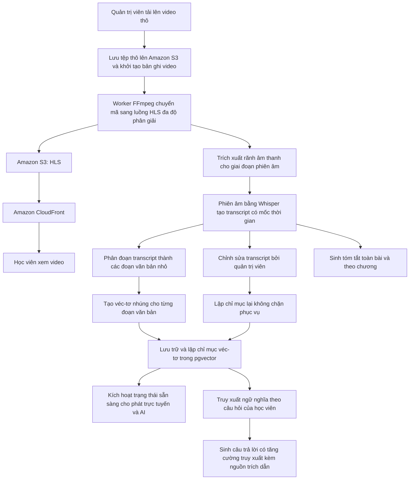
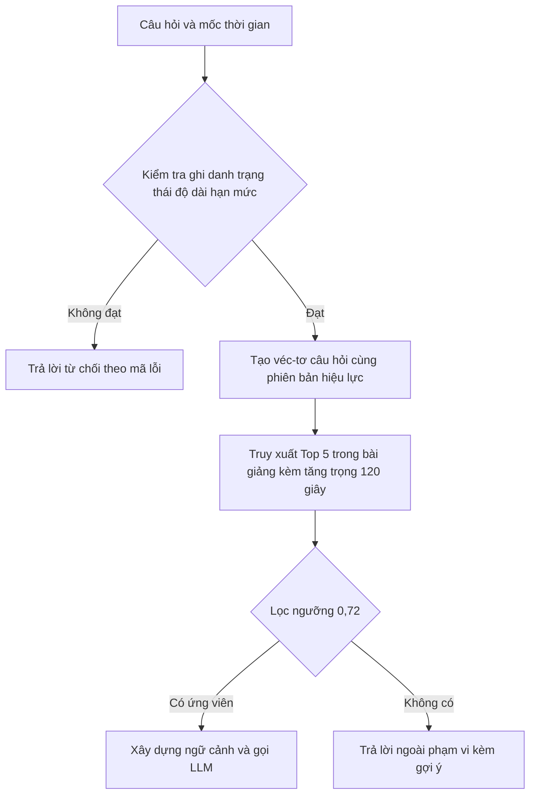
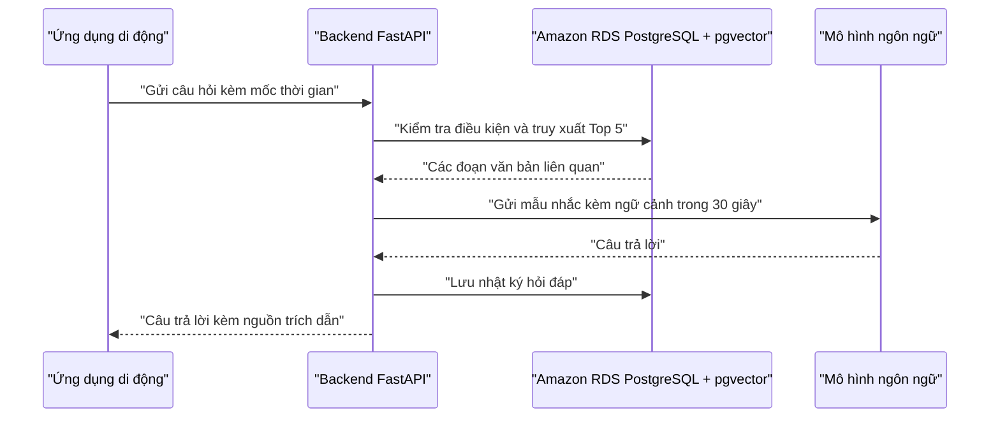

# 11 — Đặc Tả Pipeline Trí Tuệ Nhân Tạo (AI Pipeline Specification)

> **Dự án:** Nền tảng học trực tuyến thông minh tích hợp AI Trợ giảng tương tác theo ngữ cảnh bài giảng.
> **Phiên bản tài liệu:** 2.1 — Kế thừa phiên bản 2.0, cập nhật hạ tầng triển khai theo kiến trúc AWS gồm EC2, Amazon RDS PostgreSQL + pgvector, Amazon S3 và Amazon CloudFront.
> **Nguồn tham chiếu:** `00_SYSTEM_BUSINESS_ANALYSIS.md` các quy tắc BR-07, BR-08, BR-10, BR-11, BR-15 [Confirmed], `02_Use_Case_Specification.md` các UC-08, UC-09, UC-10, UC-11, UC-28, UC-29 [Confirmed], `08_FE_BE_Data_Contract.md` [Confirmed], `09_BE_Database_Schema.md`, `10_BE_Architecture.md`.
> **Quy ước trạng thái:** `[Confirmed]`, `[Derived / Proposed]`, `[Dự kiến — Chưa cam kết chính thức]`, `[TBD]`.

---

## 1. Mục Đích, Phạm Vi Và Đối Tượng Sử Dụng

### 1.1 Mục đích

Tài liệu này mô tả chuỗi xử lý video và trí tuệ nhân tạo, từ khi quản trị viên tải lên video thô đến khi học viên xem video trực tuyến, đọc phụ đề đồng bộ, đặt câu hỏi cho AI Trợ giảng và nhận tóm tắt bài giảng kèm nguồn trích dẫn có mốc thời gian.

Mỗi giai đoạn được mô tả theo cấu trúc thống nhất gồm mục đích, đầu vào, xử lý, đầu ra, dữ liệu và lưu trữ liên quan, trạng thái, trường hợp lỗi và cơ chế thử lại. Cách trình bày này hạn chế việc phải suy đoán khi triển khai pipeline.

### 1.2 Phạm vi

Phạm vi bao gồm tải lên video, chuyển mã sang luồng HLS, trích xuất âm thanh, phiên âm thành transcript, phân đoạn transcript thành các đoạn văn bản nhỏ, tạo véc-tơ nhúng, lập chỉ mục véc-tơ, truy xuất ngữ nghĩa, sinh câu trả lời có tăng cường truy xuất (RAG), sinh tóm tắt, ghi nhận phản hồi, thử lại khi lỗi, lập chỉ mục lại và quản lý phiên bản. Tài liệu không thay đổi mô hình, số chiều véc-tơ, ngưỡng hay kích thước đoạn văn bản đã chốt.

### 1.3 Đối tượng sử dụng

Nhà phát triển Backend phụ trách pipeline video, nhà phát triển tích hợp mô hình ngôn ngữ lớn và tìm kiếm véc-tơ, người quản trị nội dung cần hiểu vòng đời xử lý và người kiểm thử pipeline.

---

## 2. Tổng Quan Pipeline Trí Tuệ Nhân Tạo

### 2.1 Mục tiêu của pipeline

Pipeline phục vụ hai mục tiêu nghiệp vụ song song `[Confirmed]`. Thứ nhất, biến video thô thành luồng phát trực tuyến đa độ phân giải để học viên xem mượt mà trên nhiều điều kiện mạng. Thứ hai, biến nội dung lời giảng trong video thành tri thức có cấu trúc gồm transcript, đoạn văn bản và véc-tơ nhúng để AI Trợ giảng có thể trả lời câu hỏi bám sát bài giảng và tạo tóm tắt có căn cứ.

### 2.2 Sơ đồ tổng thể



Toàn bộ pipeline chạy trên hạ tầng AWS chính thức đã chốt của dự án: Amazon EC2 chạy FastAPI và Worker; Amazon RDS for PostgreSQL + pgvector lưu dữ liệu và véc-tơ; Amazon S3 lưu tệp video thô, luồng HLS, ảnh thu nhỏ và ảnh đại diện; Amazon CloudFront phân phối HLS và tài nguyên từ S3. Worker trên EC2 điều phối các bước FFmpeg, Whisper, Embedding và LLM `[Confirmed — Chốt nội bộ]`. Pipeline không sử dụng cơ sở dữ liệu hoặc object storage bền vững cục bộ trên EC2; chỉ sử dụng ổ đĩa tạm thời cho các tệp trung gian của pipeline và phải dọn dẹp sau khi xử lý.

### 2.3 Các giai đoạn chính và trạng thái

Chuỗi xử lý gồm tải lên video thô, chuyển mã sang HLS, trích xuất âm thanh, phiên âm thành transcript, phân đoạn transcript, tạo véc-tơ nhúng, lập chỉ mục và kích hoạt phục vụ `[Confirmed — Chốt theo hợp đồng 08]`. Trạng thái tổng thể của video gồm đang tải lên, đã tải lên, đang xử lý, hoàn tất và thất bại. Trạng thái chi tiết từng bước gồm đang chờ, đang xử lý, hoàn tất và thất bại. Hành động hủy trong lúc xử lý đưa video về trạng thái đã tải lên để giữ tệp thô `[Confirmed]`.

---

## 3. Tải Lên Video (Video Upload)

### 3.1 Mục đích

Tiếp nhận tệp video thô từ quản trị viên, lưu trữ an toàn và khởi tạo bản ghi theo dõi pipeline `[Confirmed]`.

### 3.2 Đầu vào

Đầu vào gồm định danh bài giảng, tệp video, tên tệp gốc, định dạng và dung lượng. Mỗi yêu cầu tải lên nhiều phần có dung lượng dưới 200MB `[Confirmed]`. Toàn bộ video hoàn chỉnh tối đa 5GB `[Confirmed — Chốt theo hợp đồng 08]`. Video vượt 200MB được cắt thành nhiều phần, mỗi phần dưới 200MB, gửi lần lượt qua giao thức tải lên có thể tiếp tục và tiếp tục từ phần còn thiếu khi mất mạng.

### 3.3 Xử lý

Backend kiểm tra định dạng thuộc danh sách cho phép, kiểm tra quyền quản trị viên và bài giảng thuộc khóa học hợp lệ, sau đó lưu tệp thô lên Amazon S3 thông qua Storage Adapter, tạo bản ghi video ở trạng thái đang tải lên rồi chuyển sang đã tải lên, đồng thời khởi tạo các bước pipeline ở trạng thái đang chờ `[Confirmed]`.

#### 3.3.1 Giao thức tải lên nhiều phần bằng presigned URL `[Confirmed — Chốt nội bộ]`

Backend **không** trung chuyển dữ liệu video. Máy khách tải từng phần **trực tiếp lên Amazon S3** qua URL có chữ ký do Backend cấp; Backend chỉ giữ metadata và trạng thái. Mọi thao tác lưu trữ đi qua Storage Adapter, không import SDK nhà cung cấp trong tầng service/router.

| Bước | Endpoint | Việc Backend làm |
|---|---|---|
| 1. Khởi tạo | `POST /api/admin/videos/upload/init` | Kiểm tra quyền và bài giảng; kiểm tra `file_size_bytes` ≤ 5GB và định dạng hợp lệ; tạo bản ghi `videos` ở trạng thái `uploading` cùng 4 bản ghi `pipeline_steps` ở `pending`; gọi Amazon S3 khởi tạo multipart upload và trả về `upload_id`, `part_size`, tổng số phần |
| 2. Tải từng phần | `POST /api/admin/videos/upload` | Cấp URL có chữ ký cho một `part_number`; máy khách `PUT` trực tiếp lên S3 và nhận lại `ETag` |
| 3. Hoàn tất | `POST /api/admin/videos/upload` với `part_number = 0` (hoặc tham số `complete`) | Nhận danh sách `{part_number, etag}`, ghép tệp trên S3, cập nhật `raw_storage_url` và chuyển `overall_status` sang `uploaded`, kích hoạt worker `transcode` |
| 4. Tiếp tục khi mất mạng | gọi lại bước 1 | Trả về danh sách phần đã nhận (đọc từ S3) để máy khách gửi tiếp các phần còn thiếu |
| 5. Hủy | `PUT /api/admin/pipeline/{video_id}/cancel` | Hủy phiên multipart trên S3, đưa video về trạng thái `uploaded` hoặc `failed` |

Ràng buộc kỹ thuật:
- Kích thước mỗi phần: **tối thiểu 5MB** (riêng phần cuối được nhỏ hơn) và **tối đa 200MB** — giới hạn 5MB là quy định của giao thức multipart tương thích S3, không phải lựa chọn thiết kế.
- Toàn bộ video tối đa **5GB**; vượt ngưỡng trả lỗi `413 FILE_TOO_LARGE`.
- Kích thước phần khuyến nghị **50MB**; với 5GB thì tổng số phần khoảng 100, thấp hơn nhiều so với hạn mức 10.000 phần của giao thức.
- URL có chữ ký có thời hạn ngắn; hết hạn thì máy khách xin lại URL cho phần đó chứ không làm hỏng phiên tải lên.
- Backend kiểm tra định dạng ở bước 1 dựa trên tên tệp và MIME do máy khách khai báo; kiểm tra sâu bằng `ffprobe` thực hiện ở bước `transcode`.

### 3.3.2 Triển khai worker trên Amazon EC2

Worker pipeline chạy trên cùng máy Amazon EC2 với FastAPI ở giai đoạn MVP `[Confirmed — Chốt theo kiến trúc 10]`. Worker sử dụng FFmpeg/ffprobe và Whisper cục bộ; các tệp trung gian có thể dùng ổ đĩa tạm của EC2 trong thời gian xử lý nhưng không được coi là nơi lưu trữ bền vững. Dữ liệu đầu ra cần giữ lại phải được ghi lên Amazon S3 hoặc Amazon RDS PostgreSQL + pgvector.

### 3.4 Đầu ra và kích hoạt

Đầu ra gồm định danh video, trạng thái và tiến trình tải lên. Khi tệp thô đã đầy đủ, Backend kích hoạt worker chuyển mã HLS. Trường hợp lỗi mạng hoặc tệp không hợp lệ, hệ thống giữ tệp thô đã nhận, ghi thông điệp lỗi và cho phép tải lại hoặc tiếp tục từ phần còn thiếu. Hành động hủy đưa video về trạng thái đã tải lên `[Confirmed]`.

---

## 4. Xử Lý Video Và Trích Xuất Âm Thanh

### 4.1 Chuyển mã sang HLS

Worker dùng FFmpeg để chuyển tệp thô thành luồng HLS đa độ phân giải `[Confirmed]`. Đầu ra gồm playlist chính và các playlist thành phần cùng các đoạn video nhỏ, được lưu lên Amazon S3 và phân phối qua Amazon CloudFront. Đường dẫn playlist chính được lưu vào cột đường dẫn HLS của bảng videos. Lựa chọn tự triển khai FFmpeg thay cho dịch vụ Stream tính phí nhằm kiểm soát chi phí `[Confirmed — Chốt nội bộ]`. Tên bước trong API và cơ sở dữ liệu là chuyển mã, tương ứng bước `transcode` trong hợp đồng `08` `[Confirmed — Chốt theo hợp đồng 08]`.

#### 4.1.1 Thang chất lượng và tham số mã hóa `[Confirmed — Chốt nội bộ]`

Dùng **3 mức chất lượng** để cân bằng giữa dung lượng lưu trữ S3 và trải nghiệm xem trên thiết bị di động:

| Mức | Độ phân giải | Video bitrate | Audio |
|---|---|---|---|
| 1080p | 1920×1080 | 4.5 Mbps (H.264 High) | AAC 128 kbps, 48kHz, stereo |
| 720p | 1280×720 | 2.5 Mbps (H.264 Main) | AAC 128 kbps, 48kHz, stereo |
| 480p | 854×480 | 1.2 Mbps (H.264 Main) | AAC 128 kbps, 48kHz, stereo |

Tham số bắt buộc:
- `-hls_time 6` — mỗi đoạn dài 6 giây.
- Keyframe interval cố định **2 giây** (`-g 2 × fps`, `-keyint_min` bằng cùng giá trị, `-sc_threshold 0`) để mọi mức có điểm cắt đoạn trùng nhau, cho phép chuyển mức mượt.
- `-hls_playlist_type vod`, `-hls_segment_filename` đặt tên đoạn theo mức chất lượng.
- Playlist chính `master.m3u8` khai báo cả 3 biến thể kèm `BANDWIDTH` và `RESOLUTION`.
- Không tạo bản 360p ở giai đoạn hiện tại; có thể bổ sung sau bằng cách chạy lại bước `transcode`.

Thư mục HLS trên S3 dùng tiền tố `hls/{video_id}/` và đường dẫn playlist chính được phân phối qua CloudFront theo dạng `{storage_public_base_url}/hls/{video_id}/master.m3u8`, trong đó `storage_public_base_url` trỏ tới domain CloudFront của môi trường.

### 4.2 Trích xuất âm thanh

Sau khi có HLS hoặc từ tệp thô, worker trích xuất rãnh âm thanh thành định dạng WAV đơn kênh tần số 16kHz phục vụ giai đoạn phiên âm `[Derived / Proposed]`. Tệp âm thanh trung gian được lưu tạm thời và xóa sau khi phiên âm xong để tiết kiệm lưu trữ.

### 4.3 Lỗi và thử lại

Lỗi chuyển mã do tệp hỏng hoặc tham số không phù hợp sẽ đánh dấu bước tải lên và xử lý thất bại, giữ lại tệp thô và cho phép chạy lại độc lập `[Confirmed]`.

---

## 5. Phiên Âm Âm Thanh Thành Transcript (Speech-to-Text)

### 5.1 Mục đích và đầu vào

Giai đoạn này biến lời giảng trong âm thanh thành văn bản có mốc thời gian `[Confirmed]`. Đầu vào là tệp âm thanh đã trích xuất, ngôn ngữ tiếng Việt và định danh video cùng bài giảng liên quan. Tên bước trong API và cơ sở dữ liệu là phiên âm, tương ứng bước `transcribe` trong hợp đồng `08` `[Confirmed — Chốt theo hợp đồng 08]`.

### 5.2 Xử lý bằng Whisper

Hệ thống phiên âm bằng **Whisper chạy cục bộ** trên máy worker thông qua thư viện `faster-whisper` (CTranslate2) `[Confirmed — Chốt nội bộ]`. Chạy cục bộ không có giới hạn dung lượng tệp như API nên **không cần cắt audio thủ công** và không phát sinh chi phí theo phút phiên âm.

| Tham số | Biến môi trường | Giá trị chốt |
|---|---|---|
| Kích thước mô hình | `WHISPER_MODEL_SIZE` | `small` (đổi sang `medium` hoặc `large-v3` khi cần độ chính xác cao hơn) |
| Thiết bị | `WHISPER_DEVICE` | `auto` (dùng CPU nếu không có GPU) |
| Kiểu tính toán | `WHISPER_COMPUTE_TYPE` | `int8` khi chạy CPU, `float16` khi chạy GPU. **Không dùng `float16` trên CPU** |
| Beam size | `WHISPER_BEAM_SIZE` | `5` |
| Lọc khoảng lặng | `WHISPER_VAD_FILTER` | `true` — tăng tốc và giảm phụ đề ảo giác |
| Ngôn ngữ | `WHISPER_LANGUAGE` | `vi` |

Thông số tham chiếu đã đo: model `small` với `int8` trên CPU 8 luồng xử lý 13 phút audio trong khoảng 1 phút 42 giây và dùng khoảng 1.5GB RAM. Do đó **bước phiên âm là bước chậm nhất trong pipeline**, cần báo tiến độ và cơ chế thu hồi job khi worker dừng đột ngột.

Đầu vào là tệp WAV đơn kênh 16kHz do mục 4.2 tạo ra trên ổ đĩa tạm của EC2; tệp này phải được xoá trong khối `finally` sau khi phiên âm xong (khoảng 115MB cho bài giảng 60 phút). Kết quả gồm nhiều đoạn, mỗi đoạn có thời điểm bắt đầu, thời điểm kết thúc và nội dung văn bản tính bằng giây, bảo đảm sai số không quá 0.5 giây theo BR-15. Backend lưu một bản ghi transcript với số phiên bản khởi tạo bằng 1 và lưu toàn bộ đoạn chi tiết vào bảng đoạn transcript theo số thứ tự.

Lần chạy đầu tiên tải trọng số mô hình (khoảng 0.5GB với `small`) từ HuggingFace Hub về máy worker, nên worker cần quyền truy cập mạng và dung lượng ổ đĩa tương ứng.

### 5.3 Đầu ra và đồng bộ phụ đề

Đầu ra phục vụ hai mục đích gồm hiển thị phụ đề đồng bộ trên ứng dụng di động với sai số cho phép cộng trừ 0.5 giây theo BR-15 `[Confirmed]` và làm nguyên liệu cho phân đoạn truy xuất. Quản trị viên có thể duyệt và chỉnh sửa phụ đề qua màn hình quản trị. Nếu chỉ thay đổi mốc thời gian, hệ thống lưu lại mà không lập chỉ mục lại. Nếu thay đổi nội dung văn bản, hệ thống tăng phiên bản transcript và kích hoạt lập chỉ mục lại, đồng thời trả về cờ đã kích hoạt lập chỉ mục lại `[Confirmed]`.

---

## 6. Phân Đoạn Transcript Thành Chunk (Transcript Chunking)

### 6.1 Chunk là gì và vì sao cần chia nhỏ

Chunk là một đoạn văn bản ngắn được gom từ một hoặc nhiều dòng transcript liền kề, mang đầy đủ ngữ cảnh của một ý giảng `[Derived / Proposed]`. Việc chia nhỏ là bắt buộc vì mô hình nhúng và mô hình ngôn ngữ xử lý hiệu quả nhất trên các đơn vị văn bản có độ dài vừa phải. Nếu đưa toàn bộ transcript vào một véc-tơ duy nhất, ý nghĩa ngữ nghĩa sẽ bị pha loãng và truy xuất không thể trỏ chính xác tới mốc thời gian liên quan. Biên kích thước: mỗi chunk không được vượt quá giới hạn đầu vào của mô hình nhúng hiệu lực (v1 chấp nhận tới 8191 tokens); chunk vượt biên sẽ được chia tiếp tại ranh giới câu gần nhất, không được cắt giữa từ và không được từ chối xử lý.

### 6.2 Kích thước, độ chồng lấp và siêu dữ liệu

Cấu hình chunk phiên bản c1 sử dụng kích thước 500 tokens với độ chồng lấp 80 đến 100 tokens giữa các chunk liên tiếp `[Derived / Proposed]`. Độ chồng lấp giúp câu bị cắt ở biên chunk vẫn xuất hiện đầy đủ trong chunk kề tiếp, tránh mất ngữ cảnh. Mỗi chunk lưu nội dung, mốc bắt đầu, mốc kết thúc, số thứ tự, bài giảng, transcript nguồn và phiên bản cấu hình chunk. Các mốc thời gian cho phép AI trả về nguồn trích dẫn chính xác và trình phát nhảy tới đúng vị trí.

---

## 7. Tạo Véc-Tơ Nhúng Và Chỉ Mục (Embedding and Indexing)

### 7.1 Tạo véc-tơ nhúng

Mỗi chunk được gửi qua mô hình nhúng để tạo một véc-tơ số học `[Derived / Proposed]`. Phiên bản v1 sử dụng mô hình OpenAI text-embedding-3-small với 1536 chiều. Kết quả gồm véc-tơ, tên mô hình, phiên bản và số chiều được lưu vào bảng véc-tơ nhúng tách riêng. Việc tách bảng cho phép một chunk tồn tại song song nhiều véc-tơ thuộc các thế hệ mô hình khác nhau trong giai đoạn chuyển đổi.

### 7.2 Lập chỉ mục véc-tơ

Hệ thống dùng chỉ mục HNSW theo từng phiên bản trên pgvector để tăng tốc tìm kiếm `[Derived / Proposed]`. Chỉ mục từng phần đảm bảo truy vấn của phiên bản hiệu lực chỉ so sánh với dữ liệu cùng phiên bản. Sau khi lập chỉ mục xong, bước pipeline tương ứng được đánh dấu hoàn tất. Khi toàn bộ các bước hoàn tất, video chuyển sang trạng thái hoàn tất và AI Trợ giảng được kích hoạt cho bài giảng đó `[Confirmed]`.

### 7.3 Truy vấn ở mức khái niệm

Ở mức khái niệm, truy vấn truy xuất giới hạn trong đúng một bài giảng và đúng phiên bản hiệu lực, sắp xếp các chunk theo khoảng cách cosine tới véc-tơ câu hỏi và lấy một số lượng giới hạn ứng viên `[Confirmed]`. Tài liệu này không quy định câu lệnh triển khai cụ thể.

---

## 8. Truy Xuất Ngữ Nghĩa (Retrieval)

### 8.1 Véc-tơ câu hỏi và ứng viên

Khi học viên đặt câu hỏi, Backend tạo véc-tơ cho câu hỏi bằng đúng mô hình và phiên bản hiệu lực đang phục vụ `[Derived / Proposed]`. Hệ thống lấy các chunk trong cùng bài giảng có khoảng cách ngữ nghĩa gần nhất với véc-tơ câu hỏi làm ứng viên. Việc giới hạn phạm vi theo bài giảng thực thi quy tắc BR-10 rằng AI chỉ trả lời trong nội dung bài giảng hiện tại `[Confirmed]`.

### 8.2 Top-K, ngưỡng và tăng trọng thời gian

Số lượng ứng viên tối đa Top-K bằng 5 `[Derived / Proposed — Đồng bộ UC-10]`. Top-K là số chunk nhiều nhất được đưa vào ngữ cảnh cho mô hình ngôn ngữ. Ngưỡng tương đồng 0.72 là mức tối thiểu để một chunk được coi là đủ liên quan. Mọi ứng viên dưới ngưỡng đều bị loại, kể cả khi chưa đủ 5 kết quả. Cửa sổ tăng trọng thời gian 120 giây ưu tiên các chunk có mốc thời gian gần vị trí video mà học viên đang xem, vì câu hỏi thường liên quan tới nội dung vừa nghe `[Derived / Proposed]`.

**Công thức tăng trọng thời gian `[Confirmed — Chốt nội bộ]`:** gọi `d` là khoảng cách cosine giữa véc-tơ câu hỏi và véc-tơ của chunk, `t` là mốc thời gian video mà học viên đang xem, `s` là mốc bắt đầu của chunk. Khoảng cách hiệu dụng được tính:

```text
d' = d - w * max(0, 1 - |s - t| / W)
```

trong đó `w = 0.05` (khóa `retrieval_time_weight`) và `W = 120` giây (khóa `retrieval_time_window_seconds`). Chunk càng gần vị trí đang xem thì khoảng cách hiệu dụng càng giảm, tối đa 0.05 khi trùng mốc thời gian; ngoài cửa sổ 120 giây thì không được ưu tiên. Xếp hạng theo `d'` tăng dần và lấy tối đa 5 ứng viên, sau đó loại mọi ứng viên có độ tương đồng gốc dưới 0.72 — **ngưỡng áp dụng trên khoảng cách gốc `d`, không áp dụng trên `d'`**. Công thức này là nguồn duy nhất, module không tự đổi hệ số.

### 8.3 Khi không có ứng viên đạt ngưỡng

Nếu không có chunk nào đạt ngưỡng 0.72, hệ thống **không gọi mô hình ngôn ngữ** (tiết kiệm token và độ trễ) mà trả ngay HTTP **200** với trường `is_out_of_scope = true`: `answer` là câu từ chối cố định theo mẫu nêu rõ câu hỏi nằm ngoài phạm vi bài giảng và gợi ý học viên xem lại đoạn video gần nhất, `sources` là mảng rỗng. Đây là **kết quả nghiệp vụ bình thường**, không phải lỗi, nên **không** dùng mã lỗi `AI_OUT_OF_SCOPE`. Câu hỏi bị từ chối vẫn được ghi nhật ký và vẫn tính vào hạn mức theo ngày `[Confirmed — Chốt nội bộ]`.



---

## 9. Sinh Câu Trả Lời Có Tăng Cường Truy Xuất (RAG) Và Mô Hình Ngôn Ngữ

### 9.1 Luồng RAG

Luồng gồm câu hỏi của người học, truy xuất ngữ nghĩa, ngữ cảnh gồm các chunk đạt ngưỡng, mẫu nhắc có kiểm soát phạm vi, mô hình ngôn ngữ và câu trả lời kèm nguồn `[Confirmed]`.



### 9.2 Cơ chế kiểm soát phạm vi và mô hình ngôn ngữ

Mẫu nhắc yêu cầu mô hình chỉ sử dụng ngữ cảnh được cung cấp, luôn kèm nguồn trích dẫn và từ chối khi câu hỏi ngoài phạm vi `[Confirmed]`. Mô hình chính là GPT-4o-mini, mô hình dự phòng là Gemini Flash (gemini-1.5-flash) `[Confirmed]`. Thời gian chờ mỗi lần gọi là 30 giây `[Derived / Proposed]`. Chính sách gọi: thử tối đa 1 lần với mô hình chính; khi hết thời gian chờ hoặc lỗi quá tải (HTTP 429, 503) thì gọi mô hình dự phòng đúng một lần; cả hai đều thất bại thì trả về lỗi 502/504 và cho phép máy khách thử lại, tổng thời gian chờ tối đa của một yêu cầu hỏi đáp do đó không vượt quá 60 giây. Mọi câu hỏi và trả lời đều được lưu vào nhật ký để phục vụ thống kê và phản hồi.

---

## 10. Câu Trả Lời Kèm Nguồn, Tóm Tắt Và Phản Hồi

### 10.1 Cấu trúc trả lời

Phản hồi cho giao diện gồm định danh câu trả lời, nội dung, danh sách nguồn trích dẫn trong đó mỗi nguồn có định danh chunk, mốc bắt đầu, mốc kết thúc, nội dung và điểm tương đồng, cùng mốc video tại lúc hỏi `[Confirmed]`. Mỗi nguồn cho phép trình phát nhảy tới đúng vị trí liên quan theo BR-15.

### 10.2 Tóm tắt bài giảng

Học viên có thể yêu cầu tóm tắt toàn bài hoặc theo chương `[Confirmed]`. Backend từ chối transcript dưới 100 từ, kiểm tra bộ nhớ đệm theo phiên bản transcript và chỉ gọi mô hình khi chưa có tóm tắt tương ứng. Kết quả gồm các gạch đầu dòng kèm mốc thời gian, được lưu vào bảng tóm tắt và hiển thị kèm nút tạo lại.

### 10.3 Phản hồi của người học

Mỗi câu trả lời cho phép đánh giá tăng hoặc giảm `[Confirmed]`. Phản hồi được lưu trong nhật ký và chỉ dùng cho thống kê chất lượng cùng báo cáo cho quản trị viên. Hệ thống không dùng phản hồi để huấn luyện lại mô hình trong phạm vi hiện tại.

---

## 11. Thử Lại, Thất Bại, Lập Chỉ Mục Lại Và Quản Lý Phiên Bản

### 11.1 Chính sách thử lại

Lỗi tải lên và chuyển mã được thử lại từ tệp thô đã lưu mà không mất dữ liệu `[Confirmed]`. Lỗi phiên âm và lập chỉ mục được chạy lại độc lập từng bước. Lỗi mô hình ngôn ngữ do quá tải hoặc hết thời gian cho phép máy khách thử lại, nhật ký lưu câu trả lời rỗng kèm mã lỗi. Mọi lần thử lại đều cập nhật số lần thử, thời điểm và thông điệp lỗi vào bốn bước pipeline gồm tải lên, chuyển mã, phiên âm và lập chỉ mục tương ứng.

Chính sách thử lại cụ thể `[Confirmed — Chốt nội bộ]`: mỗi bước được thử lại tự động **tối đa 3 lần** với thời gian chờ tăng dần **30 giây → 2 phút → 10 phút**. Sau lần thứ ba thất bại, bước đó và `videos.overall_status` chuyển sang `failed`; chỉ quản trị viên bấm retry thủ công mới chạy lại. Mỗi lần thử cập nhật số lần đã thử, thời điểm thử kế tiếp và thông điệp lỗi. Khi chạy lại bước `transcode`, worker **phải xoá thư mục HLS dở của lần chạy trước** trước khi ghi mới, tránh lẫn đoạn phim của hai lần chạy.

### 11.2 Lập chỉ mục lại và phiên bản

Khi nội dung transcript thay đổi, Backend tăng phiên bản transcript, tạo lại chunk theo cấu hình phiên bản c1 hiện hành (500 tokens, độ chồng lấp 80–100) và tạo véc-tơ mới cho phiên bản mới, trong khi các chunk và véc-tơ cũ giữ cờ hiệu lực vẫn phục vụ tới khi dữ liệu mới sẵn sàng `[Confirmed]`. Ràng buộc duy nhất của bảng `lesson_chunks` (theo bộ lesson_id, transcript_version, chunk_config_version, chunk_index — xem tài liệu `09`) cho phép hai thế hệ chunk cùng tồn tại; việc chuyển hiệu lực thực hiện bằng cờ `is_active` rồi dọn dẹp sau thời gian giữ lại `[Confirmed — Chốt theo hợp đồng 08]`. Khi chuyển thế hệ mô hình nhúng, hệ thống điền dữ liệu song song, đánh giá trên tập câu hỏi mẫu, chuyển cờ phiên bản hiệu lực rồi dọn dẹp dữ liệu cũ sau thời gian giữ lại `[Derived / Proposed]`. Phiên bản chunk, transcript, nhúng và pipeline đều được lưu rõ để truy vết.

Thời hạn giữ lại cụ thể `[Confirmed — Chốt nội bộ]`: chunk và véc-tơ có `is_active = false` được tác vụ nền xoá sau **7 ngày** kể từ khi bị tắt hiệu lực; tệp thô trên S3 được giữ **30 ngày** sau khi bước `transcode` hoàn tất rồi xoá để giảm dung lượng lưu trữ, trong khi luồng HLS được giữ lâu dài.

---

## 12. Đối Chiếu Với API, Cơ Sở Dữ Liệu Và Kiến Trúc

Bảng videos và pipeline_steps phục vụ API trạng thái pipeline, bảng transcripts và đoạn transcript phục vụ API phụ đề và chỉnh sửa, bảng chunk và véc-tơ phục vụ truy xuất và hỏi đáp, bảng nhật ký AI phục vụ API hỏi đáp và thống kê, bảng tóm tắt phục vụ API tóm tắt `[Confirmed]`. Mọi giai đoạn đều chạy trong worker và bộ điều hợp đã mô tả trong kiến trúc Backend, tuân thủ các quy tắc BR-07, BR-08, BR-10, BR-11 và BR-15.

---

## 13. Quyết Định Đã Chốt (Không Còn Xung Đột Mở)

1. **DE-01 Giới hạn dung lượng tải lên [Confirmed — Chốt theo hợp đồng 08]:** Mỗi yêu cầu tải lên nhiều phần tối đa dưới 200MB. Toàn bộ video hoàn chỉnh tối đa 5GB. Video vượt 200MB được cắt thành nhiều phần, mỗi phần dưới 200MB, gửi lần lượt qua giao thức tải lên có thể tiếp tục và tiếp tục từ phần còn thiếu khi mất mạng. Video vượt 5GB bị từ chối với lỗi dung lượng quá lớn.
2. **DE-02 Tên bước pipeline [Confirmed — Chốt theo hợp đồng 08]:** Dùng 4 bước gồm tải lên (upload), chuyển mã (transcode), phiên âm (transcribe) và lập chỉ mục (index) cho API và cơ sở dữ liệu. Lưu ý hợp đồng `08` hiện ghi tên bước phiên âm là `stt`, cách gọi chính thức thống nhất là phiên âm và ánh xạ sang `stt` khi cần tương thích API. Bước chuyển mã tương ứng trạng thái xử lý HLS trong tài liệu `00`, bước phiên âm tương ứng trạng thái xử lý nhận dạng giọng nói, bước lập chỉ mục tương ứng trạng thái xử lý lập chỉ mục.
3. **DE-03 Tên trạng thái hoàn tất và thanh toán [Confirmed — Chốt theo hợp đồng 08]:** Tầng dữ liệu và API dùng giá trị hoàn tất cho video và giá trị đã thanh toán cho đơn hàng. Tên nghiệp vụ tương đương trong tài liệu `00` là sẵn sàng và thành công, chỉ dùng cho mô tả nghiệp vụ và hiển thị.
4. **DE-04 Cloud stack chính thức [Confirmed — Chốt nội bộ]:** Cloud stack chính thức của dự án gồm Amazon EC2 chạy FastAPI và Worker, Amazon RDS for PostgreSQL + pgvector cho cơ sở dữ liệu và véc-tơ, Amazon S3 cho lưu trữ đối tượng, và Amazon CloudFront cho phân phối nội dung. Amazon S3 là object storage chính thức cho tệp video thô, luồng HLS, ảnh thu nhỏ và ảnh đại diện; CloudFront phân phối các tài nguyên cần phục vụ cho client `[Confirmed — Chốt nội bộ]`. Không có cơ sở dữ liệu hoặc object storage bền vững cục bộ trên EC2; chỉ có tệp trung gian tạm thời của FFmpeg/Whisper được tạo và xóa trong quá trình xử lý. Mọi thao tác lưu trữ đi qua Storage Adapter để business logic không phụ thuộc nhà cung cấp cụ thể.
5. **DE-05 Phạm vi giai đoạn 2 [TBD]:** Đánh giá sao, slide bài giảng, báo cáo phân tích nâng cao, giám sát nâng cao và nhận dạng giọng nói tự triển khai thuộc giai đoạn 2. Phạm vi Đồ án 1 chỉ giữ thống kê câu hỏi trí tuệ nhân tạo và doanh thu cơ bản đã có trong hợp đồng.

---

## 14. Phạm Vi Đối Chiếu Và Ghi Chú Kết Thúc

Phạm vi đối chiếu của tài liệu này gồm các thực thể trong tài liệu `09`, kiến trúc trong tài liệu `10`, hợp đồng dữ liệu trong tài liệu `08` và các quy tắc nghiệp vụ BR-07, BR-08, BR-10, BR-11, BR-15 trong tài liệu `00`. Các giá trị kỹ thuật được giữ theo quyết định hiện tại và gắn nhãn trạng thái tương ứng tại từng mục.
